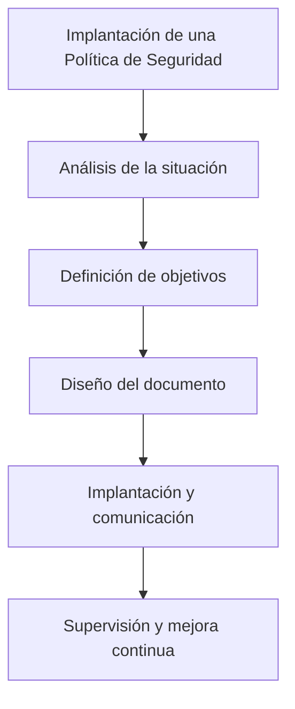
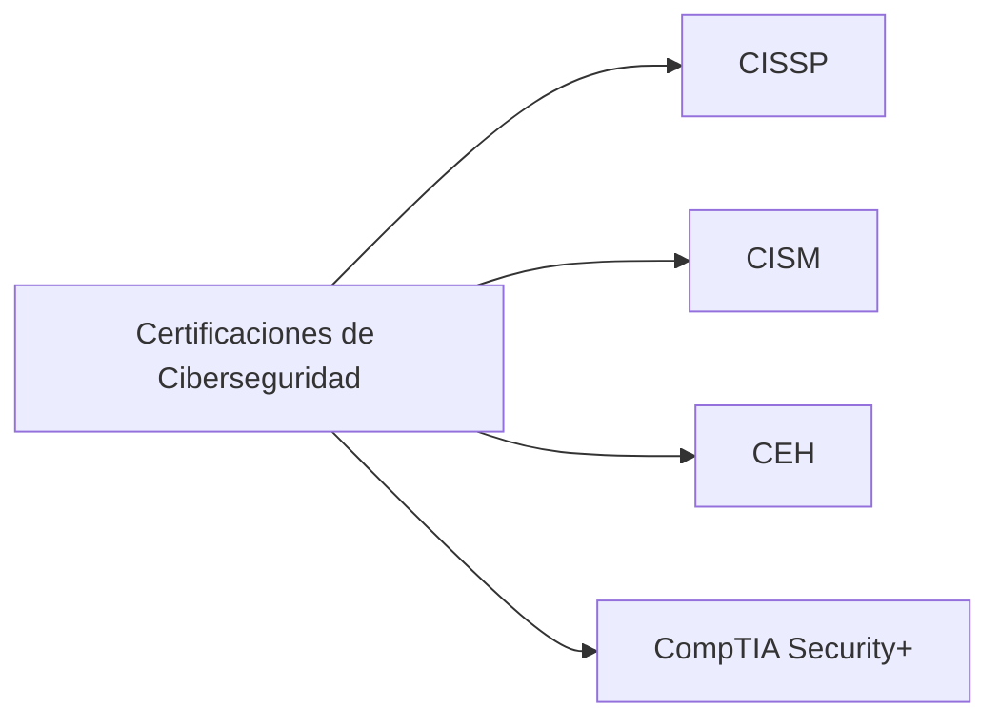

# Notas De Estudio

## Tema 2: Gestión De la Ciberseguridad

---

## 1. Introducción a la Gestión De la Ciberseguridad

La **gestión de la ciberseguridad** tiene como objetivo proteger los activos de información de una organización mediante políticas, procedimientos y controles que aseguren la **confidencialidad, integridad y disponibilidad** de la información.

Para lograrlo, una organización debe **implantar una política de seguridad** que involucre a todos los miembros, desde la dirección hasta los empleados externos.

---

## 2. Política De Seguridad De la Información

### Definición

Una **política de seguridad** es un conjunto de normas, directrices y procedimientos que establece cómo debe protegerse la información dentro de la organización.

### Objetivo

Su propósito es garantizar que todos los usuarios, recursos y sistemas operen de forma segura y coherente con los objetivos empresariales.

### Participantes

La política debe aplicarse a:

- La alta dirección.
    
- Empleados internos.
    
- Colaboradores externos.

### Fases Para Diseñar Una Política De Seguridad

1. **Análisis de la situación actual**: identificar vulnerabilidades y activos críticos.
    
2. **Definición de objetivos de seguridad**: qué se desea proteger y por qué.
    
3. **Diseño del documento de política**: establecer normas y responsabilidades.
    
4. **Implantación y comunicación**: asegurar que todos los miembros la comprendan y apliquen.
    
5. **Supervisión y mejora continua**: actualizar según nuevas amenazas o cambios tecnológicos.

---

## 3. Sistema De Gestión De Seguridad De la Información (SGSI)

### Definición

Un **SGSI (Sistema de Gestión de Seguridad de la Información)** es un marco estructurado de políticas y procedimientos que permiten gestionar la seguridad de forma continua.

### Fases Del SGSI

|Fase|Descripción|
|---|---|
|Planificar|Definir los objetivos y políticas de seguridad.|
|Hacer|Implementar los controles y procesos definidos.|
|Verificar|Evaluar la eficacia de los controles mediante auditorías.|
|Actuar|Corregir y mejorar continuamente el sistema.|

El SGSI se fundamenta en el **análisis y gestión de riesgos** de los activos de la organización.

---

## 4. Análisis Y Gestión De Riesgos

### Objetivo

Identificar, evaluar y mitigar los riesgos que afectan a los activos de información.

### Etapas Del Proceso

1. **Identificación de activos**: determinar qué se debe proteger.
    
2. **Identificación de amenazas y vulnerabilidades**.
    
3. **Evaluación del riesgo**: determinar la probabilidad e impacto.
    
4. **Definición de controles**: establecer medidas de protección.
    
5. **Revisión continua**: adaptar los controles a nuevas amenazas.

---

## 5. Rol Del Professional De Seguridad De la Información

### Perfil Professional

El **professional de seguridad** se encarga de planificar, implementar y supervisar las medidas de seguridad en la organización.

### Reconocimiento Y Demanda

Actualmente, la profesión está ampliamente reconocida en el ámbito empresarial y académico debido al aumento de ciberamenazas y la necesidad de proteger datos sensibles.

### Áreas De Desempeño

|Área|Descripción|
|---|---|
|Auditoría de Seguridad|Evalúa la eficacia de los controles implementados.|
|Ingeniería de Seguridad|Diseña y construye infraestructuras seguras.|
|Gestión de Seguridad|Supervisa políticas y cumplimiento normativo.|

---

## 6. Certificaciones En Ciberseguridad

Las **certificaciones** permiten validar los conocimientos y competencias de los profesionales de seguridad.

### Ejemplos De Certificaciones Relevantes

|Certificación|Enfoque|Organismo|
|---|---|---|
|CISSP|Gestión y arquitectura de seguridad|(ISC)²|
|CISM|Gestión de seguridad de la información|ISACA|
|CEH|Ethical Hacking y pruebas de penetración|EC-Council|
|CompTIA Security+|Fundamentos de seguridad|CompTIA|

Estas certificaciones ayudan a garantizar un **nivel de formación adecuado** en las distintas áreas de la ciberseguridad.

---

## 7. Resumen De Puntos Clave

- La **gestión de la ciberseguridad** require políticas claras y compromiso de toda la organización.
    
- La **política de seguridad** es la base sobre la que se construye la seguridad de la información.
    
- El **SGSI** permite mantener un enfoque continuo de mejora y control.
    
- La **gestión de riesgos** identifica amenazas y define controles adecuados.
    
- El **professional de seguridad** es esencial y altamente demandado.
    
- Las **certificaciones** formalizan y validan la competencia professional en el área.
