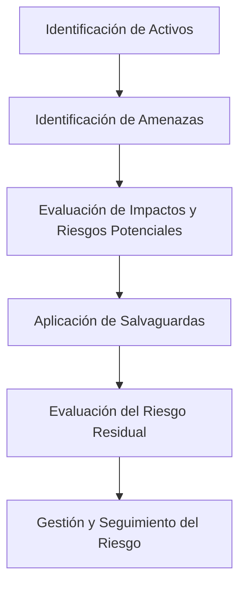

# Principales Metodologías Y Herramientas De Análisis Y Gestión De Riesgos

---

## 1. Introducción

El análisis y gestión de riesgos en sistemas de información busca **identificar, valorar y mitigar** los riesgos que pueden afectar los activos de una organización.  
Entre las metodologías más relevantes se encuentran **MAGERIT** y **OCTAVE**, ambas enfocadas en la evaluación y tratamiento del riesgo, aunque con distintos enfoques y niveles de detalle.

---

## 2. Metodología MAGERIT

### 2.1. Definición

**MAGERIT** (Metodología de Análisis y Gestión de Riesgos de los Sistemas de Información) es una metodología **implantada en la Administración Pública Española**.  
Su objetivo es **proteger los sistemas de información** frente a las amenazas que puedan afectar su valor, confidencialidad, integridad o disponibilidad.

Está asociada a la **herramienta PILAR**, que automatiza y facilita el proceso de análisis y gestión de riesgos.

---

### 2.2. Conceptos Clave

|Concepto|Descripción|
|---|---|
|**Activo**|Elemento que tiene valor para la organización y debe protegerse. Puede set un sistema de información, aplicación, personal, instalación o salvaguarda.|
|**Amenaza**|Evento o acción que puede causar una degradación del valor de un activo.|
|**Impacto**|Grado de pérdida o daño que sufre un activo si una amenaza se materializa.|
|**Riesgo Potential**|Probabilidad de que una amenaza se materialice y cause un impacto.|
|**Salvaguardas**|Medidas de protección que reducen la probabilidad o el impacto de las amenazas.|
|**Riesgo Residual**|Riesgo que permanece después de aplicar las salvaguardas.|

---

### 2.3. Proceso General (Esquema)

![[Pasted image 20251110092027.png]]

---

### 2.4. Tipos De Análisis

|Tipo de Análisis|Descripción|Método de Valoración|
|---|---|---|
|**Cualitativo**|Evalúa el riesgo de forma descriptiva.|Escala del 0 al 10.|
|**Cuantitativo**|Evalúa el riesgo de forma numérica.|Valoración económica (monetaria).|

---

### 2.5. Ventajas De MAGERIT

- Proporciona una **visión completa** del proceso de gestión de riesgos.
    
- Incluye una **amplia base de datos** de activos, amenazas y salvaguardas.
    
- Permite realizar análisis **cualitativos o cuantitativos**.
    
- **Basada en normas ISO** (ISO 31000, ISO/IEC 27001).
    
- Herramienta **PILAR** disponible en versión gratuita o comercial.
    
- Facilita el **cumplimiento de certificaciones ISO 27001**.

---

### 2.6. Desventajas De MAGERIT

- Dificultad para **traducir valoraciones cualitativas a monetarias**.
    
- La **identificación de vulnerabilidades** no se incluye explícitamente como paso.
    
- No siempre se mencionan **políticas de seguridad** dentro del análisis.
    
- Puede resultar **compleja en su implementación** sin formación previa.

---

## 3. Metodología OCTAVE

### 3.1. Definición

**OCTAVE** (Operationally Critical Threat, Asset, and Vulnerability Evaluation) es una metodología **pública y gratuita** para la **evaluación de riesgos de seguridad de la información**.  
Su propósito es identificar activos críticos, amenazas, vulnerabilidades y establecer planes de mitigación.

---

### 3.2. Fases De OCTAVE

|Fase|Enfoque|Actividades Principales|
|---|---|---|
|**Fase 1**|Organizacional|Definición de activos, identificación de amenazas, análisis de prácticas actuales y vulnerabilidades organizativas.|
|**Fase 2**|Tecnológica|Identificación de components clave y vulnerabilidades técnicas.|
|**Fase 3**|Gestión del Riesgo|Identificación de riesgos, definición de estrategias de mitigación y planificación de salvaguardas.|

---

### 3.3. Tipos De OCTAVE

|Tipo|Enfoque|Destinatarios|
|---|---|---|
|**OCTAVE-S**|Simplificada|Pequeñas y medianas empresas (Pymes).|
|**OCTAVE**|Estándar|Grandes organizaciones.|
|**OCTAVE Allegro**|Centrado en la información|Organizaciones que priorizan la gestión de información y datos.|

---

### 3.4. Ventajas De OCTAVE

- **Flexible** y adaptable a distintas organizaciones.
    
- **Cobertura completa** (activos, procesos, amenazas, controles).
    
- **Pública y gratuita**, disponible para uso público y privado.
    
- Considera tanto **aspectos organizacionales como técnicos**.

---

### 3.5. Desventajas De OCTAVE

- No define con claridad la **tipología de activos de información**.
    
- Require **alto nivel de conocimiento técnico y comunicación**.
    
- Puede resultar **compleja para equipos sin experiencia en gestión de riesgos**.

---

## 4. Comparación Entre MAGERIT Y OCTAVE

|Criterio|MAGERIT|OCTAVE|
|---|---|---|
|**Origen**|Administración Pública Española|Desarrollada por CERT (EE. UU.)|
|**Enfoque**|Normativo y estructurado|Flexible y adaptable|
|**Herramienta Asociada**|PILAR|No require herramienta específica|
|**Base Normativa**|ISO 31000, ISO/IEC 27001|No está basada directamente en ISO|
|**Accesibilidad**|Licencia pública o gratuita limitada|Totalmente gratuita|
|**Análisis**|Cualitativo y cuantitativo|Principalmente cualitativo|
|**Orientación**|Cumplimiento normativo|Mejora organizativa|

---

## 5. Recomendaciones Generales

- Utilizar **análisis cualitativo** en entornos con recursos limitados.
    
- Considerar **MAGERIT** si se busca **alineación con ISO 27001**.
    
- Emplear **OCTAVE** cuando se requiera **flexibilidad y adaptación** organizacional.
    
- Complementar ambas metodologías con políticas de seguridad internas claras.

---

## Resumen De Puntos Clave

- **MAGERIT** y **OCTAVE** son metodologías de análisis y gestión de riesgos.
    
- Ambas parten del concepto de **activo** y buscan **proteger su valor** frente a amenazas.
    
- **MAGERIT** se centra en la gestión estructurada y la alineación con estándares ISO.
    
- **OCTAVE** ofrece una aproximación más **flexible** y organizacional.
    
- Ambas permiten identificar **riesgos residuales** y diseñar **salvaguardas efectivas**.
    
- Su correcta aplicación mejora la **seguridad y resiliencia** de los sistemas de información.

---

## MicroTest

1. ¿Cuál es una desventaja de OCTAVE?
    
    - **La respuesta:** c. Implica un elevado nivel de conocimientos tecnológicos y técnicos.
        
    - **Justificación:** Una de las principales desventajas de OCTAVE es que su correcta aplicación require un alto nivel de comprensión técnica y comunicación dentro del equipo, lo cual puede dificultar su implementación en organizaciones con poca experiencia en gestión de riesgos.

---

1. ¿Cuál es la principal desventaja de MAGERIT?
    
    - **La respuesta:** A. No establece explícitamente la identificación de vulnerabilidades como uno de los pasos de la metodología.
        
    - **Justificación:** MAGERIT no incluye de manera explícita la identificación de vulnerabilidades como paso dentro de la metodología (A) y presenta dificultad para traducir valoraciones cualitativas en cuantitativas o económicas (B). Ambas características son consideradas desventajas clave.

---

1. MAGERIT está basada en las normas:
    
    - **La respuesta:** D: Todas las anteriores son correctas.
        
    - **Justificación:** MAGERIT se fundamenta principalmente en normas internacionales como ISO 31000 y **ISO/IEC 27001**, que establecen los requisitos para la gestión de la seguridad de la información. Aunque guarda relación conceptual con otras normas ISO, su base formal se alinea con ISO 27001.

https://administracionelectronica.gob.es/pae_Home/pae_Documentacion/pae_Metodolog/pae_Magerit.html#.U2_oe2CKB2E
