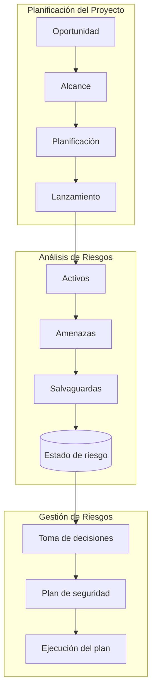
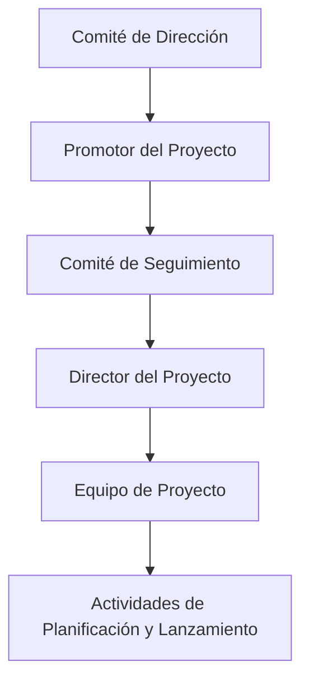

# Notas De Estudio

## Planificación De Un Proyecto De Análisis Y Gestión De Riesgos

---

## 1. Introducción

La **planificación de un proyecto de análisis y gestión de riesgos** es la primera etapa en la aplicación de una metodología como **MAGERIT**.  
Su finalidad es **organizar, definir y preparar** todos los elementos necesarios para llevar a cabo el proceso de identificación, evaluación y tratamiento de riesgos dentro de una organización.

El proceso se estructura en **tres fases principales**:

---

## 2. Fase 1: Planificación Del Proyecto De Análisis Y Gestión De Riesgos

### 2.1. Objetivo

Determinar **la oportunidad, alcance y organización** del proyecto antes de iniciar el análisis de riesgos.  
Esta fase busca asegurar que el proyecto tenga una base sólida y que los recursos estén correctamente alineados con los objetivos de la organización.

---

### 2.2. Etapas Y Actividades Principales

|Etapa|Descripción|Responsible|
|---|---|---|
|**Determinación de la oportunidad**|Evaluar si es el memento adecuado para iniciar el proyecto.|Promotor / Comité de Dirección|
|**Definición del alcance**|Establecer qué sistemas, procesos o activos se incluirán.|Comité de Seguimiento + Director del Proyecto|
|**Planificación detallada**|Diseñar el plan de acción, cronograma y recursos.|Director del Proyecto y Equipo|
|**Lanzamiento del proyecto**|Poner en marcha oficialmente el proceso y sensibilizar a los participantes.|Equipo de Proyecto + Comité Director|

---

### 2.3. Elementos Del Alcance Del Proyecto

Al definir el alcance, deben considerarse los siguientes aspectos:

|Elemento|Descripción|
|---|---|
|**Objetivos**|Qué se espera lograr con el análisis y gestión de riesgos.|
|**Dominio y límites**|Áreas, procesos o sistemas incluidos y excluidos del análisis.|
|**Entorno y restricciones**|Factores externos o internos que pueden afectar el desarrollo del proyecto.|
|**Dimensions y coste**|Recursos humanos, tecnológicos y financieros necesarios.|

---

### 2.4. Planificación Detallada

Durante esta etapa, el director del proyecto y su equipo desarrollan un plan operativo que incluye:

1. **Plan de entrevistas**: definición de las entrevistas necesarias para obtener información clave sobre activos, amenazas y vulnerabilidades.
    
2. **Participantes por entrevistar**: selección de personas relevantes dentro de la organización (usuarios, responsables técnicos, directivos).
    
3. **Calendario ético y de compromisos**: establece los plazos y las normas de conducta que los participantes deben seguir durante el proceso.

---

### 2.5. Lanzamiento Del Proyecto

El lanzamiento formal marca el inicio del proyecto e incluye las siguientes actividades:

|Actividad|Descripción|
|---|---|
|**Preparación de cuestionarios**|Instrumentos para recopilar información sobre activos, amenazas y salvaguardas.|
|**Elaboración de criterios de valoración**|Definir cómo se evaluarán los riesgos (por ejemplo, mediante escalas cualitativas o cuantitativas).|
|**Determinación de recursos necesarios**|Identificación de los medios humanos, técnicos y financieros.|
|**Sensibilización**|Actividades para concienciar al personal sobre la importancia del proyecto y la seguridad de la información.|

---

## 3. Relación Jerárquica Del Proceso

---

## 4. Importancia De la Planificación

Una **planificación adecuada** garantiza:

- Claridad en los objetivos y alcance del proyecto.
    
- Asignación eficiente de recursos.
    
- Comunicación fluida entre los equipos.
    
- Identificación temprana de limitaciones y riesgos.
    
- Base sólida para las fases de **análisis** y **gestión de riesgos** posteriores.

---

## Resumen De Puntos Clave

- La **planificación** es la primera fase del proyecto de análisis y gestión de riesgos.
    
- Su propósito es **definir el alcance, los objetivos, recursos y cronograma**.
    
- Participan el **Comité de Dirección, Comité de Seguimiento, Director y Equipo del Proyecto**.
    
- Incluye la **preparación de cuestionarios, criterios de valoración y sensibilización del personal**.
    
- Una buena planificación facilita la eficacia del análisis y la gestión posterior de los riesgos.

---

## MicroTest

1. ¿En qué fase se realiza la toma de decisiones?
    
    - **La respuesta:** b. Gestión de riesgos.
        
    - **Justificación:** La toma de decisiones se lleva a cabo en la fase de **gestión de riesgos**, ya que es en este memento cuando se definen las estrategias de mitigación, se seleccionan las salvaguardas y se determinan las acciones a implementar para reducir los riesgos identificados en la fase de análisis.

---

1. En el comité de dirección existe la figura del:
    
    - **La respuesta:** d. Promotor.
        
    - **Justificación:** El **promotor** pertenece al comité de dirección y es quien impulsa el proyecto, determina la oportunidad de su inicio y elabora el informe preliminar antes de la creación del comité de seguimiento, siendo una figura clave en la fase de planificación.

---

1. El director del proyecto y su equipo planifican toda la realización del proyecto a través de:
    
    - **La respuesta:** d. Todas las anteriores son correctas.
        
    - **Justificación:** La planificación del proyecto incluye la elaboración del **plan de entrevistas**, la **identificación de los participantes** a entrevistar y la definición del **calendario**, por lo que las tres opciones forman parte del proceso completo de planificación.