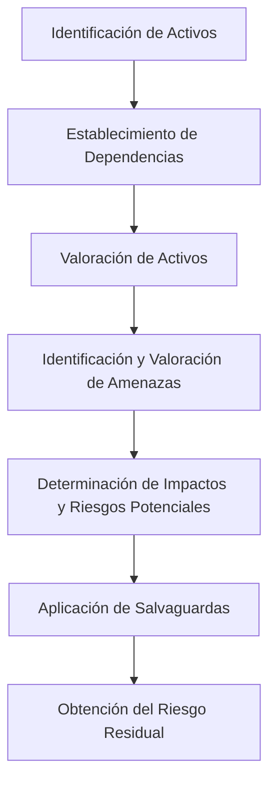
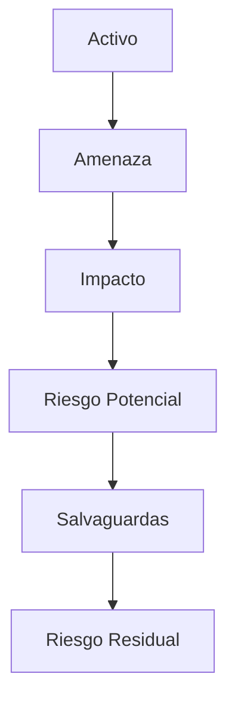

# Notas De Estudio

## Análisis De Riesgos

---

## 1. Introducción Al Análisis De Riesgos

El **análisis de riesgos** consiste en identificar, valorar y evaluar los posibles efectos de amenazas sobre los **activos** de una organización.  
Estos activos pueden verse afectados por **amenazas** que, al materializarse, provocan una **degradación de su valor**, denominada **impacto**.

### Conceptos Básicos

![[Pasted image 20251110102643.png]]

|Concepto|Definición|Relevancia|
|---|---|---|
|**Activo**|Elemento que posee valor para la organización y que debe set protegido. Puede set una aplicación web, un sistema de información, personal, instalaciones o salvaguardas.|Constituye el objeto de protección dentro del análisis de riesgos.|
|**Amenaza**|Evento o acción potential que puede causar daño o pérdida a un activo.|Genera un impacto si llega a materializarse.|
|**Impacto**|Grado de degradación del valor de un activo como consecuencia de la materialización de una amenaza.|Determina la severidad del daño sufrido por el activo.|
|**Probabilidad**|Frecuencia o posibilidad de que una amenaza se materialice sobre un activo.|Permite calcular el nivel de riesgo asociado.|
|**Riesgo**|Resultado de combinar el impacto con la probabilidad de ocurrencia de una amenaza sobre un activo.|Refleja la vulnerabilidad global frente a un evento adverso.|
|**Salvaguarda**|Medida técnica u organizativa destinada a reducir la probabilidad o el impacto de una amenaza.|Permite obtener un riesgo residual acceptable.|
|**Riesgo residual**|Nivel de riesgo que permanece después de aplicar las salvaguardas.|Indica el riesgo que la organización debe aceptar o transferir.|

---

## 2. Proceso De Análisis De Riesgos

El proceso de análisis de riesgos dentro de metodologías como **MAGERIT** se compone de varias etapas que permiten pasar de la identificación de activos a la valoración del riesgo residual.

![[Pasted image 20251110102705.png]]

---

### 2.1. Identificación De Activos

Primera actividad del proceso. Consiste en reconocer todos los **activos de la organización**:

- **Activos esenciales:** servicios e información (datos).
    
- **Activos de soporte:** aplicaciones, infraestructura, personal, instalaciones, etc.

**Ejemplo:**  
Para un servicio de _tramitación de expedientes_, los activos asociados serían:

- Servicio: Tramitación de expedientes (activo esencial).
    
- Aplicación: Software de gestión de expedientes.
    
- Infraestructura: Servidores y red.

---

### 2.2. Establecimiento De Dependencias

Una vez identificados los activos, se definen las **relaciones de dependencia** entre ellos.  
Por ejemplo, un servicio depende de la aplicación que lo soporta, y esta, a su vez, del hardware o infraestructura donde se ejecuta.

> La herramienta **PILAR** (asociada a MAGERIT) permite establecer automáticamente estas dependencias dentro de un dominio de protección.

---

### 2.3. Valoración De Activos

Los activos se valoran en función de su **importancia** para la organización.  
Generalmente se utilize una **valoración cualitativa**, por ejemplo en una escala del 1 al 10.

Esta valoración puede considerar tres dimensions principales:

- **Confidencialidad:** protección contra accesos no autorizados.
    
- **Integridad:** exactitud y completitud de la información.
    
- **Disponibilidad:** acceso oportuno a los recursos e información.

---

### 2.4. Identificación Y Valoración De Amenazas

El sistema (por ejemplo, PILAR) **infiere automáticamente** las amenazas asociadas a cada activo y las clasifica según:

- **Tipo de amenaza** (error humano, ataque, fallo técnico, desastre natural, etc.)
    
- **Probabilidad de ocurrencia**
    
- **Impacto potential**

1. Identificación de activos
	
2. Establecimiento de dependencias entre activos
	
3. Valoración de los activos
	
4. Amenazas: identificación, clasificación y valoración
	
5. Impacto
	
6. Riesgo
	
7. Salvaguardas
	
8. Normativa y procedimientos de seguridad
	
9. Impacto y riesgos residuales

El resultado de esta fase es un conjunto de informes de **impacto inicial** y **riesgo inicial o potential**.

---

## 3. Gestión Del Riesgo

Una vez conocidos los riesgos potenciales, se pasa a la **fase de gestión**, en la cual se definen las estrategias para tratar esos riesgos.

### 3.1. Opciones De Tratamiento Del Riesgo

|Opción|Descripción|Ejemplo|
|---|---|---|
|**Evitar el riesgo**|Eliminar la causa o el activo expuesto.|No ofrecer un servicio en línea vulnerable.|
|**Mitigar el riesgo**|Reducir su probabilidad o impacto mediante salvaguardas.|Implementar un firewall o políticas de contraseñas robustas.|
|**Compartir/Transferir el riesgo**|Asignar parte del riesgo a un tercero.|Contratar un seguro o externalizar la gestión de seguridad.|
|**Aceptar el riesgo**|Asumir el riesgo residual.|Continuar con la operación bajo control y monitoreo continuo.|

---

### 3.2. Tipos De Salvaguardas

|Tipo|Descripción|Ejemplo|
|---|---|---|
|**Técnicas**|Basadas en tecnología o infraestructura.|Cifrado TLS, firewall, antivirus.|
|**Organizativas**|Basadas en políticas o procedimientos.|Política de contraseñas, planes de contingencia.|
|**Combinadas**|Mezcla de medidas técnicas y organizativas.|Sistema de autenticación multifactor.|

---

### 3.3. Riesgo Residual Y Monitoreo

Después de aplicar las salvaguardas, siempre queda un **riesgo residual**, el cual debe:

- Set **aceptado formalmente** por la organización.
    
- **Monitorearse de forma continua** mediante actividades de observación en fase de producción.

El **monitoreo continuo** permite detectar incidentes, ataques o fallos en tiempo real y activar los procedimientos de respuesta y recuperación.

---

## 4. Conformidad Normativa

El proceso de gestión de riesgos puede alinearse con distintos **marcos normativos**, tales como:

|Norma / Esquema|Descripción|
|---|---|
|**Esquema Nacional de Seguridad (ENS)**|Marco español que regula la seguridad en las administraciones públicas.|
|**ISO/IEC 27001:2013 / 2022**|Norma internacional para sistemas de gestión de seguridad de la información (SGSI).|

Estas normas sirven como referencia para contrastar los **niveles de riesgo aceptables** y verificar que las **salvaguardas aplicadas** cumplen los estándares recomendados.

---

## 5. Relación Entre Los Conceptos Principales

---

## Resumen De Puntos Clave

- El **análisis de riesgos** identifica activos, amenazas y sus posibles impactos.
    
- El **riesgo** depende del impacto y de la probabilidad de ocurrencia de una amenaza.
    
- Las **salvaguardas** reducen el riesgo hasta un **nivel residual acceptable**.
    
- Las opciones de tratamiento del riesgo incluyen **evitar, mitigar, compartir o aceptar**.
    
- Se require **monitoreo continuo** para detectar y responder a incidentes.
    
- La gestión debe alinearse con normas como **ISO 27001** o el **Esquema Nacional de Seguridad**.

---

## MicroTest

1. El impacto es igual a:
    
    - **La respuesta:** b. Degradación del valor del activo.
        
    - **Justificación:** El impacto representa la **pérdida o degradación del valor de un activo** cuando una amenaza se materializa. Es la consecuencia directa del daño que sufre el activo, y no depende del riesgo acumulado o la frecuencia, sino del efecto sobre su valor.

---

1. El actor o agente que es la fuente de peligro por diferentes motivaciones como factores económicos, de prestigio u otros, se denomina:
    
    - **La respuesta:** c. Amenaza.
        
    - **Justificación:** Una **amenaza** es cualquier agente o evento que puede causar daño a un activo. Puede tener diversas motivaciones —económicas, políticas o personales— y, si se materializa, puede provocar un impacto negativo en la organización.

---

1. ¿Cómo hay que valorar una salvaguarda?
    
    - **La respuesta:** c. En base a su eficacia medida en cómo la salvaguarda está implantada.
        
    - **Justificación:** Las **salvaguardas** se valoran según su **eficacia real**, es decir, por el grado en que están implementadas y su capacidad para reducir la probabilidad o el impacto de una amenaza. No basta con conocer su costo, sino con evaluar su efectividad dentro del sistema de seguridad.