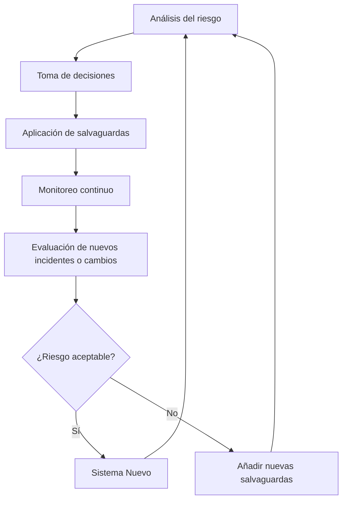

# Notas De Estudio: Gestión De Riesgos

---

## 1. Introducción a la Gestión Del Riesgo

**Definición:**  
La gestión del riesgo es el proceso que **sigue al análisis del riesgo** y consiste en **tomar decisiones** sobre qué medidas o **salvaguardas** aplicar para reducir el impacto y la probabilidad de que una amenaza se materialice sobre un activo.

**Objetivo principal:**  
Reducir el **riesgo inicial** y el **impacto potential** hasta alcanzar niveles **aceptables** mediante la implementación de salvaguardas técnicas, organizativas y operativas.

---

## 2. Opciones De Gestión Del Riesgo

La gestión del riesgo implica decidir **qué hacer frente a los riesgos identificados**. Existen cuatro estrategias principales:

|Estrategia|Descripción|Ejemplo|
|---|---|---|
|**Evitar el riesgo**|Eliminar la causa de la amenaza o dejar de realizar la actividad que genera el riesgo.|Desconectar un sistema vulnerable de la red.|
|**Mitigar o reducir el riesgo**|Implementar medidas (salvaguardas) que disminuyan la probabilidad o el impacto del riesgo.|Implementar un firewall o cifrar la información.|
|**Transferir el riesgo**|Delegar la gestión del riesgo a un tercero (por ejemplo, mediante un seguro o servicio externo).|Contratar una empresa de ciberseguridad para gestión de incidentes.|
|**Asumir el riesgo**|Aceptar las consecuencias del riesgo, asumiendo su costo operacional.|No invertir en protección adicional debido a su alto costo.|

**Nota:**  
La estrategia más común es **mitigar**, ya que “seguridad al 100% no existe”.

---

## 3. Ciclo De Gestión Del Riesgo

La gestión del riesgo **no es un proceso estático**, sino **un ciclo continuo** que debe revisarse y actualizarse con frecuencia.

**Características del ciclo:**

- Require **monitoreo continuo** del entorno y los sistemas.
    
- Se debe repetir cada vez que haya **cambios en activos**, **nuevos incidentes**, o **actualizaciones de sistemas**.
    
- Implica **retroalimentación constante** entre análisis y gestión del riesgo.

---

## 4. Elementos Del Plan De Seguridad

Un **plan de seguridad** es el documento que organiza la implementación de las medidas de gestión del riesgo. Se divide en dos partes:

1. **Programa de seguridad:** Define qué se hará para reducir los riesgos.
    
2. **Plan de ejecución:** Establece el cronograma y los recursos necesarios.

**Components del programa de seguridad:**

- **Objetivos:** Lo que se busca lograr (ej. proteger la confidencialidad o disponibilidad).
    
- **Amenazas tratadas:** Identificación clara de las amenazas a mitigar.
    
- **Activos afectados:** Sistemas, información o recursos vulnerables.
    
- **Salvaguardas seleccionadas:** Medidas concretas (técnicas, organizativas o de procedimiento).
    
- **Unidad responsible:** Quién ejecutará y supervisará las acciones.
    
- **Coste estimado:** Presupuesto necesario para implementar las medidas.
    
- **Tiempo de ejecución:** Desde la planificación hasta la puesta en marcha.
    
- **Riesgo residual esperado:** Nivel de riesgo acceptable tras la implementación.
    
- **Indicadores de eficacia y eficiencia:** Métricas para medir el rendimiento del plan.

---

## 5. Monitoreo Y Evaluación Continua

**Monitoreo continuo:**  
Consiste en la observación constante de los sistemas para detectar amenazas o incidentes.

**Acciones necesarias:**

- Revisar periódicamente la efectividad de las salvaguardas.
    
- Actualizar el análisis de riesgos ante nuevos incidentes o cambios.
    
- Tener procedimientos de **gestión de incidentes de seguridad** bien definidos para reaccionar con rapidez.

---

## 6. Riesgo Residual Y Evaluación De Resultados

**Riesgo residual:**  
Es el riesgo que **permanece tras aplicar las salvaguardas**. Debe set evaluado para determinar si es acceptable o si require medidas adicionales.

**Evaluación:**  
Si los impactos y riesgos residuales **no son aceptables**, se deben **añadir nuevas salvaguardas** o reforzar las existentes.

---

## 7. Resumen De Puntos Clave

- La **gestión del riesgo** comienza **después del análisis del riesgo**.
    
- Su propósito es **tomar decisiones** sobre la implementación de salvaguardas.
    
- Existen cuatro estrategias básicas: **evitar, mitigar, transferir y asumir**.
    
- Es un **proceso continuo**, no una acción única.
    
- Debe incluir un **plan de seguridad** con objetivos, recursos y cronograma.
    
- Se deben medir la **eficacia y eficiencia** de las medidas aplicadas.
    
- El **riesgo residual** siempre existirá, pero debe mantenerse dentro de niveles aceptables.

---

## MicroTest

1. ¿Cuál es la solución ideal para mitigar el riesgo?
    
    - **La respuesta:** a. Evitarlo.
        
    - **Justificación:** La **solución ideal** frente a un riesgo es **evitarlo**, eliminando la causa o la amenaza antes de que pueda materializarse. Aunque no siempre es possible, representa la opción más segura, ya que suprime totalmente la exposición al riesgo.

---

1. Debe haber un programa de seguridad para:
    
    - **La respuesta:** c. Cada escenario de impacto para dar respuesta.
        
    - **Justificación:** La gestión del riesgo establece que se debe diseñar un **programa de seguridad específico para cada escenario de impacto y riesgo crítico**, con el fin de proporcionar una **respuesta adecuada** y adaptada a las características del activo y la amenaza involucrada.

---

1. Los aspectos que definir en la gestión del riesgo son:
    
    - **La respuesta:** d. Todas las anteriores son correctas.
        
    - **Justificación:** La gestión del riesgo debe incluir **objetivos claros**, **salvaguardas concretas con criterios de eficacia y eficiencia**, y la **identificación de escenarios de impacto y riesgos**, incluyendo los activos y amenazas implicadas. Todos estos elementos son esenciales para elaborar un plan de seguridad completo y efectivo.
      
      