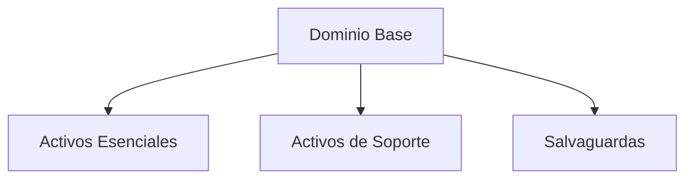

# Notas De Estudio

## Herramienta PILAR Y Metodología MAGERIT

---

### Introducción a la Herramienta PILAR

**PILAR** es una herramienta de análisis y gestión de riesgos utilizada dentro de la **metodología MAGERIT**.  
Permite identificar, valorar y tratar riesgos asociados a los activos de una organización, facilitando la toma de decisiones en materia de **seguridad de la información**.

#### Objetivo Principal

- Identificar los **activos esenciales** y su relación con otros activos.
    
- Analizar **amenazas, vulnerabilidades y salvaguardas**.
    
- Medir el **impacto y riesgo** asociado.
    
- Definir un **plan de mejora** para alcanzar los objetivos de seguridad (fase objetivo o _target_).

---

## Configuración Inicial En PILAR

### Opciones Por Defecto (Menú “Editar”)

Es recomendable revisar las opciones predeterminadas antes de comenzar un análisis.

|Opción|Recomendación|Motivo|
|---|---|---|
|Valoración|**Por dominios**|Permite una valoración global y coherente cuando hay muchos activos.|
|Influencia de amenazas|**Automática**|Facilita la inferencia automática de amenazas por parte de la herramienta.|
|Modelo de valor|**Cualitativo (escala 1-10)**|Simplifica la valoración sin necesidad de datos monetarios precisos.|

---

## Niveles De Usuario En PILAR

PILAR dispone de tres niveles de uso:

- **Básico:** Recomendado para principiantes.
    
- **Medio:** Añade mayor detalle y opciones de configuración.
    
- **Experto:** Permite un control completo sobre los parámetros de análisis.

---

## Estructura Del Proyecto

### Descripción Y Fases Del Proyecto

Por defecto, la herramienta incluye dos fases:

- **Situación actual (_current_)**
    
- **Situación objetivo (_target_)**

Se recomienda añadir **fases intermedias** (Fase 1, Fase 2, etc.) para reflejar el progreso gradual del proyecto de análisis y gestión de riesgos.

---

## Identificación De Activos

### Clasificación De Activos

Los activos se dividen en **capas** o **categorías** según su naturaleza y función.

|Categoría|Ejemplos|
|---|---|
|Esenciales|Servicios, datos, información crítica|
|Internos|Equipos, software, redes|
|Equipamiento|Hardware, servidores|
|Instalaciones|Centros de datos, oficinas|
|Personal|Usuarios, administradores|

Los **activos esenciales** (servicios e información) son el punto de partida, ya que **todos los demás dependen de ellos**.

---

## Valoración De Activos

### Valoración Por Dominios

- La valoración se realiza sobre los **activos esenciales**.
    
- Se propaga automáticamente a los activos dependientes dentro del mismo dominio.

### Dimensions a Valorar

Cada activo se evalúa en una escala **del 1 al 10** en las siguientes dimensions:

|Dimensión|Descripción|
|---|---|
|Disponibilidad|Capacidad del activo de estar operativo cuando se necesita.|
|Integridad|Precisión y completitud de la información.|
|Confidencialidad|Protección contra el acceso no autorizado.|
|Autenticidad|Verificación de la identidad de usuarios y sistemas.|
|Trazabilidad|Registro y seguimiento de acciones y cambios.|
|Datos personales|Nivel de protección requerido por normativa.|

---

## Dominios De Seguridad

### Definición

Un **dominio de seguridad** agrupa todos los activos protegidos por el **mismo conjunto de salvaguardas**.

- En proyectos pequeños suele haber un solo dominio base.
    
- Las **salvaguardas también se consideran activos** dentro del dominio.

---

## Análisis De Amenazas Y Riesgos

### Amenazas

- Se **infieren automáticamente** si la opción de influencia automática está activada.
    
- La herramienta asigna amenazas comunes a los activos esenciales (por ejemplo: pérdida de datos, fallo de hardware, acceso no autorizado).

### Evaluación De Riesgos

Los **riesgos acumulados** se calculan combinando:

- Valoración del activo.
    
- Amenazas inferidas.
    
- Eficacia de las salvaguardas aplicadas.

---

## Salvaguardas

### Aplicación Y Valoración

Las **salvaguardas** son medidas implementadas para **mitigar riesgos**.  
Se evalúan según su **nivel de madurez** de 0 a 5:

| Nivel | Significado                        |
| ----- | ---------------------------------- |
| L0     | No implementada                    |
| L1     | Inicial                            |
| L2     | Parcialmente implementada          |
| L3     | Implementada con eficacia moderada |
| L4     | Consolidada                        |
| L5     | Madurez total                      |

Estas valoraciones se comparan con normas o esquemas de referencia.

---

## Normas Y Esquemas De Referencia

PILAR permite validar las salvaguardas contra distintos marcos normativos:

|Norma / Esquema|Descripción|
|---|---|
|**ENS (España, 2020)**|Esquema Nacional de Seguridad, actualizado en 2020.|
|**ENS (2015)**|Versión anterior, menos recomendada.|
|**ISO/IEC 27002**|Norma internacional sobre controles de seguridad.|
|**GDPR**|Reglamento General de Protección de Datos (Europa).|

El **ENS 2020** es la referencia recomendada en proyectos actuales.

---

## Evaluación De Resultados

### Niveles De Impacto Y Riesgo

La herramienta muestra los resultados por fase, diferenciando:

- **Riesgos acumulados**
    
- **Riesgos repercutidos**

Se espera que los niveles de riesgo **disminuyan progresivamente** a lo largo de las fases.  
El objetivo (_target_) debe acercarse al **nivel de referencia del ENS 2020**.

### Visualización De Resultados

PILAR genera gráficos que muestran la evolución del riesgo por dimensión:

El color de los niveles (rojo, naranja, amarillo) representa la **reducción del riesgo** conforme avanzan las fases.

---

## Resumen De Puntos Clave

- **PILAR** es una herramienta integrada en la **metodología MAGERIT** para la gestión de riesgos.
    
- Se recomienda **valoración cualitativa** y **por dominios**.
    
- Los **activos esenciales** son la base del análisis; su valoración se propaga al resto.
    
- Las **amenazas** pueden inferirse automáticamente.
    
- Las **salvaguardas** se valoran con una escala de madurez (0–5) y se comparan con normas como **ENS 2020** o **ISO/IEC 27002**.
    
- El análisis debe contemplar varias **fases progresivas**, con el objetivo de **reducir los riesgos** hasta niveles aceptables.

---

## MicroTest

1. La fase de análisis de riesgos con PILAR comporta las siguientes actividades:
    
    - **La respuesta:** d. Todas las anteriores son correctas.
        
    - **Justificación:**  
        La herramienta PILAR, dentro de la metodología MAGERIT, contempla en la fase de análisis de riesgos la **identificación y valoración de activos, amenazas y salvaguardas**. Estas tres actividades son fundamentales para determinar el nivel de riesgo y establecer estrategias de mitigación adecuadas.
        
2. Señale la respuesta correcta. El coste de las salvaguardas debe set inferior a:
    
    - **La respuesta:** c. La estimación de las pérdidas.
        
    - **Justificación:**  
        En gestión de riesgos, la implantación de una salvaguarda solo es viable si su **coste es menor que las pérdidas potenciales que evita**. Invertir más en protección que lo que se perdería sin ella sería ineficiente desde el punto de vista económico y de gestión.
        
3. Los perfiles de seguridad que incorpora la herramienta PILAR son:
    
    - **La respuesta:** d. Todas las anteriores son ciertas.
        
    - **Justificación:**  
        PILAR incluye **múltiples perfiles normativos de seguridad**, entre ellos **ISO 27002:2013**, **GDPR (Reglamento General de Protección de Datos)** y el **ENS (Esquema Nacional de Seguridad)**. Esto permite adaptar el análisis y tratamiento de riesgos a diferentes marcos regulatorios y contextos organizativos.