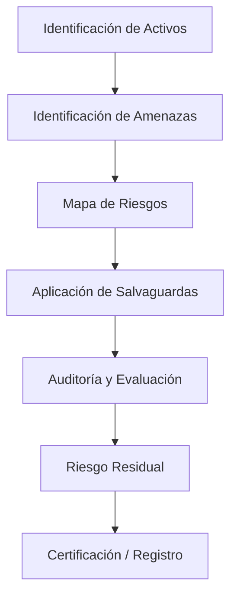

# Notas De Estudio

## Tema 3: Análisis Y Gestión De Riesgos De Ciberseguridad

---

## 1. Objetivos Principales Del Tema

El tema 3 se centra en comprender los **principios, buenas prácticas, metodologías y herramientas** que permiten realizar el **análisis y la gestión de riesgos de ciberseguridad** dentro de una organización.

### Objetivos Específicos

- Comprender los **principios y buenas prácticas** en análisis y gestión de riesgos.
    
- Conocer las **metodologías más utilizadas**, como **MAGERIT** y **OCTAVE**.
    
- Aprender a **planificar un proyecto de análisis y gestión de riesgos**.
    
- Identificar los **programas de seguridad** y su implementación mediante **salvaguardas**.
    
- Analizar el funcionamiento de la herramienta **PILAR**, asociada a la metodología MAGERIT.

---

## 2. Conceptos Fundamentales

### A. **Análisis De Riesgos**

Proceso que identifica, valora y prioriza los **activos** y las **amenazas** que pueden afectarlos.  
El objetivo es **construir un mapa de riesgos** que muestre el nivel de exposición de la organización.

**Etapas principales:**

|Etapa|Descripción|
|---|---|
|Identificación de activos|Determinar qué elementos son valiosos para la organización (información, sistemas, servicios).|
|Identificación de amenazas|Reconocer posibles eventos que pueden dañar los activos.|
|Valoración del riesgo|Calcular el impacto y la probabilidad de que las amenazas se materialicen.|

---

### B. **Gestión De Riesgos**

Conjunto de decisiones y acciones destinadas a **reducir, transferir o aceptar los riesgos identificados**.  
Se implementa mediante un **plan de aplicación de salvaguardas** (controles de seguridad).

**Características:**

- Debe realizarse **de forma planificada** y **por fases** (a medio o largo plazo).
    
- Incluye **actividades de auditoría** para evaluar la eficacia de las medidas.
    
- Conduce a un **nivel de riesgo residual**, es decir, el riesgo que permanece tras aplicar las salvaguardas.

---

### C. **Salvaguardas**

Son los **controles o medidas de seguridad** aplicados para proteger los activos frente a amenazas.  
Pueden set:

- **Preventivas:** Evitan que el incidente ocurra.
    
- **Detectivas:** Identifican incidentes cuando ocurren.
    
- **Correctivas:** Reducen el impacto una vez que ocurre el incidente.

---

### D. **Riesgo Residual**

Es el **nivel de riesgo que permanece** tras aplicar las salvaguardas.  
Debe set **acceptable** según los criterios de la organización.  
Un riesgo residual demasiado alto puede requerir nuevas medidas o revisión del plan de seguridad.

---

## 3. Metodologías De Análisis Y Gestión De Riesgos

### A. **MAGERIT**

Metodología official de la **Administración Pública Española** para el análisis y gestión de riesgos.  
Su objetivo es proteger la información y los sistemas mediante un proceso estructurado.

**Características principales:**

- De **uso obligatorio** en la administración pública.
    
- Permite evaluar activos, amenazas, impactos y riesgos.
    
- Se complementa con la herramienta **PILAR**, que automatiza gran parte del proceso.

---

### B. **OCTAVE**

Metodología alternativa que se centra en los **aspectos organizativos** del riesgo más que en los técnicos.  
Es utilizada en entornos empresariales que buscan un enfoque **cualitativo y participativo**.

---

## 4. Herramienta **PILAR**

**Definición:**  
Software que **automatiza** los procesos de análisis y gestión de riesgos según MAGERIT.

**Instituciones que la respaldan:**

|Entidad|Rol|
|---|---|
|Ministerio de Administraciones Públicas|Supervisión del uso en la administración.|
|Centro Criptológico Nacional (CCN)|Desarrollo técnico y control normativo.|
|Fábrica Nacional de Moneda y Timbre (FNMT)|Soporte y certificación del sistema.|

**Funciones principales:**

- Identificación de activos y amenazas.
    
- Valoración de riesgos.
    
- Aplicación de salvaguardas según estándares de seguridad.
    
- Generación de **informes y mapas de riesgos**.

---

## 5. Modelo Conceptual Del Análisis Y Gestión De Riesgos

Este modelo describe el **ciclo completo** desde la identificación de riesgos hasta su mitigación y certificación.

---

## 6. Resultados Del Proceso

- **Mapa de riesgos:** Representación visual de los niveles de riesgo por activo o área.
    
- **Plan de seguridad:** Estrategia para aplicar salvaguardas a medio y largo plazo.
    
- **Riesgo residual acceptable:** Indicador de madurez y eficacia del sistema de seguridad.
    
- **Certificación y acreditación:** Reconocimiento formal del cumplimiento de estándares de seguridad.

---

## Resumen De Los Puntos Clave

- El análisis y gestión de riesgos son procesos **complementarios y continuous**.
    
- **MAGERIT** es la metodología official en España; **PILAR** es su herramienta asociada.
    
- El **objetivo final** es reducir el riesgo hasta un nivel **residual acceptable**.
    
- Las **salvaguardas** deben aplicarse planificadamente y auditarse periódicamente.
    
- El proceso culmina con la **certificación** o acreditación de la seguridad del sistema.

---
