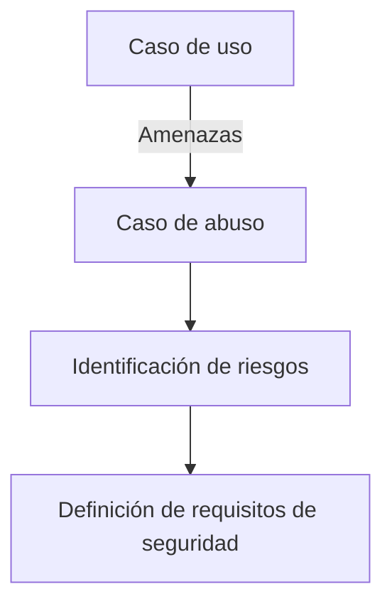

# Notas De Estudio: Ciclo De Vida De Desarrollo Seguro De Software (SSDLC)

---

## 1. Concepto General

### Definición: SSDLC (Secure Software Development Life Cycle)

El **Ciclo de Vida de Desarrollo Seguro de Software (SSDLC)** es una extensión del ciclo de vida tradicional del desarrollo de software (SDLC), en el cual se integran **actividades de seguridad** en cada una de las fases del proceso.  
Su objetivo es **prevenir vulnerabilidades** desde las etapas iniciales del proyecto y garantizar la **protección de los activos** de la organización.

**Características clave:**

- Integra seguridad desde la fase de requisitos hasta la de producción.
    
- Require colaboración entre equipos de desarrollo, seguridad y operaciones.
    
- Es un proceso **iterativo y cíclico**, ajustable a cada proyecto.

  ![[Pasted image 20251111163825.png]]

---

## 2. Fases Del SSDLC Según El Modelo De Karim Matgrau

|Fase|Actividades principales|Enfoque de seguridad|
|---|---|---|
|**1. Necesidades y diseño**|Identificación de requisitos funcionales y de seguridad.|Modelado de amenazas, análisis de riesgos, definición de requisitos de seguridad.|
|**2. Arquitectura y configuración**|Diseño de la arquitectura de seguridad.|Implementación de configuraciones seguras y medidas de protección.|
|**3. Implementación**|Desarrollo del código fuente.|Codificación segura, revisiones estáticas de seguridad del código.|
|**4. Pruebas y despliegue**|Ejecución de pruebas funcionales y de seguridad.|Casos de prueba basados en riesgos y amenazas, pruebas de penetración.|
|**5. Producción y operación**|Monitoreo continuo y gestión de incidentes.|Auditoría, parches, recuperación ante fallos, operación segura 24/7.|

---

## 3. Actividades De Seguridad Detalladas

### 3.1 Modelado De Amenazas Y Casos De Abuso

**Objetivo:** Identificar las amenazas potenciales que pueden afectar una aplicación en sus diferentes capas.

**Capas a analizar:**

- Presentación (cliente)
    
- Lógica de negocio
    
- Persistencia o datos
    
- Comunicación entre capas

**Herramientas recomendadas:**

- _Microsoft Threat Modeling Tool (Z Tool 2021)_

**Conceptos relacionados:**

- **Caso de uso:** Comportamiento legítimo del sistema.
    
- **Caso de abuso:** Representa un uso indebido o ataque possible contra un caso de uso legítimo.

**Relación entre ambos:**

---

### 3.2 Análisis De Riesgos

**Definición:** Proceso de identificar y evaluar los riesgos que afectan a los activos de la organización, no solo la aplicación.

**Pasos principales:**

1. Identificación de activos.
    
2. Evaluación de amenazas y vulnerabilidades.
    
3. Estimación del impacto.
    
4. Priorización de riesgos.

El resultado es un **conjunto de riesgos priorizados**, base para definir los **requisitos de seguridad**.

---

### 3.3 Derivación De Requisitos De Seguridad

A partir del modelado de amenazas y el análisis de riesgos se establecen los **requisitos de seguridad** específicos de la aplicación.  
Estos se implementan mediante:

- Configuraciones de seguridad.
    
- Medidas técnicas y organizativas.
    
- Arquitectura de seguridad definida.

---

### 3.4 Implementación Y Revisión De Código

**Objetivo:** Asegurar que el código fuente esté libre de vulnerabilidades comunes (como inyecciones, fugas de información, etc.).

**Prácticas recomendadas:**

- **Codificación segura.**
    
- **Análisis estático del código fuente** con herramientas automáticas.
    
- **Revisión manual o por pares** enfocada en la seguridad.

El **análisis estático** detecta vulnerabilidades sin ejecutar el programa.

---

### 3.5 Pruebas Y Despliegue

**Tipos de pruebas de seguridad:**

|Tipo|Descripción|Herramienta o enfoque|
|---|---|---|
|**Pruebas funcionales de seguridad**|Casos de prueba diseñados según amenazas y riesgos.|Manuales o automatizadas.|
|**Pruebas de penetración (Pentesting)**|Simulación de ataques reales.|Herramientas de caja negra y caja blanca.|
|**Análisis dinámico**|Pruebas durante la ejecución del sistema.|DAST, escáneres de vulnerabilidades.|

---

### 3.6 Operaciones De Seguridad Y Monitoreo

Durante la fase de producción se implementan controles continuous de seguridad:

- **Gestión de incidentes.**
    
- **Plan de recuperación ante desastres.**
    
- **Monitoreo continuo y auditorías 24/7.**
    
- **Implementación de Firewalls de Aplicaciones Web (WAF).**

Estas operaciones aseguran la **resiliencia del sistema** y permiten una **respuesta rápida ante incidentes**.

---

## 4. Herramientas Y Técnicas Relevantes

|Etapa|Herramientas / Técnicas|Propósito|
|---|---|---|
|Modelado de amenazas|Microsoft Threat Modeling Tool|Identificar amenazas en capas.|
|Revisión de código|SonarQube, Fortify, Checkmarx|Detección de vulnerabilidades.|
|Pruebas dinámicas|OWASP ZAP, Burp Suite|Detección de vulnerabilidades en ejecución.|
|Monitoreo|SIEM, WAF|Supervisión continua y detección de incidentes.|

---

## 5. Importancia De la Formación Del Desarrollador

La prevención de vulnerabilidades depende en gran parte de que los **desarrolladores estén formados en prácticas seguras** de codificación.  
Esto reduce la aparición de fallos críticos y mejora la calidad del software desde su origen.

---

## 6. Revisión Externa

Al finalizar el ciclo, se recomienda realizar una **revisión externa** o auditoría independiente para:

- Validar la eficacia de las medidas implementadas.
    
- Obtener una segunda opinión sobre el nivel real de seguridad.

---

## 7. Resumen De Puntos Clave

- El SSDLC integra la **seguridad en cada fase** del desarrollo.
    
- El **modelado de amenazas** y el **análisis de riesgos** son la base para definir los requisitos de seguridad.
    
- La **implementación segura** y la **revisión del código** previenen vulnerabilidades.
    
- Las **pruebas de seguridad** (funcionales, de penetración, estáticas y dinámicas) validan la robustez del sistema.
    
- La **operación continua y la monitorización** garantizan la protección constante en producción.
    
- La **formación del personal** y la **revisión externa** fortalecen el proceso de seguridad global.

---

## MicroTest

1. ¿En qué fase se debe realizar un test de penetración a una app web?
    
    - **La respuesta:** c. Pruebas.
        
    - **Justificación:** El test de penetración forma parte de la **fase de pruebas y despliegue** del SSDLC, donde se evalúa la seguridad del sistema antes de su paso a producción. En esta etapa se ejecutan pruebas funcionales y de penetración (de caja negra o blanca) para detectar vulnerabilidades que no fueron identificadas en fases previas.

---

1. La derivación de requisitos de seguridad depende de:
    
    - **La respuesta:** d. Las opciones A y B.
        
    - **Justificación:** Los **requisitos de seguridad** se derivan a partir del **modelado de amenazas o casos de abuso** y del **análisis de riesgos**. Estas dos actividades previas permiten identificar las amenazas potenciales y evaluar su impacto, lo que define las medidas de seguridad que deben implementarse.

---

1. Antes del test de penetración, ¿qué actividades de seguridad hay que llevar a cabo?
    
    - **La respuesta:** d. Todas las opciones anteriores son correctas.
        
    - **Justificación:** Antes de realizar un test de penetración se deben haber completado la **derivación de requisitos de seguridad**, el **modelado de amenazas** y el **análisis de seguridad del código fuente**. Estas actividades garantizan que el sistema esté preparado y que las pruebas de penetración se enfoquen en los riesgos y vulnerabilidades más relevantes.