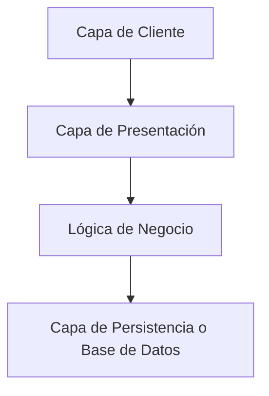
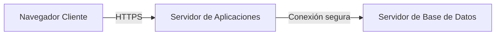

# Notas De Estudio: Arquitecturas De Las Aplicaciones Web Clásicas

---

## 1. Introducción

Una **arquitectura de aplicación web clásica o tradicional** se refiere a la estructura lógica y física que organiza los components principales de una aplicación web.  
Estas arquitecturas se clasifican principalmente según:

- **El número de máquinas físicas** utilizadas (1, 2 o 3 capas físicas).
    
- **El número de capas lógicas** involucradas (cliente, presentación, negocio, persistencia).

Su objetivo es **organizar y distribuir responsabilidades** para lograr eficiencia, escalabilidad y seguridad en las aplicaciones web.

---

## 2. Tipos De Aplicaciones Web

Existen diversos tipos de arquitecturas según la tecnología y la forma de distribución de components.

|Tipo de Aplicación|Descripción|Tecnologías asociadas|Características clave|
|---|---|---|---|
|**Clásica o tradicional (n-tier)**|Basada en múltiples capas (cliente, presentación, lógica, datos).|HTML, HTTP, SQL, servidores web.|Separación clara entre capas, comunicación cliente-servidor.|
|**Ricas de Internet (RIA)**|Usan tecnologías dinámicas en el cliente.|Ajax, JavaScript, XML, HTML5.|Parte de la lógica se ejecuta en el cliente, interfaz más interactiva.|
|**Servicios web (Web Services)**|Arquitectura orientada a servicios (SOA).|SOAP, REST, CORBA, Java RMI.|Permite aplicaciones distribuidas: cliente consume servicios remotos.|
|**Aplicaciones móviles**|Pueden incluir lado servidor web.|Swift (iOS), Kotlin/Java (Android), HTML5.|Pueden set nativas, web o híbridas; las híbridas combinan navegador y acceso local.|

---

## 3. Capas Lógicas De Una Aplicación Web Clásica

Una arquitectura tradicional suele dividirse en **cuatro capas principales**:

|Capa|Función|Ejemplo|
|---|---|---|
|**Cliente**|Interfaz de usuario; se ejecuta en un navegador web.|Google Chrome, Firefox, Edge.|
|**Presentación**|Genera las vistas y gestiona la interacción entre usuario y negocio.|Servlets, JSP, PHP, frameworks MVC.|
|**Lógica de negocio**|Procesa las reglas de la aplicación.|Controladores, servicios, lógica de aplicación.|
|**Persistencia (Base de datos)**|Almacena y gestiona los datos.|MySQL, PostgreSQL, Oracle DB.|

**Ejemplo:**  
Un usuario accede desde el navegador (cliente) → solicita un recurso al servidor de aplicaciones (presentación y negocio) → el servidor consulta la base de datos (persistencia) y devuelve la información procesada.

---

## 4. Arquitectura Física Y Seguridad

Una arquitectura web clásica normalmente se despliega en **tres máquinas físicas**:

Entre ellas, suele colocarse un **firewall de aplicaciones web (WAF)** para proteger la comunicación y filtrar ataques.

### Controles De Seguridad Recomendados

|Nivel|Medida de Seguridad|Descripción|
|---|---|---|
|**Cliente (navegador)**|Configuración segura, TLS/HTTPS|Proteger las conexiones y la sesión del usuario.|
|**Servidor de aplicación**|Autenticación multifactor, gestión de sesión segura|Evitar accesos no autorizados y secuestro de sesiones.|
|**Base de datos**|Control de acceso, cifrado de datos|Garantizar la confidencialidad y cumplir con leyes de protección de datos.|
|**Red**|Firewall de aplicaciones web (WAF)|Monitorear y bloquear tráfico malicioso.|

---

## 5. Seguridad En El Acceso Y la Autenticación

El proceso de acceso seguro implica:

1. **Autenticación del usuario**:
    
    - Verificación de identidad mediante credenciales o factores múltiples (contraseña, token, biometría).
        
2. **Gestión de sesión**:
    
    - Una vez autenticado, el usuario recibe un **ID de sesión**.
        
    - Este ID debe manejarse de forma segura (cookies protegidas, expiración, renovación).
        
3. **Autorización**:
    
    - Se valida que el usuario autenticado tenga permisos para acceder a un recurso específico (por ejemplo, una columna de una tabla).
        
4. **Confidencialidad y cumplimiento legal**:
    
    - Los datos deben almacenarse y transmitirse cifrados.
        
    - Cumplimiento con leyes de protección de datos (como LFPDPPP o GDPR).

---

## 6. Aplicaciones Móviles Como Extensión Web

Las aplicaciones móviles también pueden considerarse **arquitecturas web** cuando incluyen un lado servidor.

|Tipo|Descripción|Acceso a hardware|
|---|---|---|
|**Nativa**|Desarrollada en el lenguaje del sistema operativo (Swift, Kotlin).|Acceso total.|
|**Basada en navegador**|Ejecutada en un navegador móvil (HTML5, CSS, JS).|Acceso restringido.|
|**Híbrida**|Combinación de web y nativa; incluye un componente navegador con acceso a hardware.|Acceso casi total.|

**Todas las variantes utilizan el protocolo HTTP/HTTPS**, por lo que comparten los mismos **riesgos y medidas de seguridad** que las aplicaciones web tradicionales.

---

## 7. Arquitecturas Ricas De Internet (RIA)

En las **RIA (Rich Internet Applications)**, parte de la capa de presentación se genera y ejecuta **en el cliente**.  
La tecnología principal es **Ajax**, que permite comunicación asíncrona con el servidor sin recargar la página completa.

**Ventajas:**

- Mejora la experiencia del usuario.
    
- Reduce la carga del servidor.
    
- Comunicación más dinámica entre cliente y servidor.

**Diferencia clave con la arquitectura clásica:**  
En la clásica, la presentación se genera en el **servidor**, mientras que en la RIA se genera en el **navegador**.

---

## 8. Resumen De Puntos Clave

- La **arquitectura web clásica** está compuesta por cuatro capas lógicas: cliente, presentación, negocio y datos.
    
- Físicamente puede desplegarse en **tres máquinas** conectadas por protocolos seguros.
    
- Las **arquitecturas RIA** trasladan parte de la lógica al cliente mediante Ajax.
    
- Las **aplicaciones móviles** (nativas, web o híbridas) siguen principios similares de seguridad.
    
- Las medidas de **autenticación, autorización, cifrado y firewall** son esenciales en cualquier tipo de arquitectura.
    
- Cumplir con la **legislación de protección de datos** es obligatorio para el tratamiento seguro de la información.

---

## MicroTest

1. Los web services son un tipo de arquitectura:
    
    - **La respuesta:** c. SOA.
        
    - **Justificación:** Los **web services** pertenecen a la **arquitectura orientada a servicios (SOA)**, donde los components actúan como **proveedores y consumidores de servicios** distribuidos. Su objetivo es permitir la comunicación entre aplicaciones a través de protocolos estándar como HTTP, SOAP o REST.

---

1. ¿Qué tipo de aplicaciones móviles tienen más limitado el acceso a los dispositivos físicos del móvil?
    
    - **La respuesta:** b. Basadas en navegador.
        
    - **Justificación:** Las **aplicaciones basadas en navegador** se ejecutan dentro del navegador web del dispositivo (por ejemplo, en HTML5 y JavaScript) y, por tanto, **tienen acceso restringido al hardware** del móvil, a diferencia de las **nativas** o **híbridas**, que pueden interactuar directamente con components como la cámara o el micrófono.

---

1. En la arquitectura clásica de aplicaciones web, ¿Dónde se genera la capa de presentación?
    
    - **La respuesta:** c. Servidor de aplicaciones.
        
    - **Justificación:** En una **arquitectura clásica**, la **capa de presentación** (las vistas que el usuario ve en el navegador) se genera en el **servidor de aplicaciones**, que procesa las solicitudes del cliente, aplica la lógica de negocio y devuelve las páginas renderizadas al navegador. En cambio, en arquitecturas RIA, la presentación se genera en el cliente.

<iframe title="Arquitectura de una aplicación web" src="https://www.youtube.com/embed/5rBlxXHOJh4?feature=oembed" height="113" width="200" allowfullscreen="" allow="fullscreen" style="aspect-ratio: 1.76991 / 1; width: 100%; height: 100%;"></iframe>

