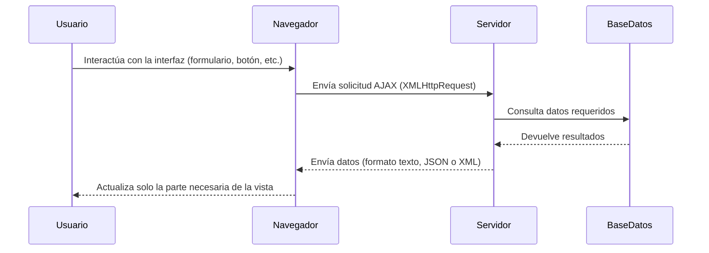
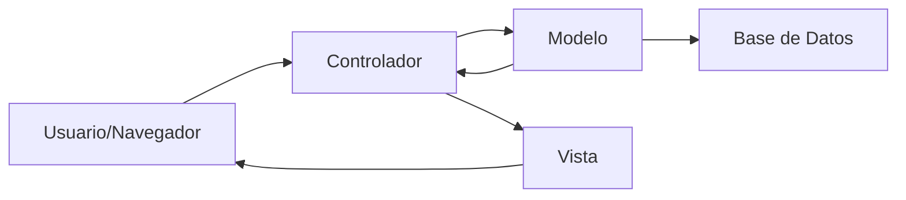

# Notas De Estudio: Arquitecturas De Aplicaciones Web Con Tecnología AJAX

---

## 1. Introducción a la Arquitectura AJAX

**AJAX (Asynchronous JavaScript and XML)** es una tecnología que permite construir aplicaciones web más interactivas y rápidas. Su objetivo principal es mejorar la **experiencia del usuario** al actualizar solo partes de una página web sin recargarla completamente.

**Características principales:**

- Utilize **JavaScript** para la lógica del cliente.
    
- Se comunica de forma asíncrona con el servidor mediante el objeto **XMLHttpRequest**.
    
- Permite obtener datos desde la capa de persistencia sin recargar toda la página.
    
- Mejora la velocidad y la fluidez de las vistas generadas en el navegador.

---

## 2. Diferencias Entre Arquitectura Clásica Y Arquitectura AJAX

|Característica|Arquitectura Clásica|Arquitectura AJAX / RIA (Rich Internet Applications)|
|---|---|---|
|**Generación de la capa de presentación**|En el **servidor de aplicaciones**.|En el **navegador del cliente**.|
|**Tecnologías principales**|HTML, CSS, JavaScript (servidor).|HTML, CSS, JavaScript, AJAX (cliente).|
|**Actualización de la página**|Require recargar toda la página.|Solo actualiza partes específicas.|
|**Velocidad de interacción**|Más lenta, dependiente del servidor.|Más rápida y fluida para el usuario.|
|**Comunicación con el servidor**|Solicitudes completas por HTTP.|Llamadas asíncronas mediante XMLHttpRequest.|
|**Ejemplos de frameworks modernos**|JSP, ASP.NET Clásico, PHP.|Angular, React, Vue.|

---

## 3. Flujo De Funcionamiento De Una Aplicación AJAX

El flujo general del funcionamiento de una aplicación web con AJAX es el siguiente:

**Explicación paso a paso:**

1. El usuario realiza una acción (por ejemplo, enviar un formulario).
    
2. El navegador traduce esta acción en una llamada **JavaScript** que utilize el objeto `XMLHttpRequest`.
    
3. El servidor recibe la solicitud, obtiene los datos necesarios (por ejemplo, desde la base de datos) y responde.
    
4. El navegador procesa la respuesta y **actualiza dinámicamente** la vista sin recargar toda la página.

---

## 4. El Objeto XMLHttpRequest

El método **XMLHttpRequest** es clave en AJAX. Permite encapsular los métodos del protocolo HTTP:

- **POST:** Enviar datos al servidor (más seguro y común).
    
- **GET, PUT, DELETE, TRACE:** Métodos que pueden set bloqueados por razones de seguridad.

**Seguridad recomendada:**

- Utilizar **solo el método POST**.
    
- **Prohibir los demás métodos** en aplicaciones sensibles.

---

## 5. Paradigma De Diseño: MVC (Model-View-Controller)

El **MVC** es un patrón de diseño utilizado para estructurar el código fuente de las aplicaciones web, separando responsabilidades.

|Componente|Función|Ejemplo|
|---|---|---|
|**Modelo (Model)**|Gestiona los datos y la lógica de negocio.|Acceso a base de datos, validación de datos.|
|**Vista (View)**|Presenta la información al usuario.|Páginas HTML, plantillas renderizadas.|
|**Controlador (Controller)**|Recibe solicitudes del usuario y coordina entre modelo y vista.|Archivos que gestionan las peticiones HTTP.|

**En AJAX:**

- El **controlador** recibe peticiones asíncronas desde el cliente.
    
- El **modelo** obtiene los datos.
    
- La **vista** se compone dinámicamente en el navegador usando JavaScript.

---

## 6. Seguridad En Aplicaciones AJAX

Las aplicaciones AJAX presentan **nuevos retos de seguridad** debido a su estructura distribuida y su dependencia del cliente.

**Buenas prácticas de seguridad:**

- **Validar todas las entradas** de formularios antes de procesarlas.
    
- Prevenir vulnerabilidades comunes del estándar **OWASP Top 10 (2021)** como:
    
    - Inyección de código (SQL, XSS).
        
    - Pérdida de control de acceso.
        
    - Exposición de datos sensibles.
        
- Implementar controles en **servidor**, no solo en el cliente.

---

## 7. Resumen De Puntos Clave

- AJAX permite construir aplicaciones más rápidas e interactivas mediante llamadas asíncronas.
    
- La **capa de presentación** se genera en el **lado del cliente**, no en el servidor.
    
- El **objeto XMLHttpRequest** encapsula métodos HTTP, siendo **POST** el más recomendado.
    
- El patrón **MVC** organiza el código en modelo, vista y controlador, separando responsabilidades.
    
- Las aplicaciones AJAX mejoran la experiencia del usuario, pero requieren **estrategias de seguridad sólidas**.

---

## **MicroTest**

1. ¿Qué método se suele usar en las arquitecturas de aplicaciones AJAX para comunicación con el servidor?
    
    - **La respuesta:** d. xmlHttpRequest().
        
    - **Justificación:** En AJAX, la comunicación entre el cliente (navegador) y el servidor se realiza mediante el objeto **XMLHttpRequest()**, que permite enviar y recibir datos de forma asíncrona sin recargar la página completa. Este método encapsula las peticiones HTTP (como GET o POST) para intercambiar información entre ambos extremos.

---

1. ¿Qué tecnologías usa la arquitectura de aplicaciones AJAX?
    
    - **La respuesta:** d. Todas las anteriores son correctas.
        
    - **Justificación:** La arquitectura AJAX combina varias tecnologías: **HTML** para la estructura de la página, **JavaScript** para la lógica y manejo dinámico de datos, y **XML** (u otros formatos como JSON) para el intercambio de información con el servidor. La integración de estas tecnologías permite crear aplicaciones web interactivas y dinámicas.

---

1. En la arquitectura RIA de aplicaciones web, ¿dónde se genera la capa de presentación?
    
    - **La respuesta:** a. Navegador.
        
    - **Justificación:** En las **RIAs (Rich Internet Applications)**, la capa de presentación se genera en el **lado del cliente**, es decir, en el **navegador**. A diferencia de la arquitectura clásica, donde el servidor produce la vista, en RIA la lógica y renderización se realizan en el cliente usando frameworks como **Angular, React o Vue**, mejorando la velocidad y experiencia del usuario.