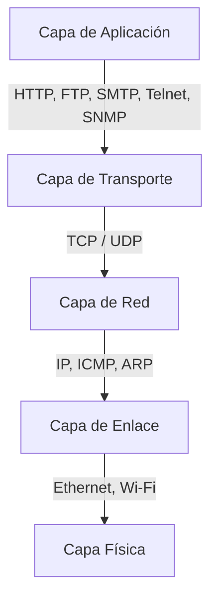

# Protocolo HTTP (HyperText Transfer Protocol)

## 1. Introducción Al Protocolo HTTP

HTTP es un **protocolo de la capa de aplicación** utilizado principalmente para la comunicación entre **clientes web (navegadores)** y **servidores web**. Permite solicitar y transferir recursos como páginas HTML, imágenes, archivos JSON, XML, entre otros.

### Relevancia

- Es la base de la **World Wide Web**.
    
- Define cómo se formulan las **peticiones** y **respuestas** entre cliente y servidor.
    
- Funciona sobre otros protocolos que garantizan el transporte de datos.

---

## 2. HTTP Dentro Del Modelo De Capas

HTTP se apoya en una pila de protocolos organizada por capas, con correspondencia aproximada entre el modelo TCP/IP y el modelo OSI.

### Jerarquía De Protocolos



### Descripción Por Capas

- **Capa de Aplicación**: HTTP, FTP, SMTP, Telnet, SNMP.
    
- **Capa de Transporte**:
    
    - TCP: Orientado a conexión.
        
    - UDP: No orientado a conexión.
        
- **Capa de Red**: IP, ARP.
    
- **Capa de Enlace**: Comunicación en redes locales.
    
- **Capa Física**: Transmisión física de bits.

---

## 3. Códigos De Estado HTTP

Los códigos de estado indican el resultado de una petición HTTP. Se agrupan por categorías.

### Clasificación De Códigos

|Categoría|Rango|Significado general|
|---|---|---|
|2xx|Éxito|Petición procesada correctamente|
|3xx|Redirección|El recurso se encuentra en otra ubicación|
|4xx|Error del cliente|Problemas en la petición|
|5xx|Error del servidor|Fallos internos del servidor|

### Códigos Más Relevantes

|Código|Nombre|Explicación|
|---|---|---|
|200|OK|Petición correcta|
|301 / 302|Redirection|Redirección, común en proxys|
|400|Bad Request|Petición malformada|
|401|Unauthorized|Faltan credenciales de autenticación|
|403|Forbidden|No autorizado a acceder al recurso|
|404|Not Found|Recurso no encontrado|
|500|Internal Server Error|Error interno del servidor|
|502|Bad Gateway|Problemas de red o proxy|
|503|Service Unavailable|Servicio no disponible|

### Nota De Seguridad

Los errores **500** en algunos casos pueden revelar:

- Fallos de configuración.
    
- Posibles vulnerabilidades (inyección SQL, errores de autorización).

---

## 4. Estructura De Un Mensaje HTTP

Un mensaje HTTP se compone de varias partes bien definidas.

### Components Principales

1. **Línea inicial**
    
    - Petición: Método + URL + versión HTTP.
        
    - Respuesta: Versión HTTP + código de estado + mensaje.
        
2. **Cabeceras (Headers)**
    
3. **Separador**: Dos saltos de línea (CRLF CRLF).
    
4. **Cuerpo del mensaje (Body)**

### Ejemplo Conceptual

```Python
GET /index.html HTTP/1.1
Host: ejemplo.com
Content-Type: text/html
Content-Length: 45

<html>...</html>
```

### Cabeceras Comunes

- **Content-Type**: Tipo de contenido (HTML, JSON, XML).
    
- **Content-Length**: Tamaño del cuerpo.
    
- **Cache-Control**: Control de caché.
    
- **Authorization**: Autenticación.
    
- **Content-Security-Policy**: Seguridad.
    
- **X-Frame-Options**: Protección contra clickjacking.

---

## 5. Versiones Del Protocolo HTTP

- **HTTP/1.0**
    
- **HTTP/1.1**
    
- **HTTP/2.0**

Cada versión mejora rendimiento, manejo de conexiones y eficiencia.

---

## 6. Métodos Principales De HTTP

### 6.1 GET

**Definición**: Solicita la representación de un recurso.

**Características**:

- Los parámetros viajan en la URL.
    
- Usa `?` y `&` para concatenar parámetros.

**Ejemplo**:

```Python
/pagina?page=main&lang=es
```

**Riesgos**:

- Exposición de información sensible.
    
- Parámetros visible en historial y logs.
    
- Facilita ataques de Cross-Site Scripting (XSS).

---

### 6.2 HEAD

**Definición**: Similar a GET, pero **solo devuelve cabeceras**, no el cuerpo.

**Uso**:

- Verificar existencia de recursos.
    
- Comprobar cabeceras del servidor.

**Recomendación**:

- No habilitarlo si no es necesario.

---

### 6.3 POST

**Definición**: Envía datos al servidor en el **cuerpo de la petición**.

**Ventajas**:

- Mayor seguridad que GET.
    
- Parámetros no visible en la URL.

**Uso recomendado**:

- Formularios.
    
- Envío de datos sensibles.

---

### 6.4 PUT

**Definición**: Carga o reemplaza un recurso en el servidor.

**Nota**:

- POST también puede cargar recursos.
    
- PUT require mayor control de seguridad.

---

### 6.5 TRACE

**Definición**: Método de diagnóstico.

**Riesgo**:

- Vulnerabilidad **Cross-Site Tracing (XST)**.
    
- Refleja cabeceras en el cuerpo de la respuesta.

**Recomendación**:

- Deshabilitar en servidores.

---

### 6.6 OPTIONS

**Definición**: Indica qué métodos HTTP soporta un servidor.

**Riesgo**:

- Facilita reconocimiento del servidor por atacantes.

**Recomendación**:

- Limitar o deshabilitar.

---

### 6.7 CONNECT

**Definición**: Permite crear túneles a través de proxys.

**Ejemplo de uso malicioso**:

- Acceso a servicios internos detrás de un proxy.
    
- Uso con herramientas como Netcat.

**Recomendación**:

- No habilitar en servidores de aplicaciones.

---

## 7. Consideraciones De Seguridad En HTTP

- Evitar el uso de **GET** para datos sensibles.
    
- Usar **POST** para envío de información.
    
- Deshabilitar métodos innecesarios: TRACE, OPTIONS, CONNECT.
    
- Revisar códigos 500 como posibles indicadores de vulnerabilidad.
    
- Implementar cabeceras de seguridad.

---

## 8. Resumen De Puntos Clave

- HTTP es un protocolo de **capa de aplicación**.
    
- Funciona sobre TCP/IP.
    
- Usa códigos de estado para indicar resultados.
    
- Los mensajes HTTP tienen línea inicial, cabeceras y cuerpo.
    
- GET es inseguro para datos sensibles.
    
- POST es el método recomendado para envío de información.
    
- Métodos como TRACE, OPTIONS y CONNECT representan riesgos.
    
- Una correcta configuración reduce vulnerabilidades.

---

## MicroTest

1. ¿Qué método HTTP permite conectarse a un servicio situado detrás de un proxy?
    
    - La respuesta: d. CONNECT.
        
    - Justificación: El método CONNECT se utilize para crear un túnel a través de un proxy, permitiendo al cliente conectarse a un servicio que se encuentra detrás de dicho proxy, como servidores internos o servicios no accesibles directamente.
        
2. ¿Qué método HTTP permite obtener solo las cabeceras de la aplicación web?
    
    - La respuesta: b. HEAD.
        
    - Justificación: El método HEAD es equivalente a GET, pero el servidor responde únicamente con las cabeceras HTTP, sin incluir el cuerpo del mensaje, lo que permite verificar metadatos del recurso.
        
3. ¿Qué método HTTP envía los parámetros en la URL?
    
    - La respuesta: a. GET.
        
    - Justificación: El método GET envía los parámetros concatenados directamente en la URL mediante el uso de `?` y `&`, lo que hace que los datos sean visible en la barra de direcciones, historial y logs del navegador.

<iframe src="https://cheatsheetseries.owasp.org/cheatsheets/HTTP_Headers_Cheat_Sheet.html" allow="fullscreen" allowfullscreen="" style="height:100%;width:100%; aspect-ratio: 16 / 9; "></iframe>

