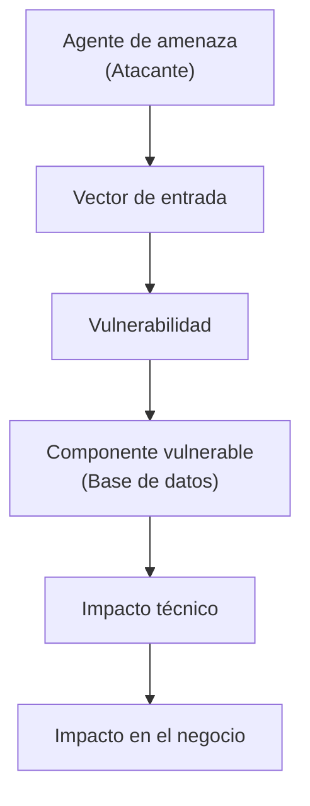

# Seguridad En Aplicaciones Web

## Introducción Al Tema 4

---

## 1. Objetivos De la Seguridad En Aplicaciones Web

La seguridad en aplicaciones web tiene como objetivo principal **proteger la información, los recursos y el negocio** frente a accesos no autorizados, ataques y usos indebidos.

Estos objetivos se articulan a través de distintas **dimensions de seguridad**, que trabajan de forma conjunta.

---

## 2. Dimensions De la Seguridad

### 2.1 Identificación

**Definición**: Proceso mediante el cual un usuario declara quién es dentro del sistema.  
**Ejemplo**: Introducir un nombre de usuario o correo electrónico.

**Relevancia**:  
Es el primer paso de la seguridad; sin identificación no se puede aplicar ningún control posterior.

---

### 2.2 Autenticación

**Definición**: Verificación de que el usuario es realmente quien dice set.

**Características clave**:

- Puede basarse en uno o varios factores.
    
- Se recomienda el uso de **autenticación multifactor (MFA)**.

**Factores de autenticación**:

- Algo que sabes: contraseña.
    
- Algo que tienes: token, teléfono.
    
- Algo que eres: biometría.

---

### 2.3 Autorización

**Definición**: Controla a qué recursos puede acceder un usuario una vez autenticado.

**Concepto clave: Rol**

- Cada usuario tiene un rol.
    
- El rol determina los permisos y recursos accesibles.

**Ejemplo**:

- Usuario administrador: acceso total.
    
- Usuario estándar: acceso limitado.

---

### 2.4 Confidencialidad

**Definición**: Protección de los recursos críticos para que no sean visible por usuarios no autorizados.

**Mecanismo principal**:

- **Cifrado** de la información.

**Tipos de cifrado**:

- Cifrado simétrico.
    
- Cifrado asimétrico.

**Relevancia**:  
Evita la exposición de información sensible del negocio.

---

### 2.5 Integridad

**Definición**: Garantiza que los datos no sean modificados por usuarios que no tengan permisos para ello.

**Ejemplo**:  
Un usuario no autorizado no debe poder alterar registros de una base de datos.

---

### 2.6 No Repudio

**Definición**: Impide que un usuario niegue haber realizado una acción.

**Ejemplo**:  
Un usuario no puede afirmar que no realizó una operación si el sistema tiene evidencia de ello.

**Mecanismo asociado**:

- **Firma digital avanzada**.

---

### 2.7 Trazabilidad

**Definición**: Capacidad de determinar:

- Quién realizó una acción.
    
- Cuándo la realizó.
    
- Sobre qué recurso.

**Implementación**:

- Monitorización continua (24x7).
    
- Registro de eventos (logs).

**Relevancia**:  
Es fundamental para auditorías, detección de incidentes y análisis forense.

---

## 3. Ciclo De Explotación De Una Vulnerabilidad

### 3.1 Elementos Del Ciclo

Una vulnerabilidad se explota siguiendo una secuencia lógica:

---

### 3.2 Ejemplo: Inyección SQL

#### Paso a Paso

1. **Agente de amenaza**: Un atacante.
    
2. **Vector de entrada**: Campo de un formulario web.
    
3. **Vulnerabilidad**: Falta de validación de datos de entrada.
    
4. **Ataque**: Inyección de código SQL.
    
5. **Componente afectado**: Motor de base de datos.
    
6. **Consecuencias**:
    
    - Extracción de información.
        
    - Modificación de datos.
        
    - Eliminación de registros.
        
7. **Impacto**:
    
    - Impacto técnico.
        
    - Impacto directo en el negocio.

---

## 4. Seguridad En El Ciclo De Vida Del Desarrollo

### 4.1 Importancia Del Diseño Seguro

La ciberseguridad debe incorporarse **desde la fase de diseño** del sistema de información.

**Razones**:

- Detectar vulnerabilidades antes de la puesta en producción.
    
- Reducir riesgos estructurales.

---

### 4.2 Coste De Implementar Seguridad Tarde

Implementar seguridad en producción es mucho más costoso.

|Fase|Coste aproximado|
|---|---|
|Diseño y desarrollo|Bajo|
|Producción|Hasta un 60% más alto|

**Conclusión**:  
La seguridad por diseño reduce costes y riesgos.

---

## 5. Impacto Técnico Vs Impacto En El Negocio

|Tipo de impacto|Descripción|
|---|---|
|Impacto técnico|Pérdida de datos, fallos del sistema, corrupción de información|
|Impacto en el negocio|Daño reputacional, pérdidas económicas, sanciones legales|

---

## 6. Resumen De Puntos Clave

- La seguridad web se basa en varias dimensions: identificación, autenticación, autorización, confidencialidad, integridad, no repudio y trazabilidad.
    
- El uso de roles controla el acceso a los recursos.
    
- El cifrado protege información crítica.
    
- La firma digital garantiza integridad y no repudio.
    
- La trazabilidad se logra mediante monitorización y registros.
    
- Las vulnerabilidades siguen un ciclo de explotación claro.
    
- La inyección SQL es un ejemplo clásico de ataque.
    
- La seguridad debe integrarse desde el diseño para reducir costes y riesgos.

---

## MicroTest