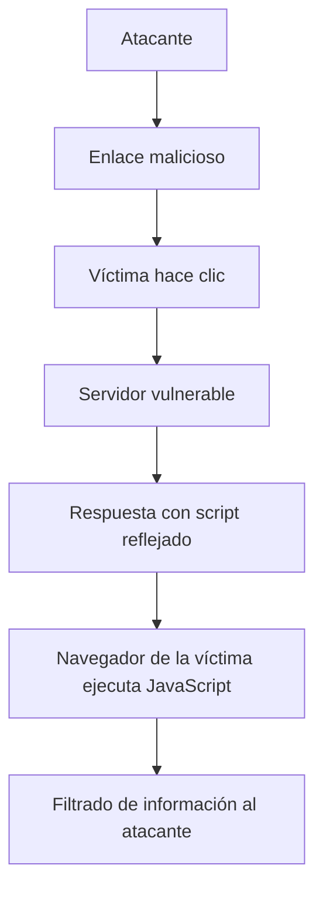
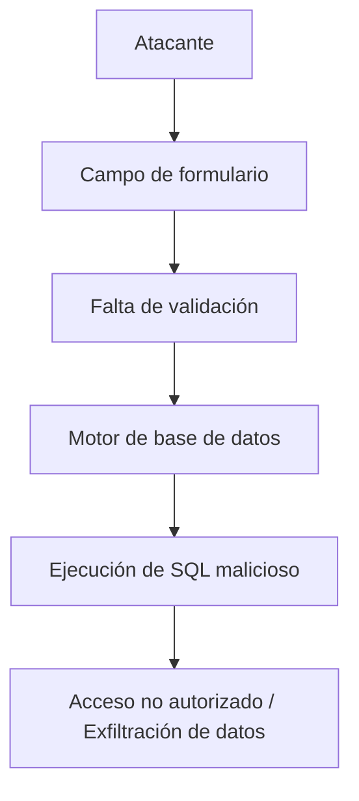

# Vulnerabilidades OWASP Top Ten 2021

## XSS (Cross-Site Scripting) Y SQL Injection (SQLi)

---

## 1. OWASP Top Ten 2021

OWASP Top Ten es un proyecto que identifica las **principales vulnerabilidades de seguridad en aplicaciones web** más frecuentes y críticas.

**Relevancia**:

- Sirve como referencia para desarrolladores y equipos de seguridad.
    
- Ayuda a priorizar riesgos y controles de seguridad.

En esta sesión se analizan dos vulnerabilidades:

- **XSS (Cross-Site Scripting)**
    
- **SQL Injection (SQLi)**

---

## 2. Cross-Site Scripting (XSS)

### 2.1 Definición

**XSS** es una vulnerabilidad que permite a un atacante **inyectar código JavaScript malicioso** en una aplicación web vulnerable, el cual se ejecuta en el **navegador de la víctima**.

### 2.2 Características Principales

- El ataque se ejecuta en el **lado cliente**.
    
- Aprovecha la **falta de validación de entradas y/o salidas**.
    
- El código inyectado se refleja en la respuesta del servidor.

---

### 2.3 Flujo Del Ataque XSS Reflejado



---

### 2.4 Ejemplo Práctico De XSS

#### Paso a Paso

1. El atacante construye un **enlace malicioso** con código JavaScript incrustado como parámetro.
    
2. El enlace se envía por correo a la víctima.
    
3. La víctima hace clic en el enlace.
    
4. El servidor vulnerable **no valida el parámetro de entrada**.
    
5. El código JavaScript se refleja en la respuesta.
    
6. El navegador de la víctima ejecuta el script.

---

### 2.5 Ejemplo De Exploit

- Modificación del título de la página:

    ```javascript
    document.title = 'exploit'
    ```

- Captura de cookies:

    ```javascript
    document.cookie
    ```

**Impacto**:

- Robo de cookies de sesión.
    
- Suplantación de identidad.
    
- Filtrado de información sensible.

---

### 2.6 Medidas De Mitigación XSS

- Validar entradas del usuario.
    
- Codificar la salida (output encoding).
    
- Evitar el uso de parámetros inseguros en métodos GET.
    
- Uso de cabeceras como Content-Security-Policy.

---

## 3. SQL Injection (SQLi)

### 3.1 Definición

**SQL Injection** es una vulnerabilidad que permite inyectar código SQL malicioso en una aplicación web, logrando que se ejecute directamente en el **motor de base de datos**.

### 3.2 Características Principales

- Ataque en el **lado servidor**.
    
- Afecta directamente a la base de datos.
    
- Se produce por falta de validación de entradas.

---

### 3.3 Consulta SQL Esperada

```sql
SELECT * FROM users 
WHERE user_id = 'admin' AND password = 'mypassword';
```

---

### 3.4 Ejemplo De Inyección SQL

#### Payload Malicioso

```sql
' OR 1=1 --
```

#### Consulta Resultante

```sql
SELECT * FROM users 
WHERE user_id = '' OR 1=1 --' AND password = '';
```

**Resultado**:

- La condición `1=1` siempre es verdadera.
    
- Se omite la validación de credenciales.
    
- Se **bypassea la autenticación**.

---

### 3.5 Flujo Del Ataque SQL Injection



---

### 3.6 Detección De SQL Injection

- Introducir caracteres especiales (`'`, `--`).
    
- Analizar mensajes de error del motor de base de datos.
    
- Identificar el tipo de base de datos (MySQL, SQL Server).

**Ejemplo**:

- Error de sintaxis SQL indica possible vulnerabilidad.
    
- Mensajes del motor revelan información interna.

---

### 3.7 UNION SELECT Injection

**Definición**:  
Permite concatenar resultados de otras tablas a la consulta original.

**Condiciones**:

- Mismo número de columnas.
    
- Tipos de datos compatibles.

#### Ejemplo

```sql
' UNION SELECT username, password FROM users --
```

**Resultado**:

- Obtención de usuarios y contraseñas.
    
- Acceso a tablas del sistema (`information_schema`).

---

### 3.8 Proceso Típico Del Atacante

1. Identificar número de columnas.
    
2. Probar tablas del sistema.
    
3. Enumerar tablas de la aplicación.
    
4. Extraer columnas sensibles (usuarios, contraseñas).

---

## 4. Comparativa XSS Vs SQL Injection

|Característica|XSS|SQL Injection|
|---|---|---|
|Lado del ataque|Cliente|Servidor|
|Lenguaje inyectado|JavaScript|SQL|
|Impacto principal|Navegador de la víctima|Base de datos|
|Objetivo|Robo de información|Acceso y manipulación de datos|

---

## 5. Medidas Generales De Mitigación

- Validar y sanitizar entradas.
    
- Usar consultas preparadas (prepared statements).
    
- Aplicar principio de mínimo privilegio.
    
- Desactivar mensajes de error detallados.
    
- Integrar seguridad desde el diseño.

---

## 6. Resumen De Puntos Clave

- OWASP Top Ten identifica las vulnerabilidades web más críticas.
    
- XSS ejecuta JavaScript en el navegador de la víctima.
    
- SQL Injection ejecuta SQL malicioso en la base de datos.
    
- Ambas se deben a falta de validación de entradas.
    
- XSS afecta al cliente; SQLi al servidor.
    
- UNION SELECT permite exfiltrar datos.
    
- La validación y el diseño seguro son fundamentales.

---

## MicroTest

1. ¿Cómo se previene XSS?
    
    - La respuesta: d. B y C son correctas.
        
    - Justificación: XSS se previene principalmente mediante la **codificación de la salida** para evitar que el navegador interpret código JavaScript inyectado y mediante la **validación de la entrada**, evitando que se introduzcan payloads maliciosos. Aunque las consultas parametrizadas se asocian más a SQLi, forman parte de una correcta validación de entradas.
        
2. ¿Qué vectors de entrada se pueden usar para intentar XSS?
    
    - La respuesta: d. Todas las anteriores son correctas.
        
    - Justificación: XSS puede explotarse a través de **enlaces enviados por correo**, **campos de formularios** y **cualquier enlace parametrizado**, siempre que la aplicación refleje el contenido sin validación adecuada.
        
3. ¿Cuál es un ejemplo de payload XSS?
    
    - La respuesta: a. `<script>alert("hacked")</script>`.
        
    - Justificación: Este payload inyecta código JavaScript que se ejecuta en el navegador de la víctima, lo cual es característico de un ataque XSS. Las otras opciones corresponden a inyección SQL y traversal de directorios, no a XSS.