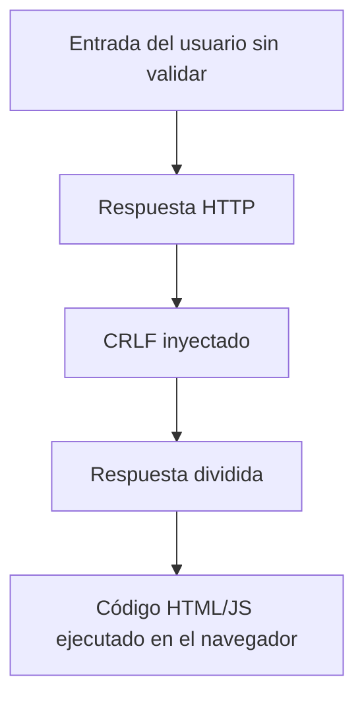
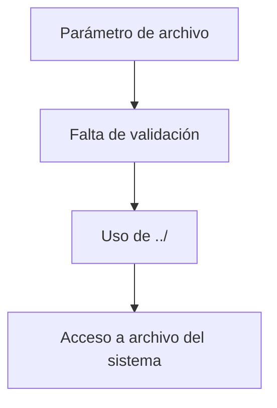

# Vulnerabilidades OWASP Top Ten 2021

## HTTP Response Splitting, LFI Y RFI

---

## 1. Introducción

Dentro del OWASP Top Ten 2021 se incluyen vulnerabilidades que afectan directamente a la **gestión de entradas y salidas** de las aplicaciones web. En esta sesión se analizan tres de ellas:

- **HTTP Response Splitting**
    
- **Local File Inclusion (LFI)**
    
- **Remote File Inclusion (RFI)**

Todas comparten un problema común: **falta de validación adecuada de los datos de entrada**.

---

## 2. HTTP Response Splitting

### 2.1 Definición

**HTTP Response Splitting** es una vulnerabilidad que permite a un atacante **dividir una respuesta HTTP en dos o más respuestas**, inyectando contenido arbitrario (HTML o JavaScript) que se ejecuta en el navegador de la víctima.

### 2.2 Objetivo Del Ataque

- Inyectar **HTML o JavaScript**.
    
- Facilitar ataques de **Cross-Site Scripting (XSS)**.
    
- Manipular cabeceras o el contenido de la respuesta HTTP.

---

### 2.3 Causa Principal

La vulnerabilidad se produce cuando:

- Los parámetros de entrada **no se validan**.
    
- Se permiten caracteres especiales como:
    
    - Retorno de carro (CR)
        
    - Nueva línea (LF)

Estos caracteres (`CRLF`) separan cabeceras y cuerpo de una respuesta HTTP.

---

### 2.4 Ejemplo Conceptual

1. El servidor recibe un parámetro sin validar.
    
2. El parámetro contiene caracteres CRLF.
    
3. El servidor genera dos respuestas HTTP:
    
    - La primera válida.
        
    - La segunda controlada por el atacante.
        
4. El navegador ejecuta el contenido inyectado.



---

### 2.5 Medidas De Mitigación

- Validar estrictamente la entrada.
    
- Escapar caracteres CR y LF.
    
- No permitir datos no confiables en cabeceras HTTP.

---

## 3. Local File Inclusion (LFI)

### 3.1 Definición

**Local File Inclusion (LFI)** es una vulnerabilidad que permite a un atacante **incluir y leer archivos locales** del servidor donde se ejecuta la aplicación web.

También se conoce como **Path Traversal**.

---

### 3.2 Objetivo Del Ataque

- Acceder a archivos sensibles del sistema operativo.
    
- Obtener información como contraseñas, configuraciones o usuarios.
    
- Escalar a otros ataques más avanzados.

---

### 3.3 Vectors De Ataque

- Parámetros GET.
    
- Campos de formularios (POST).
    
- Rutas de archivos no validadas.

---

### 3.4 Tipos De Rutas

- **Rutas absolutas**
    
- **Rutas relativas**

Ejemplo de traversal:

```Python
../../../../etc/passwd
```

---

### 3.5 Ejemplo Práctico

1. La aplicación permite indicar un archivo a cargar.
    
2. El atacante introduce `../` repetidamente.
    
3. Se accede a directorios fuera del ámbito permitido.
    
4. Se obtiene el archivo `/etc/passwd` en sistemas Linux.



---

### 3.6 Indicadores De Vulnerabilidad

- Errores al intentar acceder a archivos.
    
- Respuestas parciales del contenido del sistema.
    
- Mensajes que indican rutas internas.

---

### 3.7 Medidas De Mitigación

- Validar nombres de archivo y rutas permitidas.
    
- Restringir el acceso al sistema de archivos.
    
- Configurar correctamente permisos.
    
- Evitar que la aplicación salga de su directorio base.

---

## 4. Remote File Inclusion (RFI)

### 4.1 Definición

**Remote File Inclusion (RFI)** permite a un atacante **incrustar recursos remotos** (desde otro servidor) dentro de la aplicación web vulnerable.

---

### 4.2 Diferencia Con LFI

|Característica|LFI|RFI|
|---|---|---|
|Origen del archivo|Local|Remoto|
|Riesgo principal|Lectura de archivos|Ejecución de código externo|
|Dependencia de red|No|Sí|

---

### 4.3 Ejemplo De Ataque RFI

1. La aplicación acepta una URL como parámetro.
    
2. No se valida el origen del recurso.
    
3. El atacante proporciona una URL externa.
    
4. El servidor carga e incrusta ese contenido remoto.

Ejemplo:

```Python
http://servidor-atacante.com/malicioso.php
```

---

### 4.4 Ejemplo Práctico

- Incrustar la página principal de Google en un servidor local.
    
- Solo se integra el HTML, sin los servicios completos.
    
- Demuestra que la inclusión remota es possible.

---

### 4.5 Medidas De Mitigación

- Validar estrictamente los valores de entrada.
    
- Permitir solo recursos internos conocidos.
    
- Deshabilitar inclusión remota en la configuración del servidor.
    
- Preferir POST frente a GET para datos sensibles.

---

## 5. Comparativa General

|Vulnerabilidad|Impacto principal|Tipo de ataque|
|---|---|---|
|HTTP Response Splitting|XSS, manipulación de respuestas|Cliente|
|LFI|Acceso a archivos locales|Servidor|
|RFI|Ejecución de recursos remotos|Servidor|

---

## 6. Resumen De Puntos Clave

- HTTP Response Splitting permite dividir respuestas HTTP usando CRLF.
    
- Puede derivar en ataques XSS.
    
- LFI permite acceder a archivos locales mediante path traversal.
    
- RFI permite incluir recursos desde servidores externos.
    
- Todas se deben a falta de validación de entradas.
    
- La validación y restricción de rutas es fundamental.
    
- Un diseño seguro reduce el impacto de estas vulnerabilidades.

---

## MicroTest

1. La vulnerabilidad LFI o inclusión de ficheros…
    
    - La respuesta: d. Las opciones A y C son correctas.
        
    - Justificación: LFI permite **acceder a recursos del sistema de ficheros no permitidos**, como archivos de configuración o del sistema operativo, y como consecuencia de ello puede **facilitar el robo de credenciales** u otra información sensible almacenada en dichos ficheros.
        
2. ¿Qué vectors de entrada se pueden usar para intentar explotar LFI?
    
    - La respuesta: c. Todas las opciones son correctas.
        
    - Justificación: LFI puede explotarse mediante **parámetros en enlaces**, **campos de formularios** y **enlaces debidamente parametrizados desde cualquier ubicación**, siempre que la aplicación no valid correctamente la ruta del fichero.
        
3. ¿Cuál es un ejemplo de payload de RFI?
    
    - La respuesta: d. [http://localhost/index.php?page](http://localhost/index.php?page) = [http://google.com/](http://google.com/).
        
    - Justificación: Un ataque RFI consiste en **incluir un recurso remoto** alojado en otro servidor mediante una URL externa, lo que permite incrustar contenido remoto en la aplicación web vulnerable.