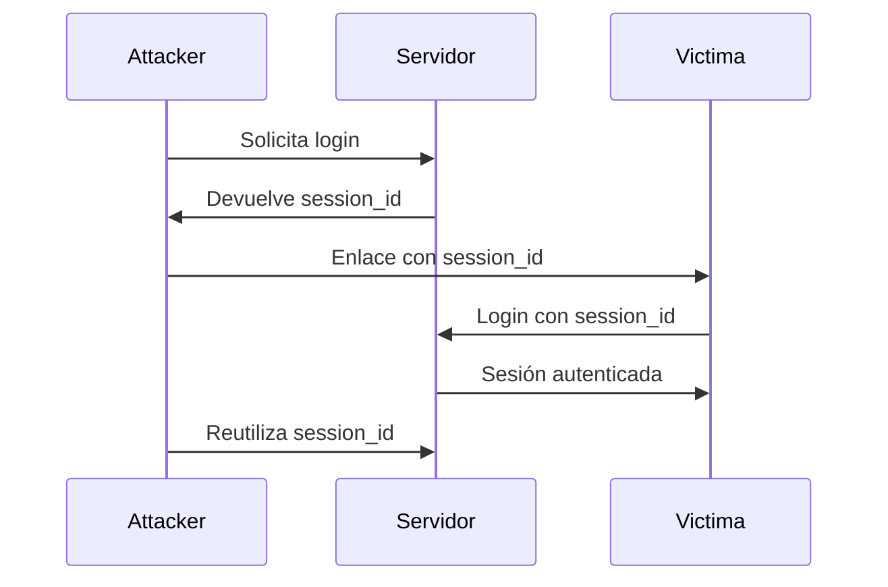
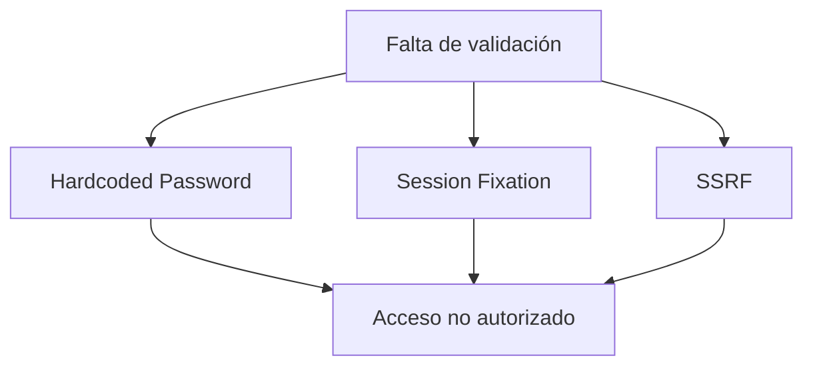

# Vulnerabilidades OWASP Top Ten 2021 – Idea Clave 3

## Introducción

En esta sesión se analizan tres vulnerabilidades incluidas en el **OWASP Top Ten 2021**, relacionadas con malas prácticas de desarrollo y gestión de sesiones:

- Hardcoded Password
    
- Session Fixation
    
- SSRF (Server-Side Request Forgery)

Estas vulnerabilidades comparten un origen común: **falta de validación, diseño inseguro y mala gestión de credenciales o sesiones**.

---

# Hardcoded Password (Contraseñas Embebidas En El código)

## Definición

La vulnerabilidad **Hardcoded Password** ocurre cuando las credenciales (usuario y contraseña) se escriben directamente en el **código fuente** de la aplicación.

## Relevancia

- Las credenciales quedan expuestas si un atacante accede al código fuente.
    
- Normalmente estas contraseñas **no se rotan con frecuencia**, aumentando el riesgo.
    
- Afecta especialmente a conexiones a bases de datos u otros servicios internos.

## Ejemplo Del Transcript

```java
username = "pp";
password = "password123";
```

## Paso a Paso Del Problema

1. El desarrollador escribe usuario y contraseña directamente en el código.
    
2. La aplicación usa esas credenciales para conectarse a una base de datos.
    
3. Un atacante obtiene el código (repositorio, backup, descompilación).
    
4. El atacante reutiliza las credenciales para acceder al sistema.

## Mitigación

- No almacenar credenciales en el código fuente.
    
- Usar:
    
    - Ficheros de configuración protegidos
        
    - Variables de entorno
        
    - Almacenamiento cifrado de secretos
        
- Aplicar permisos estrictos a los ficheros de configuración.

## Tabla Resumen

|Aspecto|Descripción|
|---|---|
|Tipo|Gestión insegura de credenciales|
|Impacto|Acceso no autorizado|
|Frecuencia|Alta en aplicaciones legacy|
|Mitigación|Externalizar y cifrar credenciales|

---

# Session Fixation (Fijación De sesión)

## Definición

La **Session Fixation** es una vulnerabilidad de gestión de sesión en la que la aplicación **asigna un identificador de sesión antes de autenticar al usuario**.

## Relevancia

Permite a un atacante **suplantar la sesión de un usuario legítimo**, incluso después de que este se haya autenticado correctamente.

## Funcionamiento Paso a Paso

1. El atacante solicita el formulario de login.
    
2. El servidor responde con un **ID de sesión válido** (antes del login).
    
3. El atacante captura ese ID de sesión.
    
4. El atacante envía a la víctima un enlace con ese `session_id`.
    
5. La víctima accede al enlace y se autentica.
    
6. El ID de sesión pasa a set **activo y autenticado**.
    
7. El atacante reutiliza ese ID para acceder como la víctima.

## Mermaid – Flujo De Session Fixation



## Causa Principal

- La aplicación **no regenera el ID de sesión tras la autenticación**.

## Mitigación

- No asignar sesión antes del login.
    
- Regenerar siempre el ID de sesión después de autenticarse.
    
- Invalidar sesiones anteriores.

---

# SSRF – Server-Side Request Forgery

## Definición

**SSRF** es una vulnerabilidad que permite a un atacante **forzar al servidor vulnerable a realizar peticiones HTTP** hacia otros servicios internos o externos.

## Relevancia

- Permite acceder a servicios internos no expuestos.
    
- Puede afectar recursos en la misma LAN o en otros dominios.
    
- El ataque se ejecuta **desde el servidor**, no desde el cliente.

## Ejemplo Típico

Un campo de formulario construye una URL:

```text
url = http://example.com?target=valor_usuario
```

Si no se valida:

```text
target = http://servicio-interno:8080
```

## Paso a Paso

1. El atacante introduce una URL maliciosa en un campo.
    
2. La aplicación no valida el valor.
    
3. El servidor realiza la petición al destino indicado.
    
4. El servidor recibe la respuesta.
    
5. La respuesta es devuelta al atacante.

## Mitigación

- Validación estricta de entrada.
    
- Uso de **listas blancas de URLs permitidas**.
    
- Bloquear IPs internas y protocolos peligrosos.
    
- Evitar que valores de formularios construyan URLs directamente.

## Tabla Resumen

|Aspecto|Descripción|
|---|---|
|Origen|Falta de validación de URLs|
|Objetivo|Servicios internos o externos|
|Riesgo|Acceso a infraestructura interna|
|Mitigación|Listas blancas y validación|

---

# Relación Entre Vulnerabilidades



---

# Buenas Prácticas Generales

- Validar siempre la entrada del usuario.
    
- Separar configuración sensible del código.
    
- Diseñar una gestión de sesiones segura.
    
- Aplicar el principio de mínimo privilegio.
    
- Auditar código y configuraciones periódicamente.

---

# Resumen De Puntos Clave

- **Hardcoded Password** expone credenciales al incluirlas en el código.
    
- **Session Fixation** permite suplantación por mala gestión del ID de sesión.
    
- **SSRF** fuerza al servidor a realizar peticiones no autorizadas.
    
- La validación de entrada es el factor crítico común.
    
- Las listas blancas y la regeneración de sesiones son medidas clave.

---

# MicroTest

1. ¿Por qué motivo se puede dar un ataque de suplantación en una aplicación web mediante fijación de sesión?
    
    - La respuesta: a.
        
    - Justificación: La fijación de sesión ocurre cuando la aplicación entrega un ID de sesión antes de que el usuario se autentique correctamente, lo que permite que un atacante fije ese ID y luego lo reutilice cuando la víctima inicia sesión.
        
2. ¿Cómo se puede conseguir explotar Server Side Request Forgery?
    
    - La respuesta: a.
        
    - Justificación: El ataque SSRF se explota manipulando parámetros de entrada (normalmente en formularios) que la aplicación utilize para construir URLs, provocando que el servidor realice peticiones a servicios internos o externos controlados por el atacante.
        
3. ¿Cómo se puede mitigar la vulnerabilidad Server Side Request Forgery?
    
    - La respuesta: b.
        
    - Justificación: La mitigación principal del SSRF es la validación de entrada, permitiendo únicamente URLs o destinos previamente autorizados mediante listas blancas y bloqueando accesos no permitidos.