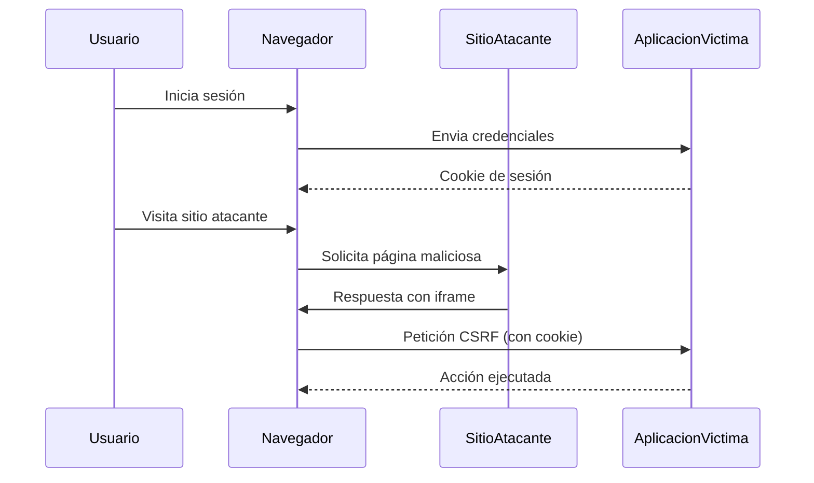
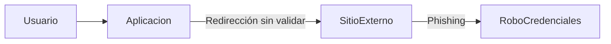

# Idea Clave 4 – Vulnerabilidades OWASP Top Ten 2013

## CSRF (Cross-Site Request Forgery) Y Open Redirect

---

# Contexto General

En esta sesión se explican dos vulnerabilidades clásicas incluidas en el **OWASP Top Ten 2013**:

- **CSRF (Cross-Site Request Forgery)**
    
- **Redirecciones no validadas (Open Redirect)**

Ambas afectan a aplicaciones web y se basan, principalmente, en una **gestión insegura de las peticiones y de la confianza del navegador**.

---

# CSRF (Cross-Site Request Forgery)

## Definición

**CSRF** es una vulnerabilidad que permite a un atacante ejecutar acciones no autorizadas en una aplicación web en nombre de un usuario autenticado, aprovechándose de su **sesión activa** en el navegador.

El navegador del usuario envía automáticamente cookies de sesión en cada petición, incluso si esta se origina desde un sitio web externo.

---

## Requisitos Para Que El Ataque Funcione

Para que un ataque CSRF tenga éxito, deben cumplirse las siguientes condiciones:

1. El usuario debe estar **autenticado** en la aplicación víctima.
    
2. La aplicación debe confiar únicamente en la **cookie de sesión**.
    
3. El usuario visita un **sitio web malicioso** en otra pestaña o dominio.
    
4. Desde ese sitio externo se lanza una petición hacia la aplicación víctima.

---

## Concepto De Cross-Site

El término _cross-site_ implica que la petición se origina desde un **dominio distinto** al de la aplicación legítima.

Ejemplo conceptual:

- Dominio víctima: `192.168.x.315`
    
- Dominio atacante: `192.168.x.3`

El usuario está logueado en el primero y navega al segundo, que lanza la petición maliciosa.

---

## Ejemplo Explicado Paso a Paso (cambio De contraseña)

1. El usuario inicia sesión en la aplicación legítima.
    
2. El navegador mantiene la cookie de sesión activa.
    
3. El usuario abre una nueva pestaña y accede al sitio del atacante.
    
4. El sitio atacante contiene una página con un `iframe` que apunta a la aplicación víctima.
    
5. Ese `iframe` ejecuta una petición para cambiar la contraseña del usuario.
    
6. El navegador envía automáticamente la cookie de sesión.
    
7. La aplicación procesa la petición como válida.
    
8. La contraseña del usuario se modifica sin que este lo note.

---

## Uso De `iframe` En El Ataque

El atacante utilize un `iframe` para cargar una página de la aplicación víctima y ejecutar una acción sensible, como un cambio de contraseña.

Esto permite reutilizar la sesión activa almacenada en el navegador.

---

## Diagrama Del Ataque CSRF (conceptual)

---

## Impacto

- Cambio de contraseña
    
- Modificación de datos
    
- Ejecución de acciones administrativas
    
- Compromiso total de la cuenta del usuario

---

## Medidas De Mitigación

|Medida|Descripción|
|---|---|
|Navegadores modernos|Implementan protecciones contra peticiones cross-site|
|Same-Origin Policy|Restringe peticiones entre dominios|
|Token Anti-CSRF|Identificador único por petición|
|Validación del origen|Verificación del `Origin` o `Referer`|

---

## Token Anti-CSRF

**Definición:**  
Un token anti-CSRF es un valor único, impredecible y de un solo uso que se envía junto con cada petición sensible.

**Funcionamiento:**

1. El servidor genera un token.
    
2. El token se incluye en el formulario o petición.
    
3. El servidor valida el token en cada solicitud.
    
4. El token expira tras su uso.

Esto evita que un atacante reutilice una petición desde un sitio externo.

---

# Redirecciones no Validadas (Open Redirect)

## Definición

Una **redirección no validada** ocurre cuando una aplicación permite redirigir al usuario a una URL externa sin validar correctamente el destino.

Normalmente se usan parámetros como:

- `url`
    
- `target`
    
- `page`
    
- `forward`

---

## Causa Principal

- **Ausencia de validación de entrada**
    
- Confianza excesiva en parámetros proporcionados por el usuario

---

## Riesgos Asociados

- **Phishing**: el usuario cree estar en un sitio legítimo.
    
- Robo de credenciales.
    
- Pérdida de confianza en la aplicación.
    
- Facilita ataques de ingeniería social.

---

## Ejemplo Práctico Con WebGoat / Wacke

1. La aplicación tiene un formulario que realiza una redirección.
    
2. Se envía un parámetro con una URL externa (por ejemplo, Google).
    
3. La aplicación no valida el destino.
    
4. El navegador redirige al usuario a Google.
    
5. El atacante puede redirigir a un sitio falso que imita la aplicación original.

---

## Ejemplo De Flujo Del Ataque

---

## Uso De Métodos GET Y POST

- El ataque puede realizarse tanto con **GET** como con **POST**.
    
- Las plataformas de práctica incluyen:
    
    - Casos de prueba
        
    - Ayudas
        
    - Ejemplos de payloads
        
    - Estructura del exploit

---

## Mitigación De Open Redirect

|Medida|Descripción|
|---|---|
|Validación estricta|Solo permitir URLs internas|
|Lista blanca|Definir destinos permitidos|
|Evitar URLs completas|Usar identificadores internos|
|Confirmación del usuario|Mostrar advertencias|

---

# Comparativa CSRF Vs Open Redirect

|Característica|CSRF|Open Redirect|
|---|---|---|
|Tipo de ataque|Ejecución de acciones|Redirección maliciosa|
|Require sesión|Sí|No necesariamente|
|Impacto|Alto|Medio-Alto|
|Riesgo principal|Acciones no autorizadas|Phishing|
|Mitigación clave|Token Anti-CSRF|Validación de entrada|

---

# Buenas Prácticas Generales

- No confiar en datos del cliente.
    
- Validar siempre entradas y parámetros.
    
- Implementar controles de seguridad a nivel de servidor.
    
- Usar frameworks y navegadores actualizados.
    
- Revisar OWASP Top Ten periódicamente.

---

# Resumen De Puntos Clave

- CSRF aprovecha la sesión activa del usuario para ejecutar acciones no autorizadas.
    
- El ataque CSRF require que el usuario esté autenticado.
    
- Los tokens anti-CSRF son la defensa más efectiva.
    
- Open Redirect se basa en redirecciones sin validar.
    
- Open Redirect facilita ataques de phishing.
    
- La validación de entradas es esencial para prevenir ambas vulnerabilidades.
    
- OWASP proporciona guías y plataformas de práctica para aprender a detectarlas.

---

# MicroTest

1. ¿Cómo se previene CSRF?
    
    - La respuesta: d. Token anti-CSRF.
        
    - Justificación: El token anti-CSRF es un identificador único y temporal que se incluye en cada petición sensible y se valida en el servidor. Esto evita que peticiones forjadas desde sitios externos tengan éxito, ya que el atacante no puede conocer ni reutilizar un token válido.
        
2. La vulnerabilidad redirección no validada (open redirect):
    
    - La respuesta: d. Permite redirigir al usuario víctima a un sitio web no esperado.
        
    - Justificación: La redirección no validada ocurre cuando la aplicación no valida correctamente los parámetros de redirección, permitiendo que un atacante envíe al usuario a un sitio externo no previsto, lo que puede set usado para phishing o robo de credenciales.
        
3. ¿Cuál es un ejemplo de payload de CSRF?
    
    - La respuesta: d. Ninguna de las anteriores.
        
    - Justificación: Los ejemplos dados corresponden a otras vulnerabilidades (XSS, SQL Injection y Path Traversal). Un ataque CSRF no se basa en un payload típico de inyección, sino en una petición legítima forjada que aprovecha una sesión autenticada del usuario.