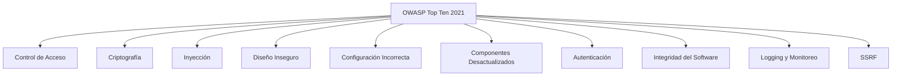

# Tema 5: Vulnerabilidades De Seguridad En Aplicaciones Web

## Introducción Al Tema

El tema se centra en el estudio de las principales vulnerabilidades en aplicaciones web, tomando como referencia el proyecto **OWASP (Open Web Application Security Project)**, una organización abierta dedicada a mejorar la seguridad del software mediante la definición de estándares, metodologías y buenas prácticas.

Uno de los proyectos más relevantes de OWASP es el **OWASP Top Ten**, que clasifica las diez categorías más críticas de vulnerabilidades en aplicaciones web.

---

## OWASP Top Ten 2021: Visión General

El **OWASP Top Ten 2021** presenta cambios importantes respecto a la edición 2017:

- Algunas categorías cambian de posición según su impacto y prevalencia.
    
- Se introducen **nuevas categorías** que reflejan riesgos actuales.
    
- Cada categoría agrupa **familias de vulnerabilidades**, no fallos aislados.

### Comparación Conceptual Entre Ediciones

- Las categorías no son vulnerabilidades individuales, sino **conjuntos de fallos relacionados**.
    
- Ejemplo: la categoría _Inyección_ incluye SQL Injection, XML Injection, LDAP Injection, etc.

---

## Categorías Principales Del OWASP Top Ten 2021

### A01: Pérdida De Control De Acceso

**Definición:**  
Fallas en los mecanismos que limitan qué usuarios pueden acceder a qué recursos.

**Relevancia:**  
Permite accesos no autorizados a funcionalidades o datos sensibles.

**Buenas prácticas:**

- Principio de **mínimos privilegios**.
    
- Control de acceso basado en roles (RBAC).
    
- Validación de permisos en servidor, no solo en cliente.

---

### A02: Fallos Criptográficos

**Definición:**  
Uso incorrecto o débil de algoritmos de cifrado, hashing o gestión de claves.

**Relevancia:**  
Puede provocar exposición de datos sensibles como contraseñas o información personal.

**Aspectos clave:**

- Uso de algoritmos modernos y seguros.
    
- Longitud de clave adecuada.
    
- Diferenciar entre cifrado simétrico y asimétrico.
    
- Hashing seguro para contraseñas.

---

### A03: Inyección

**Definición:**  
Introducción de datos maliciosos que son interpretados como commandos por el sistema.

**Ejemplos incluidos:**

- SQL Injection
    
- XML Injection
    
- LDAP Injection
    
- Cross-Site Scripting (XSS)

**Relevancia:**  
Permite manipular consultas, ejecutar código o acceder a información no autorizada.

---

### A04: Diseño Inseguro

**Definición:**  
Errores conceptuales en el diseño de la aplicación que generan riesgos de seguridad.

**Relevancia:**  
Un diseño débil no puede corregirse solo con parches o configuraciones.

**Buenas prácticas:**

- Autenticación multifactor.
    
- Gestión robusta de sesiones.
    
- Uso de librerías actualizadas.
    
- Cabeceras de seguridad (CSP, X-Frame-Options).

---

### A05: Configuración De Seguridad Incorrecta

**Definición:**  
Configuraciones inseguras o incompletas en servidores, frameworks o aplicaciones.

**Relevancia:**  
Puede exponer funcionalidades internas o desactivar protecciones existentes.

**Ejemplos:**

- Mensajes de error detallados.
    
- Servicios innecesarios habilitados.
    
- Permisos por defecto inseguros.

---

### A06: Components Vulnerables Y Desactualizados

**Definición:**  
Uso de librerías, frameworks o components con vulnerabilidades conocidas.

**Relevancia:**  
Muchas vulnerabilidades ya tienen exploits públicos disponibles.

**Conceptos clave:**

- Vulnerabilidades conocidas (CVE).
    
- Importancia del parcheo y actualización continua.

---

### A07: Fallos De Identificación Y Autenticación

**Definición:**  
Errores en los mecanismos que verifican la identidad del usuario.

**Relevancia:**  
Permite suplantación de identidad o acceso no autorizado.

**Buenas prácticas:**

- Autenticación multifactor.
    
- Gestión segura de contraseñas.
    
- Protección contra fuerza bruta.

---

### A08: Fallos En la Integridad Del Software Y Los Datos

**Definición:**  
Ausencia de mecanismos que garanticen que el software y los datos no han sido alterados.

**Relevancia:**  
Puede permitir la ejecución de código malicioso o manipulación de información.

**Mecanismos recomendados:**

- Hashing.
    
- Firmas digitales.
    
- Verificación de integridad.

---

### A09: Fallos En El Registro Y Monitoreo

**Definición:**  
Falta de registros adecuados que permitan detectar y analizar incidentes de seguridad.

**Relevancia:**  
Impide identificar ataques o responder a incidentes.

**Buenas prácticas:**

- Registro de eventos críticos.
    
- Monitoreo continuo 24x7.
    
- Auditoría de acciones.

---

### A10: Falsificación De Solicitudes Del Lado Servidor (SSRF)

**Definición:**  
El servidor realiza solicitudes a servicios internos o externos controlados por un atacante.

**Relevancia:**  
Puede permitir acceso a servicios internos no expuestos públicamente.

**Causa principal:**

- Falta de validación de entradas usadas para construir solicitudes o redirecciones internas.

---

## Relación Entre Categorías (visión general)

---

## Resumen De Puntos Clave

- OWASP es la referencia principal en seguridad de aplicaciones web.
    
- El Top Ten 2021 introduce nuevas categorías y reordena prioridades.
    
- Cada categoría agrupa múltiples vulnerabilidades relacionadas.
    
- La seguridad debe abordarse desde el diseño, implementación y operación.
    
- Actualización, validación de entradas y monitoreo son pilares fundamentales.

---

## MicroTest