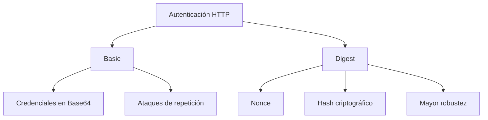

# Idea Clave 1: Autenticación HTTP BASIC Y DIGEST

## Introducción a la Autenticación HTTP

La autenticación HTTP define mecanismos estándar para que un cliente demuestre su identidad ante un servidor web. Estos mecanismos están definidos en el estándar del protocolo HTTP (RFC) y se implementan a nivel de servidor web, no en la lógica interna de la aplicación.

En este tema se analizan dos métodos clásicos:

- **HTTP Basic Authentication**
    
- **HTTP Digest Authentication**

---

## HTTP Basic Authentication

### Definición

**HTTP Basic Authentication** es un método de autenticación en el que el cliente envía el usuario y la contraseña en **cada petición HTTP**, codificados en **Base64** dentro de la cabecera `Authorization`.

### Características Principales

- Las credenciales se envían **en todas las peticiones**.
    
- Las credenciales están **codificadas, no cifradas** (Base64).
    
- Se implementa en el **servidor web**, no en la aplicación.
    
- Las cabeceras pueden quedar almacenadas en **caché o historial del navegador**.
    
- Es vulnerable a **ataques de repetición y sniffing**.

### Flujo De Funcionamiento Paso a Paso

1. El cliente realiza una petición HTTP sin cabecera de autenticación.
    
2. El servidor responde con:
    
    - Código **401 Unauthorized**.
        
    - Cabecera `WWW-Authenticate` indicando el uso de **Basic** y el área protegida (realm).
        
3. El navegador solicita al usuario sus credenciales.
    
4. El cliente envía una nueva petición con:
    
    - Cabecera `Authorization: Basic <credenciales en Base64>`.
        
5. El servidor decodifica las credenciales y valida el acceso.

### Riesgos De Seguridad

- Cualquier atacante que capture la petición puede **decodificar fácilmente** usuario y contraseña.
    
- Especialmente vulnerable si no se utilize **HTTPS**.
    
- Facilita ataques de **repetición**.

---

## HTTP Digest Authentication

### Definición

**HTTP Digest Authentication** es un método de autenticación basado en **desafío–respuesta**, donde la contraseña nunca se envía directamente, sino un **hash criptográfico** calculado a partir de varios parámetros.

### Conceptos Clave

- **Nonce**: valor aleatorio generado por el servidor, con validez temporal.
    
- **Response**: hash generado por el cliente usando el nonce, usuario, contraseña y otros parámetros.
    
- **Algoritmos hash**: MD5, SHA-256, SHA-512, entre otros.

### Flujo De Funcionamiento Paso a Paso

1. El cliente accede sin cabecera de autenticación.
    
2. El servidor responde con:
    
    - Código **401 Unauthorized**.
        
    - Cabecera `WWW-Authenticate: Digest`.
        
    - Parámetros como `nonce`, `realm` y `opaque`.
        
3. El cliente:
    
    - Concatena el nonce con usuario, contraseña y otros valores.
        
    - Calcula un hash criptográfico (`response`).
        
4. El cliente envía la petición con:
    
    - Cabecera `Authorization: Digest … response=<hash>`.
        
5. El servidor recalcula el hash.
    
6. Si ambos valores coinciden, la autenticación es correcta.

### Ventajas Frente a Basic

- La contraseña **no viaja en claro ni codificada**.
    
- Mayor resistencia a **ataques de repetición**, siempre que el nonce sea válido por poco tiempo.
    
- El valor `response` cambia si cambia algún parámetro del cálculo.

---

## Comparación Entre HTTP Basic Y Digest

|Característica|Basic|Digest|
|---|---|---|
|Envío de contraseña|Base64 (no cifrada)|No se envía directamente|
|Uso de hash|No|Sí|
|Protección contra replay|No|Sí (dependiente del nonce)|
|Complejidad|Baja|Media|
|Seguridad|Baja|Mayor que Basic|
|Uso de HTTPS recomendado|Imprescindible|Altamente recomendado|

---

## Ataques Comunes contra Basic Y Digest

### Ataques Man-in-the-Middle (MITM)

- Uso de **ARP spoofing** para colocarse entre cliente y servidor.
    
- Interceptación, modificación o reenvío de peticiones y respuestas.
    
- Posibilidad de observar o alterar credenciales y parámetros.

### Ataques De Repetición (Replay)

- Captura de peticiones válidas y reenvío posterior.
    
- Especialmente efectivos contra **Basic**.
    
- En Digest se mitigan usando **nonce con caducidad**.

### Ataques Por Sniffing

- Uso de herramientas como **Wireshark** para capturar tráfico.
    
- Críticos cuando no se utilize HTTPS.

### Ataques De Fuerza Bruta Y Diccionario

- Herramientas como **Hydra** o **Burp Suite**.
    
- Ataques online contra formularios o mecanismos HTTP.
    
- Ataques offline si se consigue el hash o las credenciales.

---

## Relación Entre Los Métodos De Autenticación HTTP

---

## Buenas Prácticas Recomendadas

- Evitar HTTP Basic sin HTTPS.
    
- Preferir métodos modernos de autenticación (tokens, OAuth, JWT).
    
- Usar **HTTPS siempre**, independientemente del método.
    
- Configurar nonces con caducidad corta en Digest.
    
- Monitorear intentos fallidos y aplicar controles antifuerza bruta.

---

## Resumen De Puntos Clave

- HTTP Basic envía credenciales codificadas en cada petición.
    
- HTTP Digest usa un modelo desafío–respuesta con hash.
    
- Digest es más seguro que Basic, pero no infalible.
    
- Ambos métodos pueden set atacados si no se protegen adecuadamente.
    
- HTTPS es obligatorio para garantizar la confidencialidad.

---

## MicroTest

1. ¿Cómo envía el método Basic las credenciales al servidor de aplicaciones?
    
    - La respuesta: c. Codificadas Base64.
        
    - Justificación: El método HTTP Basic envía el usuario y la contraseña en cada petición dentro de la cabecera Authorization, codificados en Base64, lo cual no implica cifrado y permite recuperar fácilmente las credenciales.
        
2. ¿Qué ataques puede sufrir Basic?
    
    - La respuesta: a. Repetición.
        
    - Justificación: Debido a que las credenciales se envían siempre de la misma forma en cada petición, un atacante puede capturar una petición válida y reenviarla posteriormente para autenticarse sin conocer la contraseña.
        
3. ¿Cómo envía Digest las credenciales al servidor de aplicaciones?
    
    - La respuesta: d. HASH MD5.
        
    - Justificación: En la autenticación HTTP Digest no se envía la contraseña directamente, sino un valor hash (tradicionalmente MD5) calculado a partir del usuario, la contraseña, el nonce y otros parámetros, que el servidor puede verificar recalculándolo.
