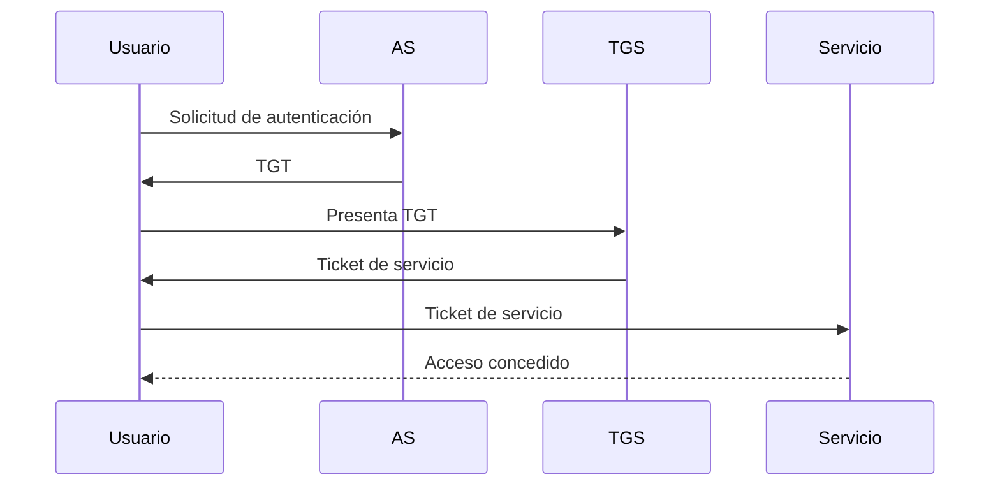

# Idea Clave: Métodos De Autenticación NTLM Y Kerberos

## Introducción

En entornos de dominio, especialmente en **Windows (Active Directory)** y también en **Linux (OpenLDAP)**, se utilizan métodos de autenticación centralizados para validar identidades y controlar el acceso a recursos. Los dos mecanismos principales tratados son **NTLM** y **Kerberos**, ambos basados en esquemas de desafío–respuesta, pero con niveles de seguridad y arquitectura distintos.

---

## Autenticación NTLM

### Definición

**NTLM (NT LAN Manager)** es un método de autenticación de desafío–respuesta que utilize una **contraseña secreta compartida** entre cliente y servidor, sin enviar la contraseña directamente por la red.

### Funcionamiento General

- El servidor envía un **desafío (nonce)** al cliente.
    
- El cliente calcula respuestas criptográficas usando el nonce y la contraseña.
    
- El servidor recalcula los valores y los compara para autenticar.

### Cálculos Criptográficos

NTLMv2 utilize dos valores principales:

- **LMv2 Response**
    
- **NTLMv2 Response**

Ambos se calculan mediante **HMAC-MD5**, incorporando:

- Hash de la contraseña del usuario.
    
- Nombre de usuario y dominio.
    
- Desafío del servidor.
    
- Desafío del cliente.
    
- Sello de tiempo (para mitigar ataques de repetición).

### Flujo De Autenticación NTLM

1. El cliente solicita acceso al servidor.
    
2. El servidor envía un desafío (nonce).
    
3. El cliente calcula LMv2 y NTLMv2 Response.
    
4. El cliente envía las respuestas al servidor.
    
5. El servidor recalcula y compara.
    
6. Si coinciden, la autenticación es válida.

### Protección contra Ataques De Repetición

- Uso de **sellos de tiempo**.
    
- Cambios en los parámetros de cada autenticación.
    
- Si el servidor reutiliza un nonce, se abre la posibilidad de ataque.

---

## Ataques contra NTLM

### Obtención De Credenciales

Para explotar NTLM, el atacante suele necesitar **privilegios elevados**, normalmente:

- Usuario administrador del dominio.

### Técnicas Comunes

- Explotación de vulnerabilidades públicas con herramientas como:
    
    - OpenVAS
        
    - Metasploit
        
- Extracción de hashes desde:
    
    - Caché de credenciales.
        
    - Memoria del proceso **LSASS**.
        
    - Base de datos **SAM** en Windows.

### Ataques Específicos

- **Ataques de repetición** si se reutiliza un nonce.
    
- **Man-in-the-Middle (MITM)**.
    
- **Suplantación de usuario** reutilizando respuestas NTLMv2 capturadas.

---

## Autenticación Kerberos

### Definición

**Kerberos** es un protocolo de autenticación basado en **tickets**, ampliamente utilizado en dominios Windows mediante **Active Directory**. Evita el envío de contraseñas y utilize criptografía simétrica.

### Components Principales

- **KDC (Key Distribution Center)**:
    
    - AS (Authentication Server).
        
    - TGS (Ticket Granting Service).
        
- **TGT (Ticket Granting Ticket)**.
    
- **TGS (Service Ticket)**.

---

## Flujo De Autenticación Kerberos

1. El usuario solicita autenticación al **AS**.
    
2. El AS valida las credenciales y emite un **TGT**.
    
3. El usuario presenta el TGT al **TGS**.
    
4. El TGS emite un **ticket de servicio**.
    
5. El usuario presenta el ticket a la aplicación o servicio.
    
6. El acceso es válido mientras el ticket no expire.

---

## Ataques contra Kerberos

### Pass-the-Hash

- Uso del hash de la contraseña para solicitar tickets sin conocer la contraseña real.
    
- Require acceso previo a hashes (normalmente con privilegios altos).

### Pass-the-Ticket

- Robo de un **TGT o TGS** válido.
    
- Permite acceder a servicios mientras el ticket sea válido.

### Kerberoasting

- Ocurre cuando servicios usan **cuentas de usuario normals**.
    
- El ticket TGS se cifra con una clave derivada de la contraseña del servicio.
    
- El atacante puede crackear el ticket offline para obtener la contraseña.

### AS-REP Roasting

- Afecta a cuentas con **preautenticación Kerberos deshabilitada**.
    
- Permite solicitar un AS-REP y crackearlo sin set administrador.

### Golden Ticket

- Ataque más crítico.
    
- Require el hash de la cuenta **KRBTGT**.
    
- Permite generar TGTs falsos con privilegios de dominio.

### Silver Ticket

- Obtención del hash de la cuenta propietaria de un servicio.
    
- Permite generar tickets TGS falsos para ese servicio específico.

---

## Comparación NTLM Vs Kerberos

|Característica|NTLM|Kerberos|
|---|---|---|
|Tipo de autenticación|Desafío–respuesta|Basada en tickets|
|Envío de contraseña|No|No|
|Escalabilidad|Limitada|Alta|
|Dependencia del dominio|Opcional|Requerida|
|Resistencia a replay|Media|Alta|
|Ataques avanzados|Pass-the-Hash|Golden / Silver Ticket|

---

## Recomendaciones De Seguridad

- Implementar **políticas fuertes de contraseñas**.
    
- Evitar cuentas sin **preautenticación Kerberos**.
    
- No usar cuentas de usuario como cuentas de servicio.
    
- Rotar contraseñas periódicamente.
    
- Deshabilitar algoritmos criptográficos débiles.
    
- Preferir Kerberos frente a NTLM siempre que sea possible.

---

## Resumen De Puntos Clave

- NTLM y Kerberos son métodos de autenticación usados en dominios.
    
- NTLM se basa en desafío–respuesta con HMAC.
    
- Kerberos utilize un sistema de tickets y es más robusto.
    
- Ambos pueden set vulnerables si se configuran incorrectamente.
    
- La gestión adecuada de cuentas y contraseñas es crítica.

---

## MicroTest

1. ¿Cómo envía NTLM las credenciales al servidor de aplicaciones?
    
    - La respuesta: b. HMAC-MD5.
        
    - Justificación: NTLM no envía la contraseña en claro ni cifrada, sino que utilize un esquema de desafío–respuesta donde calcula valores criptográficos (LMv2 y NTLMv2) mediante HMAC-MD5 a partir del hash de la contraseña y un nonce enviado por el servidor.
        
2. ¿Qué ataque es típico contra Kerberos?
    
    - La respuesta: d. Todas las anteriores son correctas.
        
    - Justificación: Kerberos puede set atacado mediante Golden Ticket, Silver Ticket y Kerberoasting, todos ellos descritos como ataques específicos del protocolo que explotan una mala gestión de cuentas, claves o tickets.
        
3. NTLM calcula 2 parámetros que son:
    
    - La respuesta: a. LMV2 y NTV2.
        
    - Justificación: NTLMv2 calcula dos respuestas principales, LMv2 y NTLMv2, que se generan usando HMAC-MD5 y combinan el hash de la contraseña, el dominio, el usuario y los desafíos cliente-servidor.

  https://www.tarlogic.com/es/blog/como-atacar-kerberos/