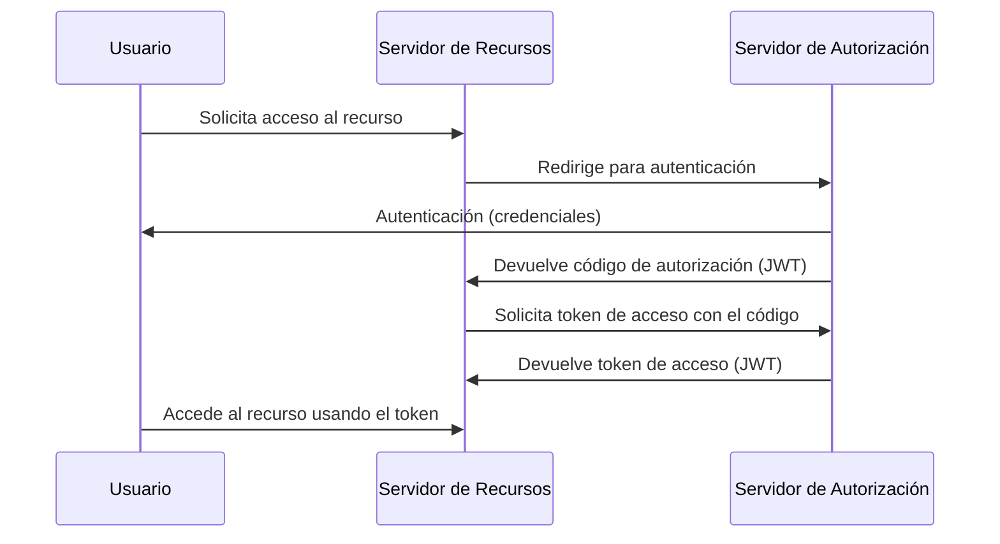

# Idea Clave 3: OAuth 2.0 Y OpenID Connect

## Introducción

OAuth 2.0 junto con OpenID Connect es un **método mixto de autenticación y autorización** que permite a un usuario acceder a recursos protegidos sin compartir directamente sus credenciales con el servidor que aloja dichos recursos.  
Separa claramente **quién autentica**, **quién autoriza** y **quién provee el recurso**, mejorando seguridad y escalabilidad.

---

# Components Principales

## Usuario

Entidad que desea acceder a un recurso protegido.

## Propietario Del Recurso

Servidor que aloja el recurso protegido (API, servicio, aplicación).  
Normalmente **no autentica directamente** al usuario, sino que delega esa tarea.

## Servidor De Autenticación / Autorización

Servidor especializado (OAuth 2.0 / OpenID Connect) que:

- Autentica al usuario.
    
- Emite códigos de autorización.
    
- Emite tokens de acceso (JWT).

---

# Flujo De Funcionamiento (Authorization Code Flow)



## Pasos Explicados

1. El usuario solicita acceso a un recurso protegido.
    
2. El propietario del recurso delega la autenticación al servidor de autorización.
    
3. Si las credenciales son correctas, el servidor de autorización emite un **código de autorización**.
    
4. El propietario del recurso intercambia ese código por un **token de acceso**.
    
5. El token de acceso se devuelve en formato **JWT**.
    
6. El cliente puede realizar múltiples peticiones mientras el token sea válido.

**Recomendación:** idealmente, tokens de corta duración y de un solo uso.

---

# JSON Web Token (JWT)

## Definición

JWT es un **formato compacto y seguro** para transmitir información entre partes como un objeto JSON firmado digitalmente.

## Estructura De Un JWT

|Parte|Descripción|
|---|---|
|Header|Tipo de token y algoritmo de firma|
|Payload|Información (claims) del usuario y del token|
|Firma|Garantiza la integridad del token|

Formato:

```Python
Header.Base64.Payload.Base64.Firma
```

---

## Header

Contiene:

- Tipo de token (`JWT`)
    
- Algoritmo de firma (`HS256`, `RS256`, etc.)

Codificado en Base64.

---

## Payload

Incluye información como:

- Identidad del usuario
    
- Fecha de creación (`iat`)
    
- Fecha de expiración (`exp`)
    
- Ventana de validez
    
- Token de autenticación
    
- Roles o permisos

Codificado en Base64.

---

## Firma

Se genera a partir de:

- Header + Payload (Base64)
    
- Clave secreta (HS256) o clave privada (RS256)

Su función es **verificar la integridad** del token y asegurar que no ha sido modificado.

---

# Algoritmos De Firma

## HS256 (HMAC-SHA256)

- Clave secreta compartida.
    
- Solo el servidor conoce la clave.
    
- Más vulnerable si la clave se filtra.

## RS256 (RSA-SHA256)

- Criptografía asimétrica.
    
- Firma con clave privada.
    
- Verificación con clave pública.
    
- Más seguro y recomendado.

---

# Ataques Comunes

## Ataque De Fuerza Bruta

Intento de adivinar claves débiles de firma.

## Ataque De Repetición

Uso de un token capturado si:

- No caduca.
    
- No es de un solo uso.

## Ataque De Confusión De Algoritmo

El atacante modifica el `alg` del header a `none` o cambia HS256/RS256.  
Si la aplicación **no valida explícitamente el algoritmo**, puede aceptar tokens falsificados.

---

# Buenas Prácticas Y Recomendaciones

## Comunicación Segura

- Uso obligatorio de HTTPS.
    
- Certificados de servidor y, si es possible, de cliente.

## Tokens

- Alcance (scope) mínimo necesario.
    
- Tiempo de vida corto.
    
- Preferiblemente de un solo uso.

## Almacenamiento

- No guardar tokens en lugares accesibles.
    
- Usar cookies seguras con:
    
    - `HttpOnly`
        
    - `Secure`
        
    - `SameSite=Strict`

## Validaciones

- Validar siempre el algoritmo de firma.
    
- Verificar firma, expiración y audiencia.
    
- Validar URLs de redirección registradas.

## Generación De Tokens

- Tokens no predecibles.
    
- No modificables.
    
- Generados solo por el servidor de autorización.

---

# Relación OAuth 2.0 Y OpenID Connect

|Protocolo|Función|
|---|---|
|OAuth 2.0|Autorización de acceso a recursos|
|OpenID Connect|Autenticación (identidad del usuario)|

OpenID Connect se apoya en OAuth 2.0 y añade información de identidad.

---

# Resumen De Puntos Clave

- OAuth 2.0 + OpenID Connect separan autenticación y autorización.
    
- El flujo usa códigos de autorización y tokens de acceso.
    
- JWT es el formato estándar de los tokens.
    
- Un JWT tiene header, payload y firma.
    
- RS256 es más seguro que HS256.
    
- Tokens deben set de corta duración y bien validados.
    
- Validar algoritmo y usar HTTPS es crítico para la seguridad.

---

# MicroTest

1. OAUTH2 usa:
    
    - La respuesta: c. La A y la B.
        
    - Justificación: OAuth 2.0 utilize un **código de autorización** para obtener posteriormente un **token de acceso**, separando el proceso de autenticación del acceso al recurso protegido.
        
2. ¿De qué tipo son el token y el código de autorización en OAUTH2?
    
    - La respuesta: c. JWT.
        
    - Justificación: Tanto el token de acceso como el código de autorización se transmiten habitualmente en formato **JSON Web Token (JWT)**, que permite incluir información estructurada y firmada de forma segura.
        
3. ¿Dónde se aloja la información del usuario en un JWT?
    
    - La respuesta: b. PAYLOAD.
        
    - Justificación: El **payload** del JWT contiene los _claims_, donde se almacena la información del usuario, tiempos de validez, roles y otros datos relevantes para la autorización.