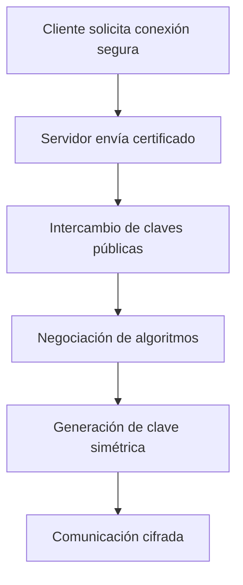
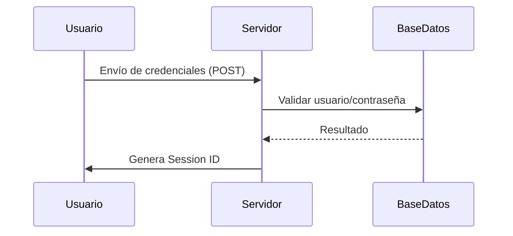

# Autenticación TLS Y Autenticación Basada En Formularios

---

## 1. Autenticación TLS (Transport Layer Security)

### Definición

**TLS (Transport Layer Security)** es un protocolo criptográfico que proporciona **confidencialidad, integridad y autenticación** en las comunicaciones a través de redes como Internet. Se utilize comúnmente en **HTTPS** para proteger la información intercambiada entre cliente y servidor.

---

### Modalidades De TLS

|Modalidad|Descripción|Nivel de Seguridad|
|---|---|---|
|TLS solo servidor|Solo el servidor presenta certificado digital|Medio|
|Mutual TLS (mTLS)|Tanto cliente como servidor presentan certificados digitales|Alto|

**Mutual TLS (mTLS)** implica autenticación en ambos sentidos:

- El servidor valida al cliente.
    
- El cliente valida al servidor.  
    Es una de las opciones más seguras para comunicaciones críticas.

---

### Certificados Digitales

**Certificado Digital:** Documento electrónico emitido por una **Autoridad de Certificación (CA)** que vincula una clave pública con una identidad.

**Infraestructura requerida:**

- Infraestructura de Clave Pública (PKI)
    
- Autoridades certificadoras raíz y secundarias
    
- Almacén de certificados de confianza

---

### Proceso De Negociación TLS (Handshake)

---

### Tipos De Cifrado

|Tipo|Uso|Ejemplo|
|---|---|---|
|Cifrado Simétrico|Cifrar grandes volúmenes de datos|AES|
|Cifrado Asimétrico|Intercambio seguro de claves|RSA|
|Hash|Integridad de datos|SHA-512|

**Funcionamiento combinado:**

1. Se genera una clave simétrica (AES).
    
2. Se cifra esa clave con RSA usando la clave pública del receptor.
    
3. El receptor descifra con su clave privada.
    
4. Se usa AES para cifrar el tráfico.

---

### Vulnerabilidades Y Riesgos

#### Uso Parcial De TLS

Si TLS solo se usa en autenticación y no en toda la sesión, el tráfico restante puede quedar expuesto.

**Herramientas de interceptación mencionadas:**

- Firesheep
    
- Ettercap
    
- Burp Suite

---

### Ataque Man-in-the-Middle (MITM)

**Definición:** Interceptación de la comunicación entre dos partes sin que estas lo sepan.

**Prevención:**

- Uso de Mutual TLS.
    
- Validación correcta de certificados.
    
- Almacén confiable de autoridades certificadoras.

---

### Impacto En Rendimiento

|Factor|Efecto|
|---|---|
|Negociación TLS|Alta carga en servidor|
|Múltiples clientes|Incremento exponencial de uso de CPU|

**Possible solución:**  
Trasladar parte de la carga de negociación al cliente o usar técnicas de optimización como TLS Offloading.

---

## 2. Autenticación Basada En Formularios

### Definición

Método de autenticación donde el usuario introduce **credenciales (usuario y contraseña)** en un formulario web que la aplicación valida internamente.

---

### Flujo De Autenticación

---

### Almacenamiento De Credenciales

**Buenas prácticas:**

- Nunca almacenar contraseñas en texto plano.
    
- Usar **Hash criptográfico** (SHA-512).
    
- Possible uso de salting adicional.

---

### Identificador De Sesión (Session ID)

**Definición:** Token único que representa la autenticación del usuario tras validar sus credenciales.

**Importancia:**  
Tras autenticarse, **la sesión es la verdadera credencial**.  
Si se roba la sesión → suplantación de identidad.

---

### Cookies Seguras

|Parámetro|Función|
|---|---|
|HttpOnly|Impide acceso desde JavaScript|
|Secure|Solo se envía por HTTPS|
|SameSite|Evita envío a dominios externos|

---

### Riesgos Comunes

|Ataque|Descripción|
|---|---|
|Session Hijacking|Robo de sesión|
|Session Fixation|Forzar ID de sesión previo|
|Credential Theft|Robo de usuario/contraseña|

---

### Cuándo Reautenticar

- Cambio de rol o privilegios.
    
- Acceso a datos sensibles.
    
- Acceso a servicios de terceros.
    
- Operaciones críticas.

Debe definirse en la **fase de análisis y diseño** dentro del ciclo de desarrollo seguro.

---

## Comparativa TLS Vs Formularios

|Característica|TLS|Formularios|
|---|---|---|
|Nivel de seguridad|Alto|Medio|
|Complejidad|Alta|Media|
|Require certificados|Sí|No|
|Manejo de sesiones|No necesariamente|Sí|
|Protección MITM|Alta (mTLS)|Baja|

---

## Información Adicional Relevante

- TLS protege el canal; formularios protegen la aplicación.
    
- Lo ideal es **usar ambos métodos combinados**.
    
- TLS sin validación de certificados pierde efectividad.
    
- Formularios sin HTTPS son inseguros.

---

## Resumen De Puntos Clave

- TLS garantiza confidencialidad, integridad y autenticación.
    
- Mutual TLS ofrece autenticación bidireccional y mayor seguridad.
    
- AES se usa para datos; RSA para intercambio de claves.
    
- TLS parcial expone vulnerabilidades.
    
- Formularios requieren hashing de contraseñas.
    
- La sesión se convierte en la credencial principal tras login.
    
- Cookies deben configurarse con HttpOnly, Secure y SameSite.
    
- Reautenticación necesaria en operaciones sensibles.
    
- La combinación de TLS + Formularios es la práctica más segura.

---

## MicroTest

1. TLS usa algoritmos como:
    
    - La respuesta: d. Todos los anteriores son correctos.
        
    - Justificación: TLS combina distintos tipos de algoritmos criptográficos según su función: RSA para cifrado asimétrico e intercambio de claves, AES para cifrado simétrico de los datos de la comunicación y SHA-512 para funciones hash que garantizan integridad.
        
2. La autenticación basada en formularios hace uso de:
    
    - La respuesta: d. Todas las anteriores son correctas.
        
    - Justificación: La autenticación por formularios require el envío de credenciales mediante método HTTP POST, valida usuario y contraseña en el servidor y, una vez autenticado, genera un ID de sesión que se convierte en la credencial activa del usuario.
        
3. ¿Qué se recomienda para TLS?
    
    - La respuesta: d. Todas las anteriores son correctas.
        
    - Justificación: Las buenas prácticas de seguridad en TLS incluyen el uso de cifrados robustos como AES-256, claves asimétricas fuertes como RSA-2048 y, además, la autenticación mutua mediante certificados de cliente y servidor para prevenir ataques de intermediario y fortalecer la identidad de ambas partes.

  