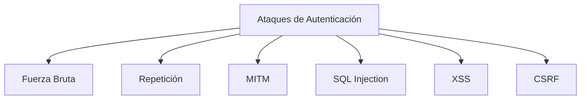

# Autenticación: Ataques Y Recomendaciones De Seguridad

---

## 1. Ataques Comunes a Los Métodos De Autenticación

### 1.1 Ataque De Fuerza Bruta

**Definición:**  
Intento sistemático de adivinar contraseñas probando múltiples combinaciones hasta encontrar la correcta.

**Variante más común:**

- **Ataque de diccionario:** uso de listas predefinidas de contraseñas frecuentes.

**Herramientas típicas:**

- John the Ripper
    
- Brutus

**Riesgo:** acceso no autorizado por contraseñas débiles.

---

### 1.2 Ataque De Repetición (Replay Attack)

**Definición:**  
Consiste en capturar una comunicación válida (por ejemplo, un token o credencial) y reutilizarla posteriormente para suplantar a un usuario.

**Impacto:**

- Suplantación de identidad.
    
- Acceso indebido sin conocer la contraseña real.

---

### 1.3 Ataque Man-in-the-Middle (MITM)

**Definición:**  
Un atacante se sitúa entre cliente y servidor para interceptar, modificar o espiar la comunicación.

**Fases típicas:**

1. **ARP Spoofing:** envenenamiento de tablas ARP para posicionarse en medio.
    
2. **Redirección Proxy:** interceptación del tráfico.

**Consecuencia:** robo de credenciales, sesiones o información sensible.

---

### 1.4 SQL Injection (SQLi)

**Definición:**  
Inserción de código SQL malicioso en campos de entrada para manipular bases de datos.

**Objetivos comunes:**

- Obtener usuarios y contraseñas.
    
- Extraer tablas de sesiones activas.

---

### 1.5 Cross-Site Scripting (XSS)

**Definición:**  
Inyección de scripts maliciosos en páginas web que se ejecutan en el navegador de la víctima.

**Impacto principal:**

- Robo de cookies.
    
- Secuestro de sesiones.

---

### 1.6 Cross-Site Request Forgery (CSRF)

**Definición:**  
Forzar a un usuario autenticado a ejecutar acciones sin su consentimiento aprovechando su sesión activa.

**Ejemplo típico:** envío automático de formularios ocultos.

---

### Relación De Ataques

---

## 2. Recomendaciones De Seguridad En Autenticación

### 2.1 Uso De CAPTCHA

**Definición:**  
Prueba automática para diferenciar humanos de bots.

**Objetivo:**  
Prevenir ataques de fuerza bruta automatizados.

---

### 2.2 Gestión De Cuentas

|Medida|Propósito|
|---|---|
|Permitir deshabilitar cuentas|Bloquear accesos sospechosos|
|Deshabilitar cuentas por defecto|Evitar accesos con credenciales conocidas|

---

### 2.3 Gestión De Contraseñas

**Evitar recordar contraseñas:**  
No almacenar contraseñas de forma persistente en cookies o almacenamiento local.

**Riesgo:**

- Exposición prolongada de credenciales.
    
- Robo mediante malware o XSS.

---

### 2.4 No Incluir Credenciales En El Código Fuente

**Hardcoded Password:**  
Contraseñas incrustadas directamente en el código de la aplicación.

**Problemas:**

- Difíciles de cambiar.
    
- Expuestas en repositorios o binarios.
    
- Vulnerabilidad reconocida por MITRE (CWE).

---

### 2.5 Certificate Pinning En TLS

**Definición:**  
Validación estricta de la cadena de certificación y claves públicas de autoridades certificadoras.

**Objetivo:**  
Evitar ataques MITM asegurando que solo se acepten certificados previamente confiables.

---

### 2.6 Confiar En APIs Y Frameworks

**Justificación:**  
Los frameworks de desarrollo suelen incluir librerías auditadas por expertos en seguridad, reduciendo errores de implementación propios.

---

### 2.7 Autenticación Multifactor (MFA)

**Definición:**  
Uso combinado de varios factores de autenticación.

**Tipos de factores:**

|Factor|Ejemplo|
|---|---|
|Algo que sabes|Contraseña|
|Algo que tienes|Token, SMS, email|
|Algo que eres|Biometría|

**Ventaja:**  
Incrementa significativamente la seguridad al requerir múltiples verificaciones.

---

### 2.8 Uso Obligatorio De TLS Con Certificado De Cliente

**Recomendación:**  
Implementar Mutual TLS como un factor adicional dentro del esquema de autenticación.

**Beneficio:**  
Protección del canal de comunicación y verificación de identidad bidireccional.

---

## Información Adicional Relevante

- La autenticación segura no depende de un único mecanismo sino de la **combinación de controles**.
    
- Los ataques suelen aprovechar configuraciones por defecto o malas prácticas.
    
- TLS protege el canal; MFA protege la identidad.
    
- Frameworks reducen riesgos de implementación insegura.

---

## Resumen De Puntos Clave

- Ataques frecuentes: fuerza bruta, MITM, SQLi, XSS, CSRF y repetición.
    
- CAPTCHA reduce automatización de ataques.
    
- Deshabilitar cuentas por defecto y permitir bloqueo de cuentas sospechosas.
    
- Nunca almacenar contraseñas en código fuente ni en cookies persistentes.
    
- Certificate Pinning protege contra MITM.
    
- Confiar en frameworks de seguridad auditados.
    
- MFA combina factores: saber, tener y set.
    
- Mutual TLS fortalece la autenticación y el canal seguro.
    
- La seguridad efectiva surge de la combinación de múltiples medidas.

## MicroTest

1. ¿Qué tipo de ataques puede sufrir la autenticación para suplantar un usuario?
    
    - La respuesta: a. Fuerza bruta.
        
    - Justificación: La fuerza bruta intenta adivinar credenciales probando múltiples combinaciones hasta encontrar la correcta, lo que permite suplantar directamente al usuario. LFI y SSRF son vulnerabilidades de acceso o redirección de recursos, pero no están orientadas específicamente a la suplantación por autenticación.
        
2. ¿De qué tipo de ataque previene la implementación de CAPTCHA?
    
    - La respuesta: a. Fuerza bruta.
        
    - Justificación: CAPTCHA está diseñado para diferenciar humanos de bots automatizados, evitando que herramientas automáticas puedan realizar miles de intentos de contraseñas en poco tiempo, que es precisamente la base del ataque de fuerza bruta.
        
3. ¿Qué medidas se recomiendan para implementar para tener una autenticación más robusta?
    
    - La respuesta: d. Todas las anteriores son correctas.
        
    - Justificación: Verificar la ruta de certificación mediante certificate pinning evita ataques MITM, combinar factores de autenticación incrementa la seguridad de identidad y requerir TLS de cliente añade verificación bidireccional y protección del canal, por lo que la suma de todas fortalece significativamente la autenticación.

<iframe src="https://cheatsheetseries.owasp.org/cheatsheets/Authentication_Cheat_Sheet.html" allow="fullscreen" allowfullscreen="" style="height:100%;width:100%; aspect-ratio: 16 / 9; "></iframe>

