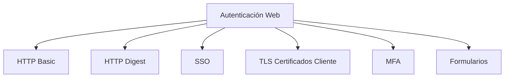

# Autenticación En Aplicaciones Web — Resumen Del Tema

---

## 1. Objetivos Del Tema

### Propósito General

Comprender los **métodos de autenticación en aplicaciones web**, sus **vulnerabilidades**, **fortalezas** y los **mecanismos de defensa** tanto específicos como generales.

### Objetivos Específicos

- Conocer los principales métodos de autenticación.
    
- Identificar los tipos de ataques dirigidos a la autenticación.
    
- Analizar mecanismos de defensa por método.
    
- Comprender medidas de seguridad generales aplicables a todos los métodos.
    
- Entender la importancia de **combinar factores de autenticación**.

---

## 2. Concepto De Autenticación

**Definición:**  
La autenticación es el proceso mediante el cual un sistema **verifica la identidad de un usuario** antes de conceder acceso a recursos o funcionalidades.

**Relevancia:**  
Es la primera barrera de seguridad de una aplicación web y protege datos, sesiones y privilegios.

---

## 3. Principales Métodos De Autenticación

### 3.1 Autenticación HTTP Basic

**Definición:**  
Método estándar de HTTP donde las credenciales (usuario y contraseña) se envían codificadas en **Base64** en cada petición.

**Características:**

- Simple de implementar.
    
- No cifra las credenciales, solo las codifica.

**Vulnerabilidad principal:**  
Exposición de credenciales si no se usa HTTPS.

---

### 3.2 Autenticación HTTP Digest

**Definición:**  
Método de autenticación HTTP basado en **desafío–respuesta** que utilize funciones hash.

**Características:**

- No envía la contraseña en texto claro.
    
- Usa algoritmos de resumen criptográfico (MD5, SHA).

**Ventaja:**  
Mayor seguridad que HTTP Basic.  
**Limitación:** menor adopción moderna.

---

### 3.3 SSO (Single Sign-On)

**Definición:**  
Sistema que permite autenticarse una sola vez para acceder a múltiples servicios.

**Ejemplos comunes:**

- **NTLMv2**
    
- **Kerberos**
    
- **OAuth 2.0 + OpenID Connect**
    
- **SAML**

**Ventajas:**

- Mejora experiencia de usuario.
    
- Centraliza la autenticación.

**Riesgo:**  
Si la cuenta principal se compromete, todos los servicios quedan expuestos.

---

### 3.4 TLS Con Certificados Digitales De Cliente

**Definición:**  
Uso del protocolo **Transport Layer Security** para autenticar tanto servidor como cliente mediante certificados digitales.

**Puerto típico:** HTTPS 443.

**Ventajas:**

- Autenticación mutua.
    
- Protección del canal de comunicación.

**Requisito:** Infraestructura de Clave Pública (PKI).

---

### 3.5 Autenticación Multifactor (MFA)

**Definición:**  
Uso combinado de múltiples factores para verificar identidad.

**Tipos de factores:**

|Tipo|Ejemplo|
|---|---|
|Algo que sabes|Contraseña|
|Algo que tienes|Token, SMS|
|Algo que eres|Huella, rostro|

**Ventaja:**  
Reduce significativamente la probabilidad de suplantación.

---

### 3.6 Autenticación Basada En Formularios

**Definición:**  
Método implementado dentro de la propia aplicación web mediante formularios de login.

**Concepto clave:**  
**Identificador de sesión (Session ID)** se convierte en la credencial activa tras autenticación correcta.

**Riesgo principal:**  
Secuestro de sesión.

---

## 4. Relación De Métodos De Autenticación

---

## 5. Vulnerabilidades Generales

|Método|Vulnerabilidad Común|
|---|---|
|HTTP Basic|Exposición de credenciales|
|HTTP Digest|Compatibilidad limitada|
|SSO|Punto único de fallo|
|TLS Cliente|Complejidad de gestión de certificados|
|Formularios|Robo de sesión|
|MFA|Dependencia de dispositivos|

---

## 6. Mecanismos De Defensa

### Específicos Por Método

- HTTPS obligatorio en HTTP Basic.
    
- Hash robusto en Digest.
    
- Protección de tokens en SSO.
    
- PKI confiable en TLS.
    
- Cookies seguras y regeneración de sesión en formularios.

### Generales

- Uso de TLS.
    
- Control de sesiones.
    
- Validación de entradas.
    
- Autenticación multifactor.
    
- Frameworks de seguridad.

---

## 7. Concepto Clave: Combinación De Métodos

**Principio fundamental:**  
No depender de un solo mecanismo.  
La seguridad aumenta al **combinar factores y métodos**.

Ejemplo práctico:

- Usuario + Contraseña.
    
- Código SMS.
    
- TLS con certificado de cliente.

---

## Información Adicional Relevante

- La autenticación protege identidad; la autorización protege permisos.
    
- SSO se orienta a ecosistemas empresariales.
    
- MFA es considerado estándar moderno de seguridad.
    
- TLS protege el canal; formularios gestionan identidad.

---

## Resumen De Puntos Clave

- La autenticación valida identidad en aplicaciones web.
    
- Métodos principales: HTTP Basic, Digest, SSO, TLS con certificados, MFA y Formularios.
    
- HTTP Basic es inseguro sin HTTPS.
    
- Digest mejora seguridad mediante hashes.
    
- SSO centraliza accesos pero crea punto único de fallo.
    
- TLS con certificados ofrece autenticación mutua.
    
- MFA incrementa seguridad combinando factores.
    
- Formularios dependen de sesiones seguras.
    
- La mejor práctica es combinar múltiples métodos y factores.

## MicroTest