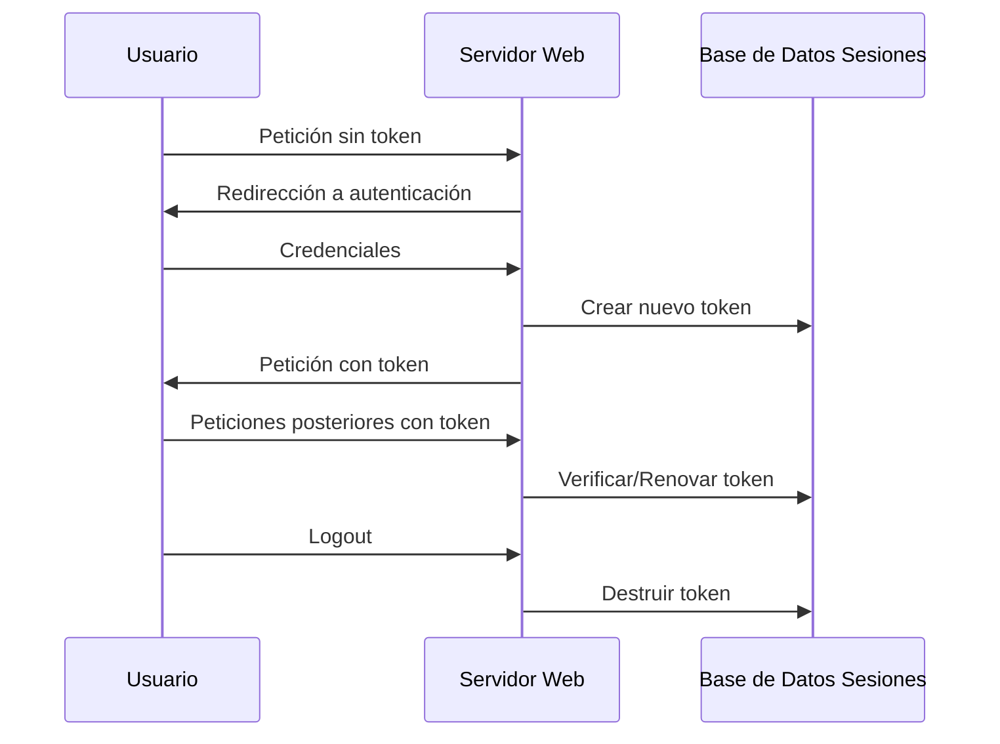

# Gestión De Sesiones En Aplicaciones Web

---

## 1. Concepto De Sesión HTTP

### Definición

Una **sesión HTTP** es una **secuencia de peticiones y respuestas** asociadas a un mismo usuario desde que inicia sesión (login) hasta que finaliza (logout).

### Propósito

HTTP es un protocolo **sin estado**; por lo tanto, las aplicaciones web necesitan mecanismos para **mantener información de contexto** entre múltiples peticiones del mismo usuario.

### Información De Estado

Durante la sesión se almacenan **atributos** como:

- Permisos
    
- Datos del usuario
    
- Preferencias
    
- Estado de navegación

Estos atributos se crean, actualizan y eliminan cuando la sesión termina.

---

## 2. Flujo General De Una Sesión



**Idea clave:**  
El **token o identificador de sesión** se crea **solo después** de validar credenciales correctamente.

---

## 3. Identificador De Sesión (Session ID)

### Definición

Token único que representa la autenticación del usuario frente a la aplicación.

### Características

- Se genera tras autenticación válida.
    
- Tiene tiempo de expiración absoluto.
    
- Tiene tiempo de inactividad máximo.
    
- Debe eliminarse al hacer logout.
    
- Debe regenerarse al reautenticar.

### Importancia

Tras el login, **la sesión se convierte en la credencial real del usuario**.

---

## 4. Almacenamiento De Sesiones

|Ubicación|Propósito|
|---|---|
|Base de datos|Guardar sesiones activas|
|Memoria del servidor|Acceso rápido|
|Navegador|Almacenamiento temporal del ID|

---

## 5. Métodos De Gestión De Sesión (Ejemplo Java)

|Método|Función|
|---|---|
|getAttribute()|Obtener atributo|
|setAttribute()|Establecer atributo|
|removeAttribute()|Eliminar atributo|
|invalidate()|Destruir sesión|
|getId()|Obtener ID de sesión|
|setMaxInactiveInterval()|Definir tiempo de inactividad|
|isNew()|Indicar si la sesión es nueva|

---

## 6. Formas De Envío Del Identificador De Sesión

|Método|Descripción|Riesgo|
|---|---|---|
|Cookie|Cabecera HTTP estándar|Bajo si está securizada|
|URL Rewriting|Agregar ID a la URL|Alto|
|Parámetro GET|ID visible en URL|Alto|
|Parámetro POST|En cuerpo de petición|Medio|
|Campo oculto HTML|Input hidden|Medio|

**Recomendación:**  
Usar **cookies seguras**.

---

## 7. Propiedades De Seguridad Del ID De Sesión

### Longitud Y Aleatoriedad

- Mínimo **128 bits pseudoaleatorios**.
    
- Aproximadamente **22 caracteres aleatorios**.
    
- Considerando prefijos no aleatorios → **25 caracteres**.

### Cálculo Aproximado

128 / log₂(62) ≈ 22

- 3 caracteres no aleatorios = 25

---

## 8. Cookies Seguras

### Cabecera Set-Cookie Segura

```Python
Set-Cookie: id=abc123;
secure;
HttpOnly;
SameSite=Strict;
domain=ejemplo.com;
path=/;
expires=<fecha pasada>
```

### Parámetros Importantes

|Parámetro|Función|
|---|---|
|Secure|Solo HTTPS|
|HttpOnly|No accessible vía JavaScript|
|SameSite=Strict|Solo mismo dominio|
|Domain|Limitar dominio|
|Path|Limitar ruta|
|Expires|Evitar persistencia|

---

## 9. Ataques Contra la Sesión

|Ataque|Descripción|
|---|---|
|Revelación/Captura|Robo del ID|
|Predicción|Adivinar tokens|
|Fuerza bruta|Probar combinaciones|
|Sidejacking|Secuestro de sesión|
|Fijación de sesión|Forzar ID previo|
|SQL Injection|Acceso a tablas de sesiones|
|CSRF|Uso indebido de sesión activa|

---

## 10. Defensas De Seguridad De Sesión

|Medida|Objetivo|
|---|---|
|Timeout absoluto|Limitar duración total|
|Timeout inactividad|Cerrar sesión ociosa|
|Limitar concurrencia|Una sesión por usuario|
|Cookies seguras|Proteger ID|
|SameSite|Evitar dominios externos|
|HttpOnly|Bloquear scripts|
|RNG criptográfico|Tokens impredecibles|
|Regenerar ID|Evitar fijación|
|Eliminar tokens inválidos|Limpieza de sesiones|
|Cookies cifradas|Confidencialidad|

---

## Información Adicional Relevante

- El ID de sesión es más sensible que la contraseña una vez autenticado.
    
- La seguridad de sesión depende tanto del servidor como del cliente.
    
- Frameworks modernos incluyen librerías seguras para gestión de sesiones.
    
- TLS es esencial para evitar interceptación de tokens.

---

## Resumen De Puntos Clave

- Una sesión HTTP mantiene estado en un protocolo sin estado.
    
- El identificador de sesión se crea tras autenticación válida.
    
- Debe tener al menos 128 bits pseudoaleatorios.
    
- Cookies son el método más seguro de transporte.
    
- Parámetros Secure, HttpOnly y SameSite son obligatorios.
    
- Ataques principales: hijacking, fijación, predicción y CSRF.
    
- Defensas clave: regenerar tokens, usar timeouts y cifrar cookies.
    
- Frameworks de desarrollo deben aprovecharse para gestión segura.

## MicroTest

1. ¿Cuándo se debe crear el ID de sesión?
    
    - La respuesta: b. Después de la autenticación correcta.
        
    - Justificación: El ID de sesión solo debe generarse una vez que las credenciales del usuario han sido validadas por el servidor; hacerlo antes permitiría ataques de fijación de sesión donde un atacante podría forzar un identificador previamente conocido.
        
2. ¿Dónde puede ubicarse el ID de sesión?
    
    - La respuesta: d. Todas las anteriores.
        
    - Justificación: El identificador de sesión puede enviarse mediante cabecera Set-Cookie, como parámetro en la URL o dentro del cuerpo de una petición POST, aunque la forma más segura recomendada es mediante cookies protegidas.
        
3. ¿Con qué método de autenticación se crea el ID de sesión?
    
    - La respuesta: c. Basado en formularios.
        
    - Justificación: En la autenticación basada en formularios la aplicación valida usuario y contraseña y, tras ello, genera un identificador de sesión que se convierte en la credencial activa del usuario durante su interacción con el sistema.