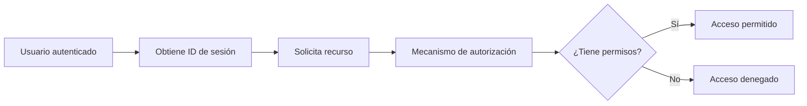
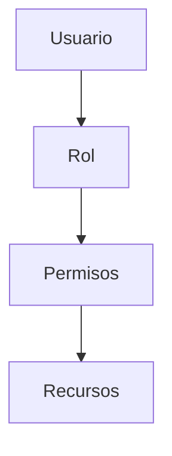

# Autorización En Aplicaciones Web

## Concepto De Autorización

**Definición:**  
La **autorización** es el mecanismo que determina **a qué recursos puede acceder un usuario y qué acciones puede realizar** dentro de una aplicación web después de haberse autenticado.

**Relevancia:**  
Su objetivo principal es **proteger los recursos** de la aplicación y evitar accesos indebidos.

---

## Objetivos De la Autorización

- Garantizar que los usuarios solo realicen acciones dentro de su **nivel de privilegios**.
    
- Aplicar el **principio de mínimos privilegios**.
    
- Evitar **escaladas de privilegios**.
    
- Controlar el acceso a recursos mediante **roles y perfiles**.

---

## Principio De Mínimos Privilegios

**Definición:**  
Cada usuario o sistema debe tener **únicamente los permisos estrictamente necesarios** para cumplir su función.

**Aplicación práctica:**

- Usuarios humanos.
    
- Aplicaciones que consumen servicios web.
    
- Aplicaciones que acceden a bases de datos.
    
- Procesos que interactúan con el sistema operativo.

**Importancia:**  
Reduce el impacto de vulnerabilidades y limita el daño en caso de compromiso.

---

## Tipos De Usuarios

No solo existen usuarios humanos; también existen usuarios lógicos dentro de la arquitectura.

|Tipo|Descripción|
|---|---|
|Usuario humano|Persona que utilize la aplicación|
|Aplicación consumidora|Sistema que consume un servicio web|
|Aplicación proveedora|Sistema que expone un servicio|
|Usuario de base de datos|Cuenta que accede al motor de BD|
|Usuario del sistema operativo|Cuenta con permisos sobre archivos/procesos|

---

## Tipos De Recursos

Los recursos son los elementos que requieren protección.

|Recurso|Ejemplo|
|---|---|
|Funcionalidades|Panel de administración|
|Objetos de base de datos|Tablas, vistas, procedimientos|
|Archivos del sistema|Logs, configuraciones|
|Servicios web|Endpoints API|
|Interfaces|Secciones de la aplicación|

---

## Flujo Horizontal De Autorización

Proceso de verificación de permisos en cada solicitud.

**Regla crítica:**  
La autorización debe evaluarse **en cada petición**, no solo al inicio.

---

## Autorización Vertical (Por Capas)

Se refiere a la seguridad en cada nivel de la arquitectura tecnológica.

### Capa Cliente

- Hardware protegido.
    
- Sistema operativo seguro.
    
- Navegador configurado de forma segura.

### Servidor Web

- Control de acceso a contenido estático.
    
- Configuraciones restrictivas.
    
- Filtrado de peticiones.

### Servidor De Aplicaciones

- Uso de **Security Manager**.
    
- Control de acceso a archivos y sockets.
    
- Middleware seguro.

### Base De Datos

- Permisos granulares.
    
- Uso de usuarios no root.
    
- Conexiones seguras mediante middleware (JDBC, ODBC).

---

## Arquitectura De Seguridad En Navegadores

Los navegadores modernos utilizan **arquitectura modular**:

- Proceso núcleo (kernel).
    
- Un proceso por pestaña.
    
- Un proceso por plugin.
    
- Renderizado HTML independiente.
    
- Ejecución de JavaScript aislada.
    
- Tokens de sistema restringidos.

**Ventaja:**  
Si una pestaña es comprometida, no afecta directamente al sistema operativo.

---

## Implementación Del Mecanismo De Autorización

### 1. Consultas SQL Dinámicas

- Consultan tablas de roles y permisos en tiempo real.
    
- Menor rendimiento.
    
- Mayor carga en base de datos.

### 2. Procedimientos Almacenados

- Precompilados.
    
- Mayor rendimiento.
    
- Más seguros que SQL dinámico.

### 3. Librerías Y Frameworks

- Integraciones listas.
    
- Menor riesgo de errores.
    
- Ejemplo: módulos de seguridad en servidores de aplicaciones.

---

## Modelo Basado En Roles (RBAC)

**Definición:**  
Sistema donde los permisos se asignan a **roles** y los usuarios heredan permisos según su rol.

**Ventaja:**  
Simplifica la administración de permisos.

---

## Components Del Mecanismo De Autorización

- **Gestor de Acceso:** decide si se permite o no el acceso.
    
- **Módulo de Permisos:** define qué rol necesita cada recurso.
    
- **Tabla de Asignación:** relaciona usuarios con roles.

Proceso:

1. Usuario solicita recurso.
    
2. Gestor consulta permisos requeridos.
    
3. Gestor verifica rol del usuario.
    
4. Permitir o denegar acceso.

---

## Riesgos Y Ataques Relacionados

- Escalada de privilegios.
    
- Acceso no autorizado.
    
- Configuraciones débiles.
    
- Permisos excesivos.

---

## Buenas Prácticas

- Evaluar permisos en cada petición.
    
- Aplicar mínimos privilegios.
    
- Separar roles claramente.
    
- Usar frameworks de seguridad.
    
- Configurar capas de infraestructura.
    
- Evitar usuarios root en producción.
    
- Mantener configuraciones seguras en navegadores y servidores.

---

## Resumen De Puntos Clave

- Autorización controla **qué puede hacer** un usuario.
    
- Debe aplicarse tras autenticación.
    
- Se basa en roles y permisos.
    
- Se evalúa en cada petición.
    
- Aplica tanto a usuarios humanos como sistemas.
    
- Protege recursos como funciones, archivos y bases de datos.
    
- Arquitecturas modulares aumentan seguridad en navegadores.
    
- RBAC es el modelo más común.
    
- Procedimientos almacenados son más eficientes que SQL dinámico.
    
- El principio de mínimos privilegios es fundamental.

## MicroTest

1. ¿Cómo se denomina la base de datos del mecanismo de autorización?
    
    - **La respuesta:** a. Lista de control de acceso.
        
    - **Justificación:** La lista de control de acceso (ACL) es el componente donde se almacenan y consultan los permisos, roles y relaciones entre usuarios y recursos. Funciona como la “base de datos lógica” del sistema de autorización porque ahí se verifica quién puede acceder a qué.
        
2. ¿Con qué tipo de usuario se ejecuta un proceso relativo a un sitio web o plugin del navegador?
    
    - **La respuesta:** c. Con un token restringido.
        
    - **Justificación:** Los navegadores modernos aíslan procesos usando tokens restringidos para limitar privilegios. Esto evita que un plugin o pestaña comprometida tenga acceso total al sistema operativo, aplicando el principio de mínimos privilegios.
        
3. ¿Qué se comprueba en la lista de control de acceso para permitir el acceso a un recurso a un usuario?
    
    - **La respuesta:** a. Si el usuario posee el rol necesario que require el recurso para set accedido.
        
    - **Justificación:** El mecanismo de autorización compara el rol o permisos del usuario contra los requisitos del recurso. Si coincide con el rol permitido en la ACL, se concede acceso; de lo contrario, se deniega.