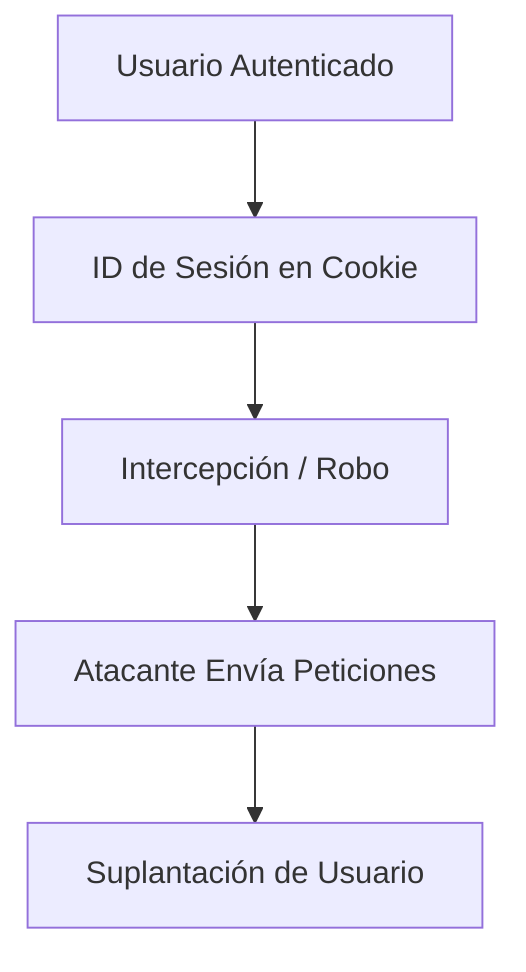
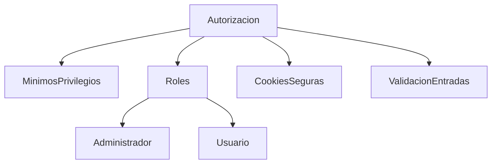

# Autorización En Aplicaciones Web — Recomendaciones De Seguridad

## Concepto General

La **autorización** es el mecanismo encargado de determinar **qué recursos puede usar un usuario y qué acciones puede ejecutar** dentro de una aplicación web una vez que ya se autenticó.

Su correcta implementación es fundamental para evitar accesos indebidos, proteger información sensible y reducir el impacto de vulnerabilidades.

---

## Principales Ataques Relacionados Con la Autorización

### 1. Secuestro De Sesión (Session Hijacking)

**Definición:**  
Consiste en robar o capturar el identificador de sesión de un usuario legítimo para suplantarlo.

**Cómo ocurre:**

- Sniffing de red.
    
- Ataques de repetición.
    
- Intercepción de tráfico.
    
- Fijación de sesión.

**Ejemplo:**  
Si un atacante obtiene el ID de sesión almacenado en cookies, puede enviar peticiones al servidor como si fuera el usuario real.

---

### 2. Fijación De Sesión

**Definición:**  
Vulnerabilidad donde la aplicación entrega un ID de sesión sin validar credenciales.

**Riesgo:**  
El atacante puede forzar un ID de sesión conocido y luego usarlo tras el login del usuario.

---

### 3. Cross-Site Scripting (XSS)

**Definición:**  
Inyección de código JavaScript malicioso en páginas web.

**Impacto:**

- Robo de cookies.
    
- Captura de sesiones.
    
- Redirecciones maliciosas.

---

### 4. Manipulación De Cabeceras HTTP

**Definición:**  
Alteración de encabezados HTTP para inyectar código o modificar respuestas del servidor.

**Ejemplo:**  
Inyección de saltos de línea para generar respuestas duplicadas o ejecutar scripts.

---

### 5. Inclusión De Archivos

|Tipo|Descripción|
|---|---|
|Inclusión Local (LFI)|Permite acceder a archivos internos del servidor.|
|Inclusión Remota (RFI)|Permite incrustar archivos de servidores externos.|

**Causa principal:** Falta de validación de entradas.

---

### 6. Cross-Site Request Forgery (CSRF)

**Definición:**  
Ataque donde un sitio externo envía peticiones usando la sesión activa del usuario sin su consentimiento.

**Ejemplo paso a paso:**

1. Usuario inicia sesión en una web.
    
2. Mantiene la sesión activa.
    
3. Visita otro sitio malicioso.
    
4. El sitio envía una petición usando la cookie de sesión.
    
5. El servidor cree que la acción es legítima.

---

### 7. Condiciones De Carrera (Race Conditions)

**Definición:**  
Ocurren cuando múltiples procesos modifican un recurso sin control atómico.

**Ejemplo:**  
Dos usuarios actualizan simultáneamente una cuenta compartida, generando estados inconsistentes.

---

## Flujo De Riesgo En Ataques De Sesión

---

## Defensas Y Buenas Prácticas

### 1. Fallo Seguro (Fail Secure)

Si ocurre un error, el sistema debe:

- Invalidar sesión.
    
- Redirigir a página inicial.
    
- No revelar información sensible.

---

### 2. Principio De Mínimos Privilegios

Cada usuario debe tener **solo los permisos estrictamente necesarios**.

---

### 3. Separación De Roles

Diferenciar claramente:

- Administradores.
    
- Usuarios estándar.
    
- Servicios internos.

---

### 4. Gestión Robusta De Contraseñas

- Políticas de longitud.
    
- Complejidad.
    
- Expiración periódica.
    
- Concientización del usuario.

---

### 5. Autorización En Cada Petición

Nunca confiar en validaciones previas.  
El control debe ejecutarse **siempre**.

---

### 6. Centralización Del Mecanismo

Evitar múltiples implementaciones dispersas.  
Usar frameworks de seguridad reduce errores.

---

### 7. Protección De Recursos Estáticos

- Permisos de sistema de archivos.
    
- Restricción de accesos directos.
    
- Evitar exposición de logs o configuraciones.

---

### 8. Gestión De Sesiones Segura

- Cookies con **HttpOnly**.
    
- Cookies con **Secure**.
    
- Evitar IDs predecibles.
    
- Regenerar sesión tras login.

---

### 9. Encabezados Y Dominios Seguros

- Separar dominios de aplicación y contenido.
    
- Configurar correctamente cabeceras HTTP.

---

## Relación De Controles De Seguridad

---

## Tabla Resumen De Ataques Y Defensas

|Ataque|Riesgo Principal|Defensa|
|---|---|---|
|Session Hijacking|Suplantación|Cookies seguras, HTTPS|
|XSS|Robo de sesión|Sanitizar entradas|
|CSRF|Acciones no autorizadas|Tokens CSRF|
|LFI/RFI|Acceso a archivos|Validación de rutas|
|Race Condition|Inconsistencia|Operaciones atómicas|

---

## Información Adicional Relevante

- Frameworks modernos incluyen módulos de seguridad integrados.
    
- Las auditorías de permisos deben set periódicas.
    
- La seguridad no es solo técnica, también depende del usuario.

---

## Resumen De Puntos Clave

- La autorización controla qué puede hacer cada usuario.
    
- Los ataques más comunes buscan robar o reutilizar sesiones.
    
- Validar entradas es crítico.
    
- Las cookies deben configurarse como HttpOnly y Secure.
    
- Aplicar mínimos privilegios reduce el impacto de brechas.
    
- Autorizar en cada petición es obligatorio.
    
- Centralizar la seguridad evita errores.
    
- La protección de archivos y cabeceras HTTP es parte del sistema.
    
- La formación del usuario también es una medida de seguridad.

---

## MicroTest

1. ¿Cuál es un ataque a la autorización?
    
    - **La respuesta:** d. Todos los anteriores.
        
    - **Justificación:** TOCTOU, XSS y LFI pueden explotarse para evadir o romper controles de autorización. Todos permiten acceder o manipular recursos sin los permisos adecuados, ya sea por condiciones de carrera, robo de sesión o acceso indebido a archivos.
        
2. ¿Cuál de los siguientes es un mecanismo de defensa para una buena autorización?
    
    - **La respuesta:** d. Todas las anteriores.
        
    - **Justificación:** Una política robusta de contraseñas, la separación de roles y la administración correcta de permisos son prácticas complementarias que fortalecen el sistema de autorización y reducen riesgos de escaladas de privilegios y accesos indebidos.
        
3. ¿A qué se debe el TOCTOU?
    
    - **La respuesta:** d. Las opciones A y B son correctas.
        
    - **Justificación:** TOCTOU ocurre cuando no se diseñan operaciones atómicas y no se controlan adecuadamente los accesos a recursos, generando ventanas de tiempo entre la verificación y el uso que pueden set explotadas para alterar estados o permisos.
<iframe src="https://cheatsheetseries.owasp.org/cheatsheets/Authorization_Cheat_Sheet.html" allow="fullscreen" allowfullscreen="" style="height:100%;width:100%; aspect-ratio: 16 / 9; "></iframe>