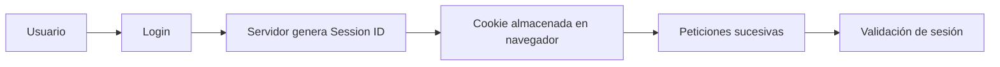
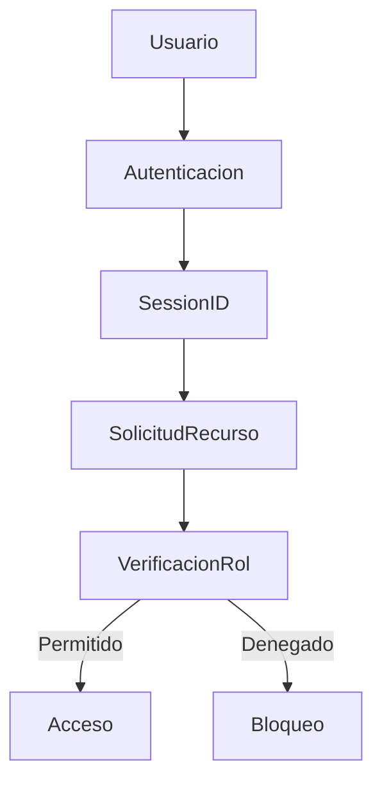

# Gestión De Sesiones Y Autorización En Aplicaciones Web

## Introducción

La **gestión de sesiones** y la **autorización** son dos pilares fundamentales de la seguridad en aplicaciones web.  
Su objetivo es:

- Mantener el estado del usuario durante su interacción.
    
- Garantizar que solo usuarios con permisos adecuados accedan a recursos protegidos.

---

## Gestión De Sesiones

### Definición

La **gestión de sesión** es el mecanismo que permite a una aplicación web **mantener información del usuario entre múltiples peticiones HTTP**, ya que HTTP es un protocolo sin estado.

Una sesión inicia cuando el usuario se autentica y termina cuando:

- Cierra sesión (logout).
    
- Expira el tiempo de inactividad.
    
- Se invalida manualmente.

---

### Estado De Sesión

El estado de sesión incluye:

- Identificador de sesión (Session ID).
    
- Usuario autenticado.
    
- Permisos activos.
    
- Tiempo de expiración.
    
- Variables asociadas al usuario.

---

## Implementación De Sesiones

### Cookies (Set-Cookie)

La forma más común y segura de mantener sesiones.

**Parámetros importantes:**

|Parámetro|Función|
|---|---|
|Expiration|Define la fecha de vencimiento|
|Path|Limita rutas accesibles|
|Domain|Restringe dominio|
|HttpOnly|Evita acceso desde JavaScript|
|Secure|Solo envía por HTTPS|
|SameSite|Evita envío entre dominios|

---

## Ataques Relacionados Con Sesiones

### 1. Session Hijacking

Robo del identificador de sesión para suplantar al usuario.

### 2. Session Fixation

El atacante fuerza un ID de sesión antes del login.

### 3. Cross-Site Scripting (XSS)

Permite robar cookies o tokens.

### 4. Cross-Site Request Forgery (CSRF)

Uso de sesión activa para ejecutar acciones sin consentimiento.

### 5. Sniffing

Captura de tráfico de red no cifrado.

---

## Flujo De Gestión De Sesión

---

## Autorización En Aplicaciones Web

### Definición

La **autorización** determina **qué acciones puede realizar un usuario** y **a qué recursos puede acceder** después de autenticarse.

---

## Tipos De Usuarios

|Tipo|Descripción|
|---|---|
|Usuario humano|Persona que usa la aplicación|
|Usuario lógico|Servicios o sistemas automatizados|
|Administrador|Control total del sistema|
|Usuario estándar|Permisos limitados|

---

## Tipos De Recursos

|Recurso|Ejemplo|
|---|---|
|Vistas|Panel administrativo|
|Tablas|Información de usuarios|
|Archivos|Logs del sistema|
|Servicios|Endpoints API|

---

## Flujo De Autorización

---

## Modelo RBAC (Role Based Access Control)

### Definición

Modelo donde los permisos se asignan a **roles** y los usuarios heredan esos permisos.

**Ventajas:**

- Simplifica administración.
    
- Reduce errores.
    
- Facilita escalabilidad.

---

## Implementación Del Mecanismo De Autorización

### Opciones

|Método|Ventaja|Desventaja|
|---|---|---|
|Librerías / Frameworks|Seguridad probada|Dependencia externa|
|SQL Dinámico|Flexible|Riesgo de inyección|
|Procedimientos Almacenados|Alto rendimiento|Menor flexibilidad|

---

## Defensas Y Buenas Prácticas

### Gestión De Sesión Segura

- Cookies HttpOnly.
    
- Uso de HTTPS.
    
- Expiración controlada.
    
- IDs impredecibles.

### Autorización Robusta

- Verificar permisos en cada petición.
    
- Separación de roles.
    
- Centralizar mecanismos.
    
- Auditorías periódicas.

---

## Información Adicional Relevante

- HTTPS es obligatorio para proteger sesiones.
    
- Frameworks modernos ya integran RBAC.
    
- Las sesiones deben regenerarse tras login.
    
- Los tokens deben set aleatorios y largos.

---

## Resumen De Puntos Clave

- HTTP no mantiene estado, la sesión lo resuelve.
    
- Cookies son el mecanismo más común.
    
- XSS y CSRF son ataques críticos.
    
- HttpOnly y Secure son configuraciones esenciales.
    
- Autorización define permisos tras autenticación.
    
- RBAC es el modelo más utilizado.
    
- Frameworks reducen errores de implementación.
    
- Validar permisos en cada petición es obligatorio.
    
- Separar roles mejora la seguridad.

---

## MicroTest