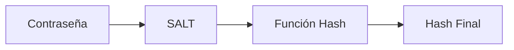
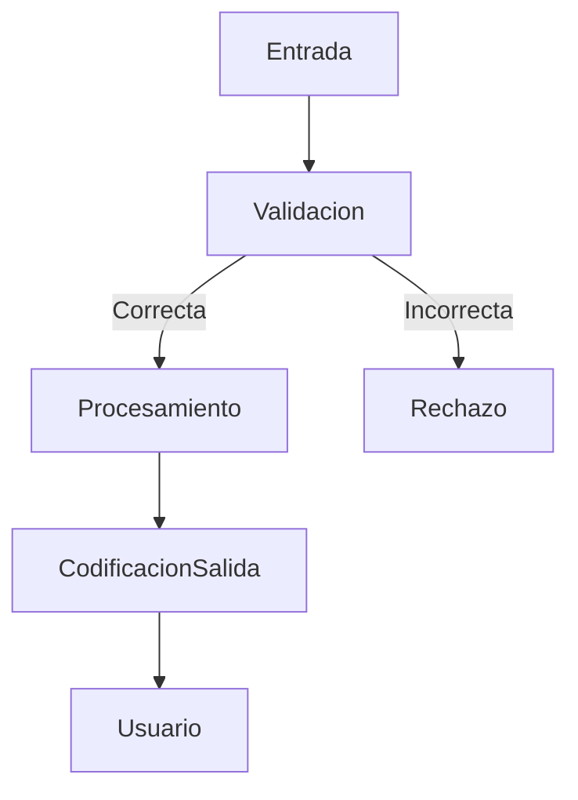

# Principios Del Desarrollo Seguro

## Introducción

El **desarrollo seguro de software** consiste en aplicar prácticas, metodologías y controles que reduzcan la probabilidad de introducir vulnerabilidades durante la creación de una aplicación.  
El objetivo es **prevenir fallos de seguridad desde el diseño y la codificación**, en lugar de corregirlos únicamente al final.

---

## Formación Continua Del Desarrollador

### Definición

La **formación continua** implica que los desarrolladores se mantengan actualizados en vulnerabilidades, técnicas de ataque y buenas prácticas de seguridad.

### Relevancia

- Permite identificar vulnerabilidades desde el inicio.
    
- Reduce errores en el código fuente.
    
- Funciona como medida preventiva principal.

---

## Manejo Seguro De Datos

### Principio Fundamental

**Toda fuente de entrada debe considerarse maliciosa por defecto.**

### Fuentes De Entrada Comunes

|Fuente|Ejemplo|
|---|---|
|Base de datos|Consultas SQL|
|Variables de entorno|Configuración del sistema|
|Parámetros de ejecución|Línea de commandos|
|Archivos|Configuración, temporales|
|Red|Sockets, APIs|
|Consola|Entradas manuales del usuario|

---

## Uso De Código Y Librerías Confiables

- Preferir librerías probadas y auditadas.
    
- Evitar librerías sin certificación de seguridad.
    
- Consultar vulnerabilidades públicas (CVE / MITRE).
    
- Aplicar parches cuando existan.

---

## Revisión De Código Y Listas Blancas

### Revisión De Código

Proceso de inspección manual o automatizada para detectar vulnerabilidades.

### Lista Blanca (Whitelist)

**Definición:**  
Conjunto de valores permitidos explícitamente para una variable.  
Todo valor fuera de la lista es rechazado.

**Ventaja:**  
Mayor seguridad que listas negras.

---

## Principio De Mínimos Privilegios

### Definición

Cada usuario, proceso o aplicación debe tener **solo los permisos necesarios** para cumplir su función.

### Aplicaciones

- Usuarios de base de datos.
    
- Acceso a memoria.
    
- Archivos del sistema.
    
- Servicios del sistema operativo.

---

## Gestión Segura De Contraseñas

### Buenas Prácticas

|Práctica|Descripción|
|---|---|
|No mostrar contraseñas|Evitar visualización en pantalla|
|No almacenar en texto plano|Siempre cifrar|
|No codificar en código fuente|Riesgo de exposición|
|Usar Hash criptográfico|SHA, bcrypt, Argon2|
|Uso de SALT|Prefijo o sufijo aleatorio para reforzar hash|
|Transmisión cifrada|HTTPS / TLS|

---

## Hash Y SALT

### Hash

Función criptográfica que transforma una contraseña en un valor irreversible.

### SALT

Valor aleatorio añadido al hash para evitar ataques de diccionario.

---

## Protección De Información Sensible

- No almacenar datos sensibles sin cifrado.
    
- No enviar contraseñas por correo electrónico.
    
- Proteger bases de datos.
    
- Evitar privilegios de administrador innecesarios.

---

## Validación De Entrada

### Objetivo

Prevenir vulnerabilidades como:

- Buffer Overflow.
    
- Inyección SQL.
    
- Cross-Site Scripting (XSS).

### Reglas De Validación

|Regla|Propósito|
|---|---|
|Longitud mínima y máxima|Evitar desbordamientos|
|Tipo de dato|Evitar errores lógicos|
|Precisión numérica|Evitar valores fuera de rango|
|Formato|Correos, fechas, IDs|
|Lista blanca|Permitir solo valores válidos|

---

## Codificación De Salida

### Definición

Proceso de transformar datos antes de mostrarlos para evitar ejecución de código malicioso.

### Uso Principal

Prevención de **XSS**.

---

## Separación De Datos Confiables Y No Confiables

- Mantener zonas diferenciadas.
    
- Validar antes de mover datos entre zonas.
    
- Asegurar que siempre exista control de entrada.

---

## Manejo De Errores Y Excepciones

- No mostrar trazas internas al usuario.
    
- Evitar revelar rutas de archivos.
    
- Proteger información del sistema.

---

## Seguridad Vs Usabilidad

### Diferencias

|Concepto|Enfoque|
|---|---|
|Usabilidad|Facilidad de uso|
|Seguridad|Protección contra ataques|

La seguridad debe priorizarse cuando exista conflicto.

---

## Funcionalidad Vs Vulnerabilidad

- **Funcionalidad:** la función cumple su objetivo.
    
- **Vulnerabilidad:** la función puede set explotada aunque funcione correctamente.

---

## Flujo De Validación Y Codificación

---

## Errores Comunes De Implementación

|Error|Riesgo|
|---|---|
|No validar entradas|Inyección de código|
|No codificar salidas|XSS|
|Manejo incorrecto de excepciones|Fuga de información|
|Cifrado débil|Robo de datos|
|Alto privilegio innecesario|Escalada de privilegios|

---

## Librerías De Seguridad

Es recomendable contar con librerías que:

- Validan entradas.
    
- Codifican salidas.
    
- Generan números aleatorios criptográficos.
    
- Implementan controles de acceso.

---

## Información Adicional Relevante

- Evitar rutas relativas de archivos.
    
- No confiar en variables de entorno sin validar.
    
- No ejecutar software no confiable desde aplicaciones confiables.
    
- Utilizar generadores criptográficos de números aleatorios.

---

## Resumen De Puntos Clave

- La formación continua es la primera defensa.
    
- Toda entrada se considera maliciosa.
    
- Usar listas blancas en validación.
    
- Aplicar mínimos privilegios siempre.
    
- Hash + SALT para contraseñas.
    
- Cifrar información sensible.
    
- Codificar salidas para evitar XSS.
    
- Separar datos confiables de no confiables.
    
- Revisar librerías de terceros.
    
- Validar longitud, tipo y formato de entradas.
    
- Priorizar seguridad sobre usabilidad.
    
- Utilizar librerías de seguridad especializadas.

## MicroTest

1. ¿Qué no hay que usar para identificar usuarios?
    
    - **La respuesta:** c. Opciones A y D.
        
    - **Justificación:** No se deben usar ni correos electrónicos ni direcciones IP/MAC como identificadores únicos de usuario porque pueden cambiar, set suplantados o no garantizar identidad real, lo que genera riesgos de seguridad y suplantación.
        
2. Señala la afirmación incorrecta sobre buenas prácticas de programación:
    
    - **La respuesta:** b. Usar listas negras en lugar de blancas de comprobación.
        
    - **Justificación:** Las listas negras son menos seguras porque solo bloquean valores conocidos, mientras que las listas blancas permiten únicamente valores explícitamente válidos, reduciendo significativamente el riesgo de inyección o entradas maliciosas.
        
3. Señalar la afirmación incorrecta sobre buenas prácticas de programación:
    
    - **La respuesta:** c. Asumir que los usuarios no son maliciosos.
        
    - **Justificación:** En seguridad siempre se debe asumir que cualquier usuario o entrada puede set maliciosa. Confiar en el usuario rompe el principio de validación de entrada y aumenta la probabilidad de vulnerabilidades.
<iframe src="https://cheatsheetseries.owasp.org/cheatsheets/Input_Validation_Cheat_Sheet.html" allow="fullscreen" allowfullscreen="" style="height:100%;width:100%; aspect-ratio: 16 / 9; "></iframe>

