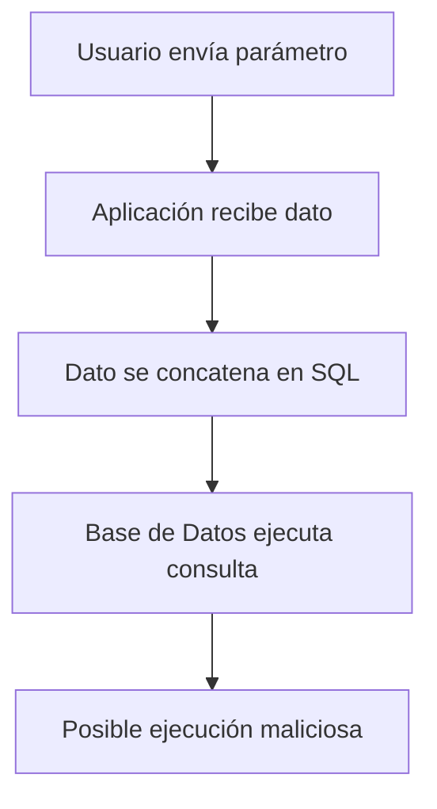
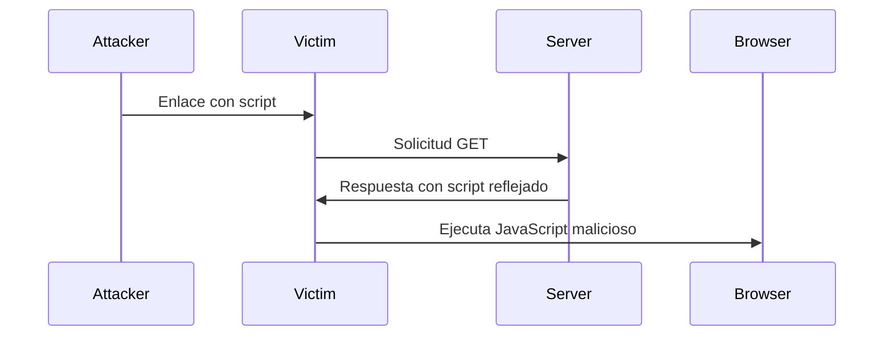
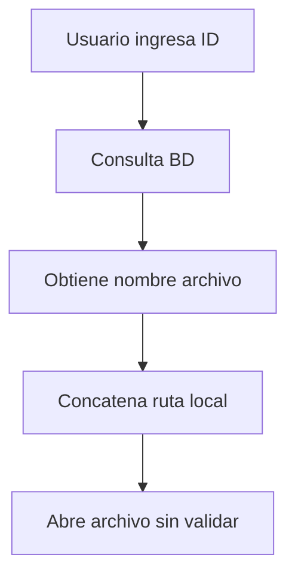

# Desarrollo Seguro – OWASP Top Ten I – Notas De Estudio

---

## Introducción

El **OWASP Top Ten** es un proyecto que identifica las **10 vulnerabilidades más críticas en aplicaciones web**.  
Su objetivo es concientizar a desarrolladores y equipos de seguridad sobre riesgos comunes y cómo mitigarlos mediante **buenas prácticas de desarrollo seguro**.

En esta sesión se abordan principalmente:

- SQL Injection (SQLi)
    
- Cross-Site Scripting (XSS)
    
- HTTP Response Splitting
    
- Local File Inclusion (LFI)

---

## 1. SQL Injection (SQLi)

### Definición

**SQL Injection** es una vulnerabilidad que ocurre cuando una aplicación inserta directamente datos proporcionados por el usuario dentro de una consulta SQL **sin validación ni sanitización**, permitiendo que un atacante ejecute commandos SQL maliciosos.

### Concepto Clave

- Las **entradas del usuario son fuentes no confiables**.
    
- El problema ocurre al **concatenar cadenas** directamente en consultas SQL.
    
- Se clasifica como **inyección de código**.

### Flujo De la Vulnerabilidad



### Código Vulnerable (Conceptual)

```java
String data = request.getParameter("name"); // SOURCE
Statement stmt = conn.createStatement();
stmt.execute("INSERT INTO users VALUES ('" + data + "')"); // SINK
```

**Problema:**  
El valor de `data` se inserta directamente en la consulta.

### Solución: PreparedStatement

```java
PreparedStatement ps = conn.prepareStatement(
  "INSERT INTO users VALUES (?)"
);
ps.setString(1, data);
ps.execute();
```

**Ventajas:**

- Valida tipos de datos.
    
- Evita ejecución de código arbitrario.
    
- Separa estructura SQL de los valores.

---

## 2. Cross-Site Scripting (XSS)

### Definición

**XSS** permite a un atacante inyectar **código JavaScript** que será ejecutado en el navegador de la víctima.

### Tipos Comunes

- **Reflejado:** Se devuelve inmediatamente en la respuesta.
    
- **Almacenado:** Se guarda en la base de datos.
    
- **DOM-Based:** Manipulación directa del DOM.

### Flujo De Ataque



### Código Vulnerable

```java
data = request.getParameter("name"); // SOURCE
response.getWriter().println(data); // SINK
```

**Problema:**  
No hay validación ni codificación antes de enviarlo al navegador.

### Solución: Sanitización / Encoding

Uso de librerías OWASP:

- **OWASP Java Encoder**
    
- **OWASP ESAPI**

```java
data = Encoder.forHtml(data);
response.getWriter().println(data);
```

**Beneficio:**  
Convierte caracteres peligrosos en entidades HTML seguras.

---

## 3. HTTP Response Splitting

### Definición

Permite a un atacante inyectar **caracteres especiales** (CR/LF) en encabezados HTTP para dividir la respuesta en múltiples partes y manipular contenido.

### Riesgo

- Inyección de HTML/JavaScript.
    
- Secuestro de sesión.
    
- Redirecciones maliciosas.

### Código Vulnerable

```java
Cookie cookie = new Cookie("lang", data); // SOURCE
response.addCookie(cookie); // SINK
```

Si `data` contiene `\r\n`, puede alterar la respuesta.

### Solución: Encoding De URL

```java
Cookie cookie = new Cookie("lang",
  URLEncoder.encode(data, "UTF-16")
);
response.addCookie(cookie);
```

**Idea Clave:**  
Codificar caracteres no alfanuméricos.

---

## 4. Local File Inclusion (LFI)

### Definición

Permite acceder o incluir archivos locales del servidor manipulando rutas o nombres de archivo.

### Riesgo

- Lectura de archivos sensibles.
    
- Escalada de privilegios.
    
- Ejecución indirecta de código.

### Flujo



### Código Vulnerable

```java
String root = "C:/datos/";
File f = new File(root + data); // SOURCE
if(f.exists()) {
  readFile(f); // SINK
}
```

**Problema:**  
`data` proviene de la base de datos o usuario sin validación.

### Solución: Lista Blanca (Whitelist)

```java
ArrayList<String> permitidos = new ArrayList<>();
permitidos.add("BMW");
permitidos.add("Mazda");

if(permitidos.contains(data)) {
  return data;
} else {
  return "";
}
```

### Defensas Adicionales

- Permisos de sistema de archivos.
    
- Control de acceso a recursos.
    
- Validación estricta de rutas.
    
- Separación de privilegios.

---

## Conceptos Transversales Importantes

|Concepto|Definición|Relevancia|
|---|---|---|
|SOURCE|Punto donde entra el dato no confiable|Inicio del riesgo|
|SINK|Punto donde se usa el dato|Donde ocurre el daño|
|Sanitización|Limpieza de datos|Previene ejecución maliciosa|
|Encoding|Conversión de caracteres|Protección en salida|
|Whitelist|Lista de valores permitidos|Control estricto|
|PreparedStatement|Consulta SQL parametrizada|Defensa principal SQLi|

---

## Buenas Prácticas Generales

- Nunca confiar en entradas del usuario.
    
- Validar **input** y codificar **output**.
    
- Usar librerías OWASP.
    
- Aplicar principio de mínimo privilegio.
    
- Implementar listas blancas.
    
- Revisar permisos del sistema.
    
- Separar lógica de datos.

---

## Resumen De Puntos Clave

- **SQL Injection:** Evitar concatenar cadenas; usar `PreparedStatement`.
    
- **XSS:** Codificar salida HTML con OWASP Encoder.
    
- **HTTP Response Splitting:** Codificar datos antes de usarlos en encabezados.
    
- **LFI:** Validar rutas y usar listas blancas.
    
- **SOURCE → SINK:** Entender flujo de datos es esencial.
    
- Toda entrada externa es **no confiable**.
    
- Validación + Sanitización + Encoding = Base del desarrollo seguro.

---

## MicroTest

1. La mejor forma de evitar SQL injection es:
    
    - La respuesta: c. Mediante sentencias preparadas de SQL.
        
    - Justificación: Las sentencias preparadas separan la estructura de la consulta SQL de los datos del usuario, evitando que el input se interpret como código SQL ejecutable. Es la defensa principal recomendada por OWASP porque valida tipos y parámetros automáticamente, a diferencia de blacklist o validaciones solo del lado del cliente que pueden set fácilmente evadidas.
        
2. ¿Cuáles son formas de prevención de XSS en el código?
    
    - La respuesta: d. Todas las anteriores son correctas.
        
    - Justificación: La prevención de XSS require un enfoque en capas: validar la entrada reduce datos maliciosos, codificar la salida impide la ejecución de scripts en el navegador y las cabeceras como XSS-Protection y Content Security Policy añaden una barrera adicional a nivel del navegador. Usar solo una técnica no es suficiente.
        
3. ¿Cuáles son formas de prevención de HTTP response splitting en el código?
    
    - La respuesta: d. Todas las anteriores son ciertas.
        
    - Justificación: El HTTP response splitting se previene combinando validación de entrada para bloquear caracteres CR/LF, codificación de salida para neutralizar caracteres especiales y controles adicionales como listas negras o filtros. La combinación de técnicas reduce significativamente la posibilidad de inyección en encabezados HTTP.

<iframe src="https://find-sec-bugs.github.io/bugs.htm" allow="fullscreen" allowfullscreen="" style="height:100%;width:100%; aspect-ratio: 16 / 9; "></iframe>