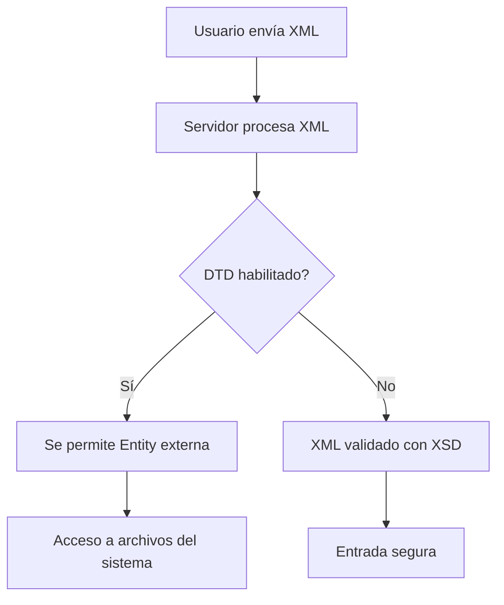

# Desarrollo Seguro – OWASP Top Ten II

## Configuración Insegura Y Vulnerabilidades Relacionadas

---

## 1. Configuración Insegura (OWASP Top Ten – Categoría 5)

### Definición

La **configuración insegura** se refiere a errores o malas prácticas en la configuración de aplicaciones, servidores o components que permiten la explotación de vulnerabilidades sin necesidad de fallos directos en el código.

### Relevancia

- No depende únicamente de programación incorrecta.
    
- Puede originarse por configuraciones por defecto, librerías antiguas o habilitación de funciones innecesarias.
    
- Es una de las causas más comunes de brechas de seguridad.

---

## 2. XXE – XML External Entities (CWE-611)

### Definición

**XXE (XML External Entities)** es una vulnerabilidad que ocurre cuando un parser XML permite la definición de **entidades externas** dentro de un documento XML, posibilitando el acceso no autorizado a recursos del sistema.

### Conceptos Clave

|Concepto|Definición|Riesgo|
|---|---|---|
|DTD (Document Type Definition)|Definición antigua de estructura XML|Permite entidades externas|
|XSD (XML Schema Definition)|Esquema moderno para XML|Permite validación más estricta|
|Entity|Macro o referencia interna/externa dentro del XML|Puede acceder a archivos del sistema|

### Problema Principal

El uso de **DTD** permite declarar entidades externas como:

```Python
<!ENTITY xxe SYSTEM "file:///etc/passwd">
```

Esto puede provocar:

- Lectura de archivos locales.
    
- Exfiltración de información sensible.
    
- Ataques SSRF (Server Side Request Forgery).

### Soluciones

- **Deshabilitar DTD** en el parser XML.
    
- **Establecer XML Resolver en null**.
    
- Utilizar **XSD en lugar de DTD**.
    
- Validar entradas XML con expresiones regulares dentro del esquema.

---

## Flujo De Vulnerabilidad XXE



---

## 3. Generación Insegura De Números Aleatorios (CWE-330)

### Definición

El uso de funciones **no criptográficas** para generar números aleatorios puede permitir que un atacante prediga valores generados.

### Ejemplo De Riesgo

Funciones como `random()` producen números con **patrones estadísticos** previsibles.

### Impacto

- Tokens de sesión predecibles.
    
- Contraseñas temporales vulnerables.
    
- Claves de seguridad débiles.

---

### Comparativa De Generadores

|Tipo|Ejemplo|Seguridad|Uso recomendado|
|---|---|---|---|
|No criptográfico|`Random()`|Baja|Simulaciones, juegos|
|Criptográfico|`SecureRandom()`|Alta|Tokens, claves, sesiones|

---

## Buenas Prácticas Generales

- Deshabilitar funciones innecesarias en configuraciones.
    
- Utilizar esquemas modernos (XSD).
    
- Validar entradas con listas blancas.
    
- Emplear generadores criptográficos.
    
- Revisar configuraciones por defecto de frameworks.

---

## Información Adicional Relevante

- OWASP recomienda auditorías periódicas de configuración.
    
- Las configuraciones inseguras suelen combinarse con otras vulnerabilidades.
    
- Automatizar escaneos de seguridad ayuda a detectar configuraciones débiles.

---

## Resumen De Puntos Clave

- La **configuración insegura** es una causa frecuente de vulnerabilidades.
    
- **XXE** surge por permitir DTD y entidades externas en XML.
    
- La solución principal es **usar XSD y deshabilitar DTD**.
    
- Los números aleatorios inseguros permiten predicciones peligrosas.
    
- Deben usarse **generadores criptográficos** para elementos de seguridad.
    
- Validación de entrada y revisión de configuraciones son esenciales.

---

## MicroTest

1. ¿Cómo se pueden evitar vulnerabilidades XXE?
    
    - La respuesta: d. Todas las anteriores son ciertas.
        
    - Justificación: Las vulnerabilidades XXE se mitigan combinando varias defensas: validar entradas en el código, validar contra un XSD para restringir la estructura y, especialmente, deshabilitar DTD. Cada medida reduce un vector distinto de ataque, por lo que lo correcto es aplicar todas.
        
2. ¿Qué se recomienda a la hora de generar números aleatorios?
    
    - La respuesta: b. Usar algoritmos de tipo criptográfico.
        
    - Justificación: Los algoritmos estadísticos comunes son predecibles y no aptos para seguridad. Los criptográficos están diseñados para set impredecibles y se usan en tokens, contraseñas y sesiones. La longitud por sí sola no garantiza seguridad si el generador es débil.
        
3. ¿Cómo se denomina en Java la función segura de generación de números aleatorios?
    
    - La respuesta: b. SecureRamdom().
        
    - Justificación: En Java la clase segura es **SecureRandom**, pensada para usos criptográficos. Las otras opciones son incorrectas o corresponden a generadores no seguros.


