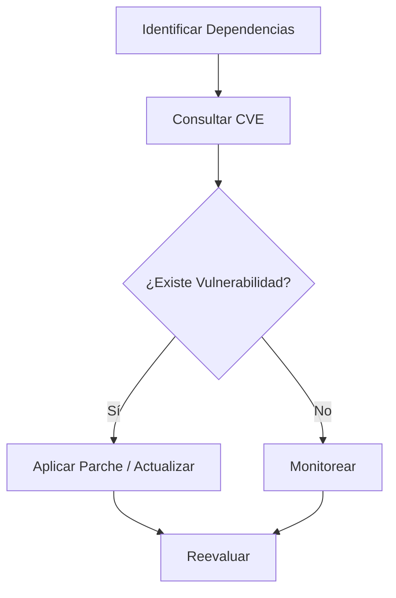
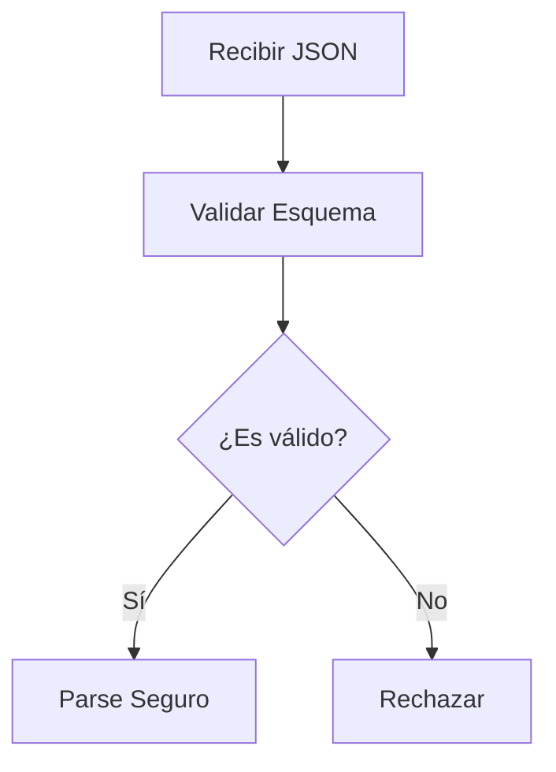

# Idea Clave 4 — Desarrollo Seguro OWASP Top Ten III

## 1. Uso De Components Vulnerables (OWASP A6)

### Definición

Consiste en **utilizar librerías, frameworks o dependencias de terceros que contienen vulnerabilidades conocidas**.  
Es un riesgo crítico porque gran parte del software moderno depende de components externos.

### Riesgos Principales

- Exposición a vulnerabilidades públicas (CVE).
    
- Existencia de **exploits** disponibles.
    
- Pérdida de confidencialidad, integridad o disponibilidad.
    
- Ataques indirectos a través de dependencias.

### Medidas De Mitigación

- Consultar bases de datos de vulnerabilidades (MITRE CVE, NVD).
    
- Aplicar **parches y actualizaciones** inmediatamente.
    
- Usar components con soporte activo.
    
- Auditorías de dependencias.
    
- Análisis de código si es software libre.
    
- Certificaciones de seguridad cuando existan.

### Ejemplos De Vulnerabilidades (CVE)

|CVE|Año|Componente|Tipo de Vulnerabilidad|Impacto|
|---|---|---|---|---|
|CVE-2023-44469|2023|OpenID Connect Issuer|SSRF (Server-Side Request Forgery)|Permite enviar solicitudes a URLs arbitrarias desde el servidor|
|CVE-2023-26464|2023|Apache Log4j|Denial of Service|Agotamiento de memoria al deserializar objetos|

### Flujo De Gestión De Dependencias

---

## 2. Hardcoded Password (OWASP A7)

### Definición

Ocurre cuando una **contraseña se escribe directamente en el código fuente**.  
Es una mala práctica grave porque:

- Puede filtrarse si el repositorio es expuesto.
    
- El ejecutable puede set descompilado.
    
- Rompe el principio de gestión segura de credenciales.

### Ejemplo Vulnerable (Concepto)

1. El desarrollador escribe una contraseña fija en el código.
    
2. El programa la usa para autenticarse.
    
3. Un atacante accede al código o lo descompila.
    
4. Obtiene la contraseña y accede al sistema.

### Solución Correcta

- Leer contraseñas desde:
    
    - Consola.
        
    - Variables de entorno.
        
    - Gestores de secretos.
        
    - Bases de datos seguras.
        
- Nunca almacenar en texto plano.
    
- Validar entrada.

### Comparación

|Práctica|Seguridad|Motivo|
|---|---|---|
|Contraseña en código|Baja|Fácil de extraer|
|Lectura desde consola|Media|Menor exposición|
|Gestor de secretos|Alta|Cifrado y control de acceso|

---

## 3. Deserialización Insegura (OWASP A8)

### Definición

La **deserialización insegura** ocurre cuando una aplicación convierte datos externos (JSON, XML, objetos) a estructuras internas **sin validarlos**, permitiendo ejecución de código o manipulación de datos.

Puede ocurrir en:

- **Servidor → Cliente**
    
- **Cliente → Servidor**

---

### 3.1 Deserialización Insegura En Servidor

#### Riesgo

- Uso de funciones como `eval()` que ejecutan directamente contenido.
    
- Possible ejecución de código malicioso.

#### Solución

- Usar parsers seguros (`JSON.parse`, validadores de esquema).
    
- Validar contra **JSON Schema** o **XSD**.
    
- Evitar `eval()`.

#### Proceso Seguro

---

### 3.2 Deserialización Insegura En Cliente

#### Riesgo

- Navegador ejecuta JavaScript embebido.
    
- Ataques XSS indirectos.

#### Solución

- Usar `JSON.parse()` en lugar de `eval()`.
    
- Validar estructura antes de usarla.

---

## Conceptos Clave Relacionados

|Concepto|Definición|Relevancia|
|---|---|---|
|CVE|Identificador público de vulnerabilidades|Permite rastrear fallos conocidos|
|SSRF|Solicitudes forzadas desde el servidor|Acceso a recursos internos|
|DoS|Denegación de servicio|Interrupción del sistema|
|Hardcoded Password|Credencial fija en código|Exposición directa|
|JSON Schema|Esquema de validación JSON|Prevención de datos maliciosos|

---

## Información Adicional Relevante

- Herramientas útiles: OWASP Dependency Check, Snyk, SonarQube.
    
- Buenas prácticas DevSecOps integran seguridad en el ciclo de desarrollo.
    
- Principio de **actualización continua** es fundamental.

---

## Resumen De Puntos Clave

- Las dependencias externas deben auditarse constantemente.
    
- Consultar CVE y aplicar parches reduce riesgos críticos.
    
- Nunca almacenar contraseñas en el código.
    
- La deserialización debe validarse siempre.
    
- `JSON.parse` es más seguro que `eval`.
    
- Validar datos contra esquemas evita ejecución de código malicioso.
    
- La seguridad debe considerarse desde el diseño del software.

---

## MicroTest

1.Señalar la afirmación incorrecta  
- La respuesta: a.  
- Justifacion: Es incorrecta porque **sí existe riesgo al usar librerías de terceros**; pueden container vulnerabilidades públicas (CVE) y no se puede asumir que son seguras sin auditoría y actualización.

2.¿Cómo no se debe acceder (mediante autenticación) a una base de datos desde el código?  
- La respuesta: b.  
- Justifacion: **Codificar usuario y contraseña en el código fuente (hardcoded)** es una mala práctica grave de seguridad, ya que cualquiera con acceso al código o al binario podría extraer las credenciales.

3.¿Qué función hay que usar en lugar de eval()?  
- La respuesta: c.  
- Justifacion: `json.parse()` valida y convierte texto JSON de forma segura, mientras que `eval()` ejecuta código arbitrario y puede permitir inyección de scripts o ejecución maliciosa.