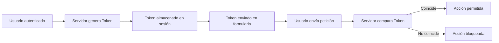

# Idea Clave 5 – Desarrollo Seguro: Open Redirect, CSRF Y SSRF

---

## 1. Open Redirect (Redirección Abierta)

### Definición

**Open Redirect** es una vulnerabilidad que ocurre cuando una aplicación web **redirige al usuario a una URL construida a partir de datos de entrada sin validación**.  
Esto permite que un atacante envíe enlaces que aparentan set legítimos pero que terminan en sitios maliciosos.

### Riesgos

- **Phishing**
    
- Robo de credenciales
    
- Suplantación de identidad
    
- Elevación de privilegios indirecta

### Escenario Típico

1. El usuario hace clic en un enlace aparentemente legítimo.
    
2. La aplicación recibe un parámetro `url` desde un formulario.
    
3. La aplicación redirige automáticamente a esa URL sin validar.
    
4. El atacante logra enviar al usuario a un sitio falso.

---

### Ejemplo Conceptual De Código Vulnerable

```java
String location = request.getParameter("url");
response.sendRedirect(location);
```

**Problema:**  
`location` proviene del usuario y no se valida.

---

### Solución: Lista Blanca (Whitelist)

**Concepto:** Solo se permite redirigir a URLs previamente definidas como seguras.

```java
ArrayList<String> whitelist = new ArrayList<>();
whitelist.add("https://ejemplo1.com");
whitelist.add("https://ejemplo2.com");

if(whitelist.contains(location)){
    response.sendRedirect(location);
}
```

### Idea Clave

Validación de entrada mediante **listas blancas de URLs permitidas**.

---

## 2. CSRF (Cross-Site Request Forgery)

### Definición

**CSRF** es un ataque donde un atacante consigue que un usuario autenticado en una aplicación legítima **realice acciones sin su consentimiento**.

### Requisitos Del Ataque

- Usuario autenticado.
    
- Sesión activa en el navegador.
    
- Enlace o script malicioso externo.
    
- Aplicación vulnerable sin validación de token.

### Funcionamiento Del Ataque

1. Usuario inicia sesión en su banco.
    
2. Abre otra pestaña con un sitio malicioso.
    
3. El sitio malicioso envía una petición al banco.
    
4. El navegador adjunta automáticamente la cookie de sesión.
    
5. El banco procesa la petición como válida.

---

### Solución: Anti-CSRF Token

**Concepto:**  
Un **token único por sesión o petición** que debe coincidir entre servidor y cliente.

#### Flujo De Protección



### Idea Clave

Uso de **token anti-CSRF** único y validado en cada petición sensible.

---

## 3. SSRF (Server-Side Request Forgery)

### Definición

**SSRF** ocurre cuando una aplicación permite que el servidor realice solicitudes HTTP basadas en **datos proporcionados por el usuario**, sin validación adecuada.

### Riesgos

- Acceso a recursos internos del servidor.
    
- Lectura de archivos locales.
    
- Acceso a servicios internos (localhost, intranet).
    
- Exfiltración de datos.

---

### Escenario Típico

1. Usuario ingresa una URL.
    
2. Servidor construye petición con esa URL.
    
3. Servidor accede a un recurso interno.
    
4. El atacante recibe la respuesta.

---

### Solución: Validación De Entrada + Lista Blanca

Se aplica el mismo principio que Open Redirect, pero en el **lado servidor**.

```java
ArrayList<String> hostsPermitidos = new ArrayList<>();
hostsPermitidos.add("api.segura.com");
hostsPermitidos.add("servicio.empresa.com");

if(hostsPermitidos.contains(host)){
    realizarPeticion();
}
```

### Idea Clave

No permitir que el usuario defina libremente destinos internos o externos.

---

## Tabla Comparativa De Vulnerabilidades

|Vulnerabilidad|Tipo de Ataque|Vector Principal|Solución Clave|
|---|---|---|---|
|Open Redirect|Redirección|URL manipulada|Lista blanca de URLs|
|CSRF|Peticiones forzadas|Sesión activa|Token anti-CSRF|
|SSRF|Peticiones del servidor|URL manipulada|Lista blanca de hosts|

---

## Información Adicional Relevante

- Las **listas blancas** son preferibles a listas negras.
    
- CSRF suele afectar operaciones como:
    
    - Transferencias bancarias
        
    - Cambios de contraseña
        
    - Eliminación de datos
        
- SSRF puede usarse para escaneo de puertos internos.
    
- Siempre validar **protocolo, dominio y ruta**.

---

## Resumen De Puntos Clave

- **Open Redirect:** validar URLs con lista blanca.
    
- **CSRF:** usar tokens únicos por petición.
    
- **SSRF:** restringir destinos del servidor.
    
- Nunca confiar en datos del usuario.
    
- Aplicar validación de entrada y control de acceso.
    
- Preferir whitelist sobre blacklist.

---

## MicroTest

1.Señalar la afirmación correcta para evitar Open Redirect  
- La respuesta: c.  
- Justifacion: Open Redirect se produce por **redirigir a URLs controladas por el usuario sin validación**; la medida correcta es **validar contra una lista blanca de URLs permitidas**, no basta con validar en cliente ni con codificar salida.

2.Señalar la afirmación correcta para evitar CSRF  
- La respuesta: a.  
- Justifacion: CSRF se previene mediante **tokens anti-CSRF únicos por sesión o petición**, que el servidor compara antes de ejecutar acciones sensibles; codificar salida o listas blancas no mitigan este tipo de ataque.

3.¿A qué corresponde la siguiente línea de código?: `req.getParameter("_csrf_token").equals(req.getSession().getAttribute("_csrf_token")`  
- La respuesta: d.  
- Justifacion: Esa línea **compara el token enviado en la petición con el token almacenado en la sesión**, que es exactamente el mecanismo de **verificación de un token anti-CSRF** para asegurar que la solicitud es legítima.