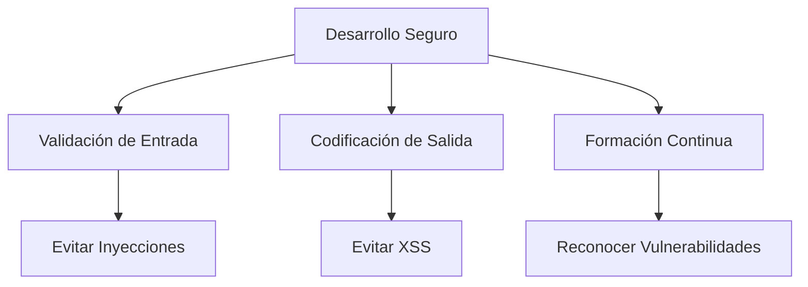

# Seguridad En El Desarrollo De Aplicaciones Web – Notas De Estudio

## Introducción Al Desarrollo Seguro

El desarrollo seguro de aplicaciones web consiste en **aplicar principios, técnicas y buenas prácticas** durante la creación del software para **prevenir vulnerabilidades** antes de que el sistema sea desplegado.

### Importancia

- Reduce riesgos de ataques.
    
- Protege datos sensibles.
    
- Disminuye costos de corrección posteriores.
    
- Mejora la confiabilidad del sistema.

---

## Principios Fundamentales De Seguridad

### Formación Continua Del Desarrollador

**Definición:** Proceso permanente de aprendizaje sobre nuevas vulnerabilidades, herramientas y prácticas de seguridad.

**Relevancia:**

- Permite reconocer patrones de vulnerabilidad.
    
- Facilita escribir código más seguro desde el inicio.
    
- Reduce errores humanos comunes.

---

### Validación De Entrada

**Definición:** Proceso de comprobar que los datos que recibe una aplicación cumplen reglas esperadas antes de set procesados.

**Concepto Clave:**  
Todas las fuentes de entrada deben considerarse **no confiables**.

**Ejemplos de fuentes de entrada no confiables:**

- Formularios web.
    
- Base de datos.
    
- Variables de entorno.
    
- Logs del sistema.
    
- Sockets de red.
    
- Archivos externos.

**Objetivo:** Evitar que datos maliciosos alteren el comportamiento del sistema.

---

### Codificación De Salida

**Definición:** Transformar datos antes de mostrarlos en el navegador para evitar ejecución de código malicioso.

**Relevancia:**

- Previene ataques de **Cross-Site Scripting (XSS)**.
    
- Protege sesiones activas de usuario.
    
- Evita ejecución de scripts inyectados.

---

## OWASP Y Vulnerabilidades Comunes

OWASP (Open Web Application Security Project) publica un listado de vulnerabilidades frecuentes en aplicaciones web.

### Vulnerabilidades Más Relevantes

|Vulnerabilidad|Descripción|Riesgo Principal|
|---|---|---|
|**SQL Injection**|Inserción de commandos SQL maliciosos en consultas|Robo o modificación de datos|
|**Cross-Site Scripting (XSS)**|Inyección de scripts en el navegador de la víctima|Robo de sesión|
|**Local File Inclusion (LFI)**|Acceso a archivos internos no permitidos|Exposición de información sensible|
|**HTTP Response Splitting**|Inyección de caracteres CRLF para dividir respuestas|Inyección de HTML/JS|
|**XXE (XML External Entity)**|Uso inseguro de DTD en XML|Lectura de archivos del servidor|
|**CSRF**|Ejecución de acciones sin consentimiento del usuario|Transferencias no autorizadas|
|**SSRF**|El servidor realiza peticiones a destinos controlados por atacante|Acceso a servicios internos|

---

## Relación Entre Conceptos De Seguridad

---

## Validación De Entradas – Buenas Prácticas

### Listas Blancas

**Definición:** Permitir únicamente valores previamente definidos como seguros.

**Ventaja:**  
Mayor seguridad que listas negras, ya que solo acepta lo permitido.

---

### Longitud Y Formato

- Verificar tamaño mínimo y máximo.
    
- Comprobar tipos de datos.
    
- Validar formatos (email, números, fechas).

---

## Codificación De Salidas – Buenas Prácticas

- Escapar caracteres especiales.
    
- Usar librerías de codificación seguras.
    
- Evitar imprimir directamente datos de usuario.

---

## Comparación Validación Vs Codificación

|Característica|Validación de Entrada|Codificación de Salida|
|---|---|---|
|Memento|Antes de procesar datos|Antes de mostrar datos|
|Objetivo|Bloquear datos maliciosos|Evitar ejecución de scripts|
|Ataques mitigados|SQLi, LFI, SSRF|XSS|

---

## Enfoque General De Seguridad

1. **Desarrollar con mentalidad preventiva.**
    
2. **No confiar en ninguna entrada.**
    
3. **Aplicar controles múltiples.**
    
4. **Actualizar dependencias.**
    
5. **Auditar código regularmente.**

---

## Resumen De Puntos Clave

- El desarrollo seguro comienza con **formación continua**.
    
- **Toda entrada es potencialmente maliciosa**.
    
- Validar entradas y codificar salidas es esencial.
    
- OWASP proporciona un marco de referencia de vulnerabilidades.
    
- Las listas blancas son más seguras que las negras.
    
- La seguridad debe integrarse desde el diseño, no añadirse al final.

---

## MicroTest