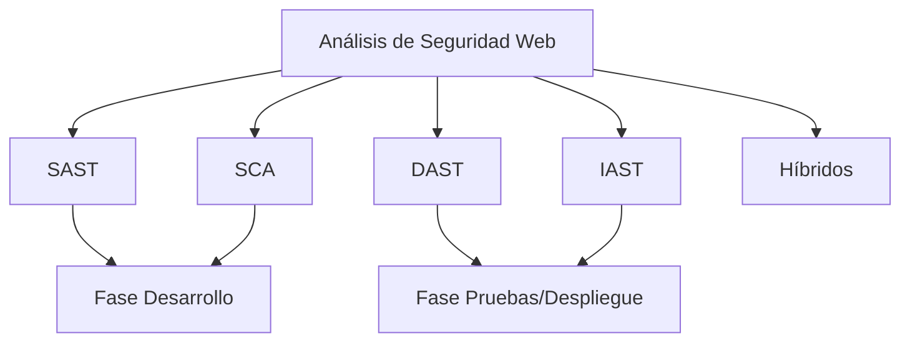

# Análisis De Seguridad En Aplicaciones Web — Notas De Estudio

---

## 1. Concepto General De Análisis De Seguridad Web

El **análisis de seguridad en aplicaciones web** es el proceso de identificar, evaluar y mitigar vulnerabilidades que podrían set explotadas por atacantes.

### Idea Clave

No existe una sola herramienta capaz de cubrir toda la **superficie de ataque** de una aplicación. Por ello, es necesario combinar **múltiples tipos de análisis** y herramientas.

### Superficie De Ataque

Conjunto de todos los puntos donde un sistema puede set atacado:

- Formularios
    
- APIs
    
- Servicios externos
    
- Autenticación
    
- Configuraciones del servidor
    
- Librerías de terceros

---

## 2. Naturaleza De Las Herramientas De Seguridad

Las herramientas de seguridad son **semi-automáticas**.

### ¿Qué Significa Semi-automático?

- Automatizan la detección inicial.
    
- **Requieren validación manual** de resultados.
    
- Generan:
    
    - **Verdaderos positivos**: Vulnerabilidad real.
        
    - **Falsos positivos**: Error de detección.
        
    - **Falsos negativos**: Vulnerabilidad no detectada.

---

## 3. Tipos De Análisis De Seguridad

### 3.1 Análisis Estático (SAST — Static Application Security Testing)

**Definición:**  
Evaluación del **código fuente** sin ejecutar la aplicación.

**Características:**

- Se realiza en fase de **desarrollo**.
    
- Detecta errores de lógica, malas prácticas y vulnerabilidades comunes.
    
- No necesita desplegar la aplicación.

**Ventajas:**

- Detección temprana.
    
- Bajo costo de corrección.

**Limitaciones:**

- No detecta problemas en ejecución real.

---

### 3.2 Análisis Dinámico (DAST — Dynamic Application Security Testing)

**Definición:**  
Evaluación de la aplicación **en ejecución**, desde el exterior.

**Características:**

- En fase de **despliegue o pruebas**.
    
- Enfoque **caja negra**.
    
- Simula ataques reales.

**Ventajas:**

- Detecta fallos reales de ejecución.
    
- No necesita acceso al código.

**Limitaciones:**

- Menor visibilidad interna.

---

### 3.3 Análisis Interactivo (IAST — Interactive Application Security Testing)

**Definición:**  
Análisis híbrido que observa la aplicación **desde dentro mientras se ejecuta**.

**Características:**

- Necesita **interacción del auditor**.
    
- Usa sensores dentro del servidor.
    
- Examina:
    
    - Peticiones
        
    - Respuestas
        
    - Código en tiempo real
        
    - Configuración del servidor

**Ventajas:**

- Alta precisión.
    
- Bajo número de falsos positivos.

---

### 3.4 Herramientas Híbridas

Combinan:

- Estático + Dinámico
    
- Dinámico + Interactivo
    
- O los tres

**Objetivo:** Maximizar cobertura y precisión.

---

### 3.5 SCA — Software Composition Analysis

**Definición:**  
Análisis de **dependencias externas** y librerías de terceros.

**Función Principal:**

- Detectar **CVE (Common Vulnerabilities and Exposures)** públicas.

**Importancia:**  
Gran parte del código de una aplicación proviene de terceros.

---

## 4. Ubicación De Los Análisis En El Ciclo De Vida

|Fase|Análisis Recomendado|Objetivo|
|---|---|---|
|Desarrollo|SAST + SCA|Detectar errores tempranos y vulnerabilidades en librerías|
|Pruebas|DAST + IAST|Detectar fallos en ejecución|
|Despliegue|DAST + IAST|Validar seguridad en producción|
|Mantenimiento|SCA continuo|Detectar nuevas CVE|

---

## 5. Análisis Funcional De Seguridad

Es un **análisis dinámico escalonado** basado en requisitos de seguridad.

### Ejemplos De Pruebas

- Identificación de usuario
    
- Gestión de sesiones
    
- Login
    
- Manejo de errores
    
- Excepciones
    
- Permisos y roles

---

## 6. Problema Del Software De Terceros

### Realidad Del Desarrollo

- Solo **12–13%** del código suele set propio.
    
- El resto proviene de:
    
    - Frameworks
        
    - Librerías
        
    - APIs
        
    - Bases de datos

### Riesgos

- Vulnerabilidades heredadas.
    
- Falta de control.
    
- Dependencia externa.

### Mitigaciones

- Especificar requisitos de seguridad en contratos.
    
- Solicitar certificaciones.
    
- Exigir acceso al código fuente cuando sea possible.
    
- Ejecutar pruebas de penetración.

---

## 7. Relación De Tipos De Análisis

---

## 8. Conceptos Clave

|Concepto|Definición|
|---|---|
|Vulnerabilidad|Debilidad explotable en un sistema|
|Superficie de Ataque|Conjunto de puntos vulnerables|
|Falso Positivo|Error que indica vulnerabilidad inexistente|
|Falso Negativo|Vulnerabilidad real no detectada|
|CVE|Base pública de vulnerabilidades conocidas|
|Caja Negra|Pruebas sin acceso al código|

---

## 9. Buenas Prácticas

- Combinar múltiples herramientas.
    
- Validar manualmente resultados.
    
- Analizar dependencias constantemente.
    
- Integrar seguridad desde el inicio.
    
- Revisar contratos de software externo.
    
- Ejecutar pruebas de penetración periódicas.

---

## Resumen De Puntos Clave

- No existe herramienta única suficiente.
    
- Las herramientas son semi-automáticas y requieren validación humana.
    
- SAST se usa en desarrollo; DAST e IAST en pruebas y despliegue.
    
- SCA es esencial para dependencias externas.
    
- Gran parte del código proviene de terceros.
    
- Los falsos positivos y negativos son inevitables.
    
- La seguridad debe integrarse en todo el ciclo de vida del software.

---

## MicroTest

1. ¿En qué fase del SSDLC se debe usar una herramienta SAST?
    
    - La respuesta: b. Desarrollo.
        
    - Justificación: SAST analiza el código fuente sin ejecutar la aplicación, por lo que su objetivo es detectar vulnerabilidades tempranas mientras se está programando, antes de desplegar el sistema.
        
2. ¿En qué fase del SSDLC se debe usar una herramienta DAST?
    
    - La respuesta: d. Pruebas.
        
    - Justificación: DAST evalúa la aplicación en ejecución desde el exterior (caja negra), lo cual solo es possible cuando la aplicación ya está desplegada en un entorno de prueba o staging.
        
3. ¿En qué fase del SSDLC se debe usar una herramienta IAST?
    
    - La respuesta: d. Pruebas.
        
    - Justificación: IAST require que la aplicación esté ejecutándose y además necesita interacción del auditor y sensores internos, lo cual se realiza típicamente en entornos de prueba donde se validan comportamientos reales del sistema.
<iframe src="https://owasp.org/www-project-web-security-testing-guide/stable/6-Appendix/A-Testing_Tools_Resource" allow="fullscreen" allowfullscreen="" style="height:100%;width:100%; aspect-ratio: 16 / 9; "></iframe>

