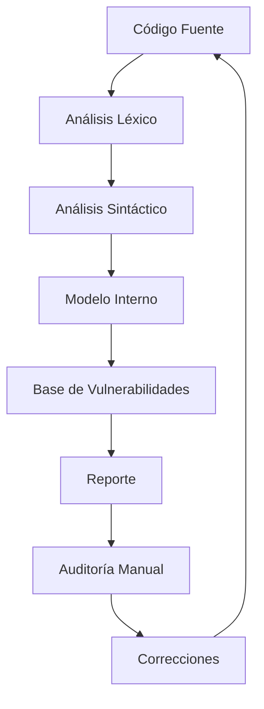

# Análisis De Seguridad Estático De Código Fuente (SAST) — Notas De Estudio

---

## 1. ¿Qué Es SAST?

**SAST (Static Application Security Testing)** es un tipo de análisis de seguridad que examina el **código fuente sin ejecutar la aplicación** para detectar vulnerabilidades, malas prácticas y posibles riesgos de seguridad.

### Características Principales

- Se realiza en **fase de desarrollo**.
    
- No require despliegue de la aplicación.
    
- Analiza estructura interna del código.
    
- Permite correcciones tempranas.
    
- Es **semi-automático**: require auditoría humana posterior.

---

## 2. Tipos De Análisis Que Realiza SAST

Las herramientas SAST funcionan de forma similar a un compilador, realizando varios niveles de análisis.

### 2.1 Análisis Léxico

- Examina **tokens** del código.
    
- Detecta símbolos, palabras reservadas y estructuras básicas.

### 2.2 Análisis Sintáctico

- Construye el **Árbol de Sintaxis Abstracta (AST)**.
    
- Verifica estructura gramatical del código.

### 2.3 Análisis Semántico

- Comprueba coherencia lógica.
    
- Detecta uso incorrecto de variables y tipos.

### 2.4 Análisis Local

- Evalúa vulnerabilidades **dentro de cada función**.

### 2.5 Análisis Global

- Analiza **flujo de llamadas entre funciones**.
    
- Rastrea cómo se transfieren datos.

### 2.6 Análisis De Configuración (Opcional)

- Algunas herramientas revisan configuraciones inseguras del proyecto.

---

## 3. Flujo De Funcionamiento De Una Herramienta SAST

---

## 4. Resultados Del Análisis

### Tipos De Hallazgos

- **Verdadero Positivo:** Vulnerabilidad real.
    
- **Falso Positivo:** Error de detección.
    
- **Falso Negativo:** Vulnerabilidad no detectada.

### Importancia De la Auditoría Manual

Ninguna herramienta es completamente fiable; siempre se require validación humana para:

- Confirmar hallazgos.
    
- Identificar omisiones.
    
- Priorizar correcciones.

---

## 5. Configuración De Herramientas SAST

Algunas configuraciones típicas incluyen:

|Configuración|Opciones|
|---|---|
|Tipos de Vulnerabilidad|Seguridad, malas prácticas, código malicioso|
|Severidad|Error, Warning, Info|
|Nivel de Confianza|Low, Medium, High|
|Detección Individual|Activar o desactivar reglas específicas|

---

## 6. Proyectos De Prueba De Vulnerabilidades

Se utilizan proyectos con **casos de prueba diseñados** para medir la eficacia de herramientas SAST.

### Características

- Incluyen múltiples categorías de vulnerabilidades.
    
- Varían la **fuente de entrada de datos**:
    
    - Consola
        
    - Cookies
        
    - Base de datos
        
    - Parámetros HTTP
        
    - Sockets TCP

---

## 7. Ejemplo Conceptual: SQL Injection

### Escenario Vulnerable

1. Se recibe entrada del usuario (socket, parámetro, cookie).
    
2. Se asigna a una variable sin validación.
    
3. Se inserta directamente en una consulta SQL.
    
4. El atacante puede modificar la sentencia.

**Problema:** Concatenar datos de usuario en SQL sin validación.

---

### Escenario Seguro

- Uso de **Prepared Statements**.
    
- Validación automática de parámetros.
    
- Separación entre datos y estructura SQL.

---

## 8. Diferencia Conceptual

|Método|Riesgo|
|---|---|
|Concatenar Strings SQL|Alto|
|Prepared Statements|Bajo|

---

## 9. Buenas Prácticas Con SAST

- Ejecutarlo continuamente durante el desarrollo.
    
- Configurar reglas de seguridad estrictas.
    
- Validar manualmente resultados.
    
- Priorizar vulnerabilidades críticas.
    
- Integrarlo con pipelines de CI/CD.
    
- Analizar también configuraciones del proyecto.

---

## 10. Limitaciones De SAST

- No detecta fallos en tiempo de ejecución.
    
- Puede generar falsos positivos.
    
- Depende de reglas actualizadas.
    
- No sustituye pruebas dinámicas.

---

## 11. Relación Con Otras Técnicas

|Técnica|Ejecución|Acceso al Código|
|---|---|---|
|SAST|No|Sí|
|DAST|Sí|No|
|IAST|Sí|Sí|

---

## MicroTest

1. ¿Qué tipo de análisis puede realizar una herramienta SAST para comprobar las interacciones entre distintas funciones?
    
    - La respuesta: d. Todos los anteriores.
        
    - Justificación: Una herramienta SAST puede realizar análisis intraprocedural (dentro de una función), interprocedural (entre funciones) y semántico (significado y lógica del código). Para comprobar correctamente las interacciones entre funciones necesita apoyarse en todos estos niveles de análisis en conjunto.
        
2. En cuanto a herramientas de análisis de la seguridad SAST, señalar la afirmación falsa:
    
    - La respuesta: d. Todas las anteriores son falsas.
        
    - Justificación: Las opciones a, b y c son afirmaciones verdaderas sobre SAST (no cubren dependencias de terceros directamente, tienen falsos positivos/negativos y algunas pueden analizar bytecode o ejecutables), por lo tanto no es cierto que sean falsas.
        
3. ¿Qué se puede hacer con los falsos positivos posibles en el resultado de análisis de una herramienta SAST?
    
    - La respuesta: a. Auditar las vulnerabilidades del informe.
        
    - Justificación: Los falsos positivos deben revisarse manualmente para confirmar si la vulnerabilidad existe realmente, ya que SAST es un proceso semi-automático que require validación humana.
---

## Resumen De Puntos Clave

- SAST analiza código sin ejecutarlo.
    
- Funciona de forma similar a un compilador.
    
- Detecta vulnerabilidades tempranas.
    
- Require auditoría manual.
    
- Prepared Statements reducen riesgo de SQL Injection.
    
- Debe combinarse con DAST e IAST.
    
- Es esencial en fase de desarrollo.