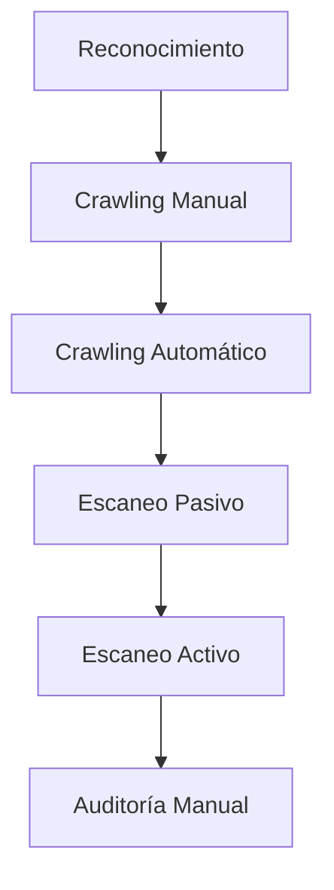

# Análisis De Seguridad Funcional Y Dinámico (DAST) — Notas De Estudio

---

## 1. ¿Qué Es El Análisis Dinámico De Seguridad?

El **Análisis Dinámico de Seguridad** o **DAST (Dynamic Application Security Testing)** es una técnica de evaluación de seguridad que analiza una aplicación **mientras está en ejecución**, simulando ataques reales desde el exterior.

### Características Principales

- Se realiza con la aplicación **desplegada**.
    
- Enfoque **caja negra** (sin acceso al código).
    
- Puede convertirse en **caja gris** si se proporciona información adicional (usuarios, credenciales, tecnologías).
    
- Detecta vulnerabilidades en tiempo real.
    
- Require auditoría manual posterior.

---

## 2. Diferencia Entre Análisis Funcional Y Dinámico

|Tipo|Enfoque|Objetivo|
|---|---|---|
|Dinámico|Ataque externo automatizado|Detectar vulnerabilidades en ejecución|
|Funcional|Validación por requisitos de seguridad|Verificar comportamientos específicos (login, sesiones, errores)|

---

## 3. Fases Del Análisis Dinámico

### 3.1 Reconocimiento

Consiste en recopilar información inicial de la aplicación:

- Tecnologías utilizadas
    
- Base de datos
    
- Servidor web
    
- Lenguaje de programación
    
- Sistema operativo
    
- Gestión de sesión
    
- Posibles usuarios administrativos

Este paso mejora la precisión del análisis y lo convierte parcialmente en **caja gris**.

---

### 3.2 Crawling Manual (Navegación Manual)

- El auditor navega manualmente la aplicación.
    
- La herramienta registra:
    
    - URLs
        
    - Formularios
        
    - Parámetros
        
    - Cookies
        
    - Peticiones y respuestas HTTP
        
- Se detectan **cabeceras de seguridad ausentes**.

Importancia:  
Cuanta más navegación manual, más información para el análisis automático posterior.

---

### 3.3 Crawling Automático (Spider)

Proceso automatizado de descubrimiento de la aplicación.

#### Funciones

- Encontrar URLs ocultas.
    
- Analizar archivos robots.txt.
    
- Identificar directorios.
    
- Profundizar niveles de navegación.

---

### 3.4 Escaneo Pasivo

No altera la aplicación.

Detecta:

- Cabeceras de seguridad faltantes.
    
- Configuraciones débiles.
    
- Exposición de información.

---

### 3.5 Escaneo Activo

Ataque automatizado real.

Características:

- Inyección de **payloads**.
    
- Pruebas sobre:
    
    - Formularios
        
    - Parámetros GET/POST
        
    - Cookies
        
    - Cabeceras HTTP
        
    - Rutas URL
        
- Tarda más tiempo.
    
- Mayor probabilidad de detectar vulnerabilidades reales.

---

## 4. Flujo General Del Proceso

---

## 5. Conceptos Importantes

### Payload

Fragmento de código malicioso utilizado para probar vulnerabilidades.

### Cabeceras De Seguridad

Configuraciones HTTP que protegen la aplicación:

- Content-Security-Policy
    
- X-Content-Type-Options
    
- X-Frame-Options

### Parámetros Ocultos (Hidden)

Campos que no aparecen en la interfaz pero sí en la petición HTTP.  
Pueden revelar lógica sensible del sistema.

---

## 6. Contexto En Herramientas DAST

Un **Contexto** es un perfil de configuración donde se define:

- URL objetivo
    
- Tecnologías
    
- Usuarios
    
- Métodos de autenticación
    
- Gestión de sesión

Permite escaneos más precisos.

---

## 7. Configuración Del Escaneo Activo

|Elemento|Descripción|
|---|---|
|Input Vectors|Parámetros GET, POST, Cookies, Cabeceras|
|Potencia de Ataque|Low, Medium, High|
|Plugins|Reglas de vulnerabilidad|
|Profundidad Spider|Niveles de navegación|
|Usuario|Credenciales para sesión autenticada|

---

## 8. Ejemplo De Vulnerabilidad: Cross-Site Scripting (XSS)

### ¿Qué Es XSS?

Vulnerabilidad que permite inyectar JavaScript malicioso en la respuesta del servidor.

### Verificación De Verdadero Positivo

1. Se inyecta un payload en un parámetro.
    
2. El servidor lo refleja en la respuesta.
    
3. El navegador ejecuta el script.
    
4. Se confirma vulnerabilidad real.

---

## 9. Auditoría Posterior

Las herramientas DAST son semi-automáticas.  
Se debe verificar:

- Verdaderos positivos
    
- Falsos positivos
    
- Falsos negativos

Métodos de validación:

- Revisar petición y respuesta.
    
- Abrir la URL con payload en navegador.
    
- Analizar comportamiento real.

---

## 10. Buenas Prácticas

- Combinar crawling manual y automático.
    
- Proveer usuarios autenticados.
    
- Aumentar potencia de ataque gradualmente.
    
- Revisar cabeceras de seguridad.
    
- Ejecutar análisis periódicamente.
    
- Validar resultados manualmente.

---

## 11. Limitaciones

- No analiza código fuente.
    
- Puede generar falsos positivos.
    
- Tarda mucho en aplicaciones grandes.
    
- Depende de configuración adecuada.

---

## MicroTest

.

1. Señalar la afirmación falsa:
    
    - La respuesta: c. Las herramientas de tipo IAST normalmente no tienen impacto en el rendimiento.
        
    - Justificación: IAST instrumenta la aplicación en tiempo de ejecución mediante agentes o sensores internos, lo que sí puede generar impacto en rendimiento, aunque sea moderado.
        
2. Las herramientas de tipo IAST pueden instrumentar:
    
    - La respuesta: c. El código ejecutable.
        
    - Justificación: IAST inserta instrumentación en el bytecode o código compilado que se está ejecutando, no en el código fuente directamente ni únicamente en tráfico externo.
        
3. ¿Qué tipo de análisis realiza una herramienta de tipo DAST?
    
    - La respuesta: a. Semántico.
        
    - Justificación: DAST analiza el comportamiento de la aplicación en ejecución y el significado de las respuestas ante distintas entradas y payloads, no revisa sintaxis ni estructura interna del código, sino la lógica observable desde el exterior.

---

## Resumen De Puntos Clave

- DAST analiza aplicaciones en ejecución.
    
- Puede set caja negra o gris.
    
- Incluye reconocimiento, crawling y escaneo activo.
    
- El escaneo activo inyecta payloads.
    
- XSS es un ejemplo común de vulnerabilidad.
    
- Siempre require auditoría manual.
    
- Más información inicial mejora la precisión.