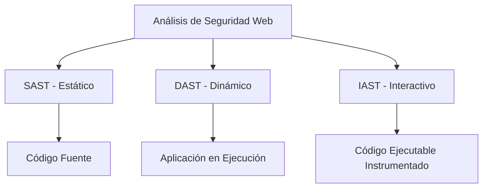
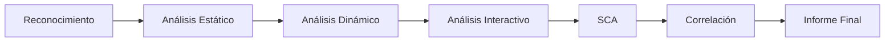

# Tema 9. Análisis De Seguridad En Aplicaciones Web

## Introducción Al Análisis De Seguridad En Aplicaciones Web

El análisis de seguridad en aplicaciones web consiste en evaluar una aplicación para identificar vulnerabilidades que puedan set explotadas por atacantes.  
Debido a la **gran superficie de ataque** de una aplicación web, no es suficiente un solo tipo de análisis; es necesario combinar múltiples enfoques automatizados y correlacionar sus resultados.

### Superficie De Ataque

Es el conjunto de todos los puntos donde una aplicación puede set atacada:

- Formularios
    
- APIs
    
- Autenticación
    
- Base de datos
    
- Configuración de servidores
    
- Librerías de terceros

Mientras más grande y compleja sea la aplicación, mayor será su superficie de ataque.

---

## Tipos De Análisis De Seguridad

### 1. Análisis Estático (SAST – Static Application Security Testing)

Analiza el **código fuente** sin ejecutar la aplicación.

**Características:**

- Se realiza en tiempo de desarrollo.
    
- Es un análisis de **caja blanca**.
    
- Permite detectar vulnerabilidades como:
    
    - SQL Injection
        
    - Cross-Site Scripting (XSS)
        
    - Errores de validación de entradas

**Ventajas:**

- Detecta errores temprano.
    
- Permite revisar todo el código de una sola vez.

**Limitaciones:**

- Puede generar falsos positivos.
    
- No detecta problemas de configuración en ejecución.

---

### 2. Análisis Dinámico (DAST – Dynamic Application Security Testing)

Analiza la aplicación **en ejecución**, sin acceso al código fuente.

**Características:**

- Es un análisis de **caja negra**.
    
- Simula ataques reales.
    
- Evalúa respuestas del sistema ante entradas maliciosas.

**Ventajas:**

- Detecta problemas reales en producción.
    
- No depende del lenguaje de programación.

**Limitaciones:**

- No ve el código interno.
    
- Puede no cubrir todas las rutas internas.

---

### 3. Análisis Interactivo (IAST – Interactive Application Security Testing)

Combina análisis estático y dinámico mediante **instrumentación interna** de la aplicación.

**Características:**

- Se ejecuta mientras la aplicación corre.
    
- Es un análisis de **caja blanca dinámica**.
    
- Inserta agentes en el código ejecutable.

**Ventajas:**

- Menos falsos positivos que SAST.
    
- Mayor precisión contextual.

**Limitaciones:**

- Puede impactar el rendimiento.
    
- Require integración técnica.

---

### Relación Entre Tipos De Análisis

---

## Falsos Positivos Y Falsos Negativos

### Falso Positivo

Alerta de vulnerabilidad que **no existe realmente**.  
Problema: genera ruido y pérdida de tiempo.

### Falso Negativo

No se detecta una vulnerabilidad que **sí existe**.  
Problema crítico: deja la aplicación expuesta.

|Tipo|Descripción|Riesgo|
|---|---|---|
|Falso Positivo|Vulnerabilidad inexistente|Bajo|
|Falso Negativo|Vulnerabilidad real no detectada|Alto|

---

## Metodología De Análisis De Seguridad

### 1. Reconocimiento

Recopilación de información de la aplicación:

- Tecnologías usadas
    
- Tipos de usuarios
    
- Roles
    
- Arquitectura

### 2. Análisis Del Código Y Lógica

Se revisa:

- Validación de entradas y salidas
    
- Control de acceso y autorización
    
- Manejo de errores y excepciones
    
- Registro de eventos (logs)

### 3. Configuración De Infraestructura

- Servidores de aplicaciones
    
- Navegadores
    
- Motores de base de datos
    
- Certificados y protocolos

### 4. Correlación De Resultados

Se unifican hallazgos de múltiples herramientas para generar **un informe integral**.

---

## Vulnerabilidades Comunes

- SQL Injection
    
- Cross-Site Scripting (XSS)
    
- Redirecciones no validadas
    
- Inclusión de archivos locales
    
- Fallas de autenticación
    
- Configuración insegura

---

## Software Composition Analysis (SCA)

Herramientas destinadas a analizar **dependencias de terceros**.

### Objetivo

Detectar vulnerabilidades públicas en librerías externas.

### Referencias

- CVE (Common Vulnerabilities and Exposures)
    
- MITRE

|Elemento|Función|
|---|---|
|CVE|Identificador de vulnerabilidades públicas|
|MITRE|Organización que mantiene estándares de seguridad|

---

## Flujo General Del Proceso De Análisis

---

## Buenas Prácticas

- Automatizar análisis.
    
- Usar múltiples herramientas.
    
- Revisar falsos positivos manualmente.
    
- Integrar seguridad en el ciclo de desarrollo (DevSecOps).
    
- Mantener dependencias actualizadas.

---

## Resumen De Puntos Clave

- La seguridad web require múltiples tipos de análisis.
    
- SAST analiza código fuente.
    
- DAST analiza comportamiento en ejecución.
    
- IAST combina ambos mediante instrumentación.
    
- Los falsos negativos son más peligrosos que los falsos positivos.
    
- Es necesario correlacionar resultados de distintas herramientas.
    
- SCA permite identificar vulnerabilidades en librerías de terceros.
    
- El objetivo final es generar un informe integral de seguridad.

## MicroTest