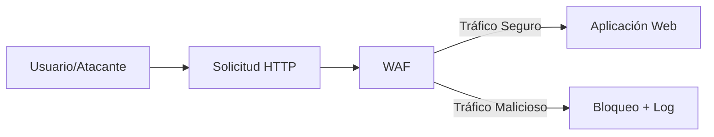

# Firewall De Aplicaciones Web (WAF)

## Concepto De Firewall De Aplicaciones Web

Un **WAF (Web Application Firewall)** es una herramienta de seguridad diseñada para **proteger aplicaciones web** contra ataques comunes explotando vulnerabilidades conocidas.

### Objetivo Principal

- Filtrar, monitorear y bloquear tráfico HTTP/HTTPS malicioso.
    
- Proteger frente a vulnerabilidades incluidas en el **OWASP Top 10**.

---

## OWASP Top 10

Es una lista de las **10 vulnerabilidades más críticas** en aplicaciones web publicada por la organización OWASP (Open Web Application Security Project).

Ejemplos de vulnerabilidades comunes:

- SQL Injection
    
- Cross-Site Scripting (XSS)
    
- Path Traversal
    
- Fallas de autenticación
    
- Configuraciones inseguras

---

## Herramienta De Práctica: Mutillidae II

**Mutillidae II** es una aplicación web vulnerable utilizada para:

- Aprender técnicas de ataque.
    
- Comprender cómo funcionan las vulnerabilidades.
    
- Practicar defensa con herramientas como WAF.

### Niveles De Seguridad

|Nivel|Característica|
|---|---|
|0|Vulnerabilidades fácilmente explotables|
|1–4|Dificultad intermedia|
|5|Defensas fuertes a nivel servidor|

---

## ModSecurity

**ModSecurity** es un WAF de código abierto comúnmente utilizado con:

- Apache
    
- Nginx

### Funcionalidades

- Detectar y bloquear ataques en tiempo real.
    
- Registrar eventos de seguridad en logs.
    
- Permitir modos de operación configurables.

---

## Modos De Operación Del WAF

|Modo|Descripción|Uso recomendado|
|---|---|---|
|Off|No detecta ni bloquea|Desactivado|
|Detection Only|Detecta pero no bloquea|Pruebas|
|On|Detecta y bloquea|Producción|

---

## Parámetros Importantes De Configuración

|Parámetro|Función|
|---|---|
|SecRuleEngine|Activa/desactiva el firewall|
|SecRequestBodyAccess|Analiza cuerpo de la petición|
|SecResponseBodyAccess|Analiza cuerpo de la respuesta|

---

## Registro De Eventos (Logs)

Los logs permiten analizar:

- Fecha y hora
    
- Dirección IP
    
- Tipo de petición (GET/POST)
    
- Payload utilizado
    
- Regla que bloqueó el ataque
    
- Resumen del evento

### Partes Comunes De Un Log

|Sección|Contenido|
|---|---|
|A|Fecha e IP|
|B|Cabeceras de petición|
|C|Cuerpo de petición|
|F|Cabeceras de respuesta|
|H|Resumen y regla aplicada|

---

## Tipos De Ataques Demostrados

### SQL Injection

Ataque que inserta código SQL malicioso en campos de entrada para manipular la base de datos.

Ejemplo de payload:

```sql
' OR 1=1 --
```

**Funcionamiento paso a paso:**

1. El atacante introduce el payload en un formulario.
    
2. La consulta SQL se altera.
    
3. El sistema concede acceso indebido.
    
4. El WAF detecta patrones peligrosos y bloquea la petición.

---

### Path Traversal

Ataque que intenta acceder a archivos fuera del directorio permitido.

Ejemplo de payload:

```Python
../../etc/passwd
```

**Funcionamiento paso a paso:**

1. El atacante modifica parámetros de URL.
    
2. Intenta acceder a archivos del sistema.
    
3. El WAF detecta caracteres sospechosos.
    
4. Bloquea la solicitud y registra el evento.

---

## Flujo De Protección Con WAF



---

## Buenas Prácticas Al Usar Un WAF

- Probar en modo **Detection Only** antes de producción.
    
- Ajustar reglas para reducir falsos positivos.
    
- Revisar logs periódicamente.
    
- Mantener reglas actualizadas.
    
- No sustituye pruebas de seguridad internas, las complementa.

---

## Ventajas Del WAF

- Protección en tiempo real.
    
- Fácil instalación.
    
- Bajo costo (en soluciones open source).
    
- Mitiga ataques sin modificar código fuente.

---

## Limitaciones

- Puede generar falsos positivos.
    
- Require ajuste de reglas.
    
- No reemplaza el desarrollo seguro.

---

## Resumen De Puntos Clave

- Un WAF protege aplicaciones web filtrando tráfico HTTP/HTTPS.
    
- OWASP Top 10 define las vulnerabilidades más críticas.
    
- Mutillidae II es una herramienta educativa para practicar ataques.
    
- ModSecurity es un WAF open source ampliamente usado.
    
- Los modos Off, Detection Only y On determinan su comportamiento.
    
- Los logs son esenciales para auditoría y análisis.
    
- SQL Injection y Path Traversal son ataques comunes detectables por WAF.
    
- El WAF complementa, no sustituye, las buenas prácticas de desarrollo seguro.

## MicroTest

1. Un WAF detecta y bloquea ataques web usando:
    
    - La respuesta: a. Expresiones regulares.
        
    - Justifacion: Los WAF analizan peticiones HTTP comparándolas con **patrones y firmas** de ataques conocidos, comúnmente implementados mediante expresiones regulares que permiten identificar cadenas maliciosas como SQL Injection o Path Traversal.
        
2. ¿Qué tipo de instalación de un WAF solo detecta y no bloquea un ataque?
    
    - La respuesta: c. Pasivo.
        
    - Justifacion: En modo o instalación **pasiva** el WAF únicamente monitoriza y registra el tráfico, generando alertas o logs, pero no interviene en la comunicación ni bloquea peticiones maliciosas.
        
3. ¿Qué tipo de instalación es la más recomendable para un WAF?
    
    - La respuesta: b. Proxy reverso.
        
    - Justifacion: El modo **proxy reverso** coloca al WAF delante de la aplicación, permitiendo inspeccionar, filtrar y bloquear tráfico antes de que llegue al servidor, ofreciendo mayor control y nivel de protección que otros modos.