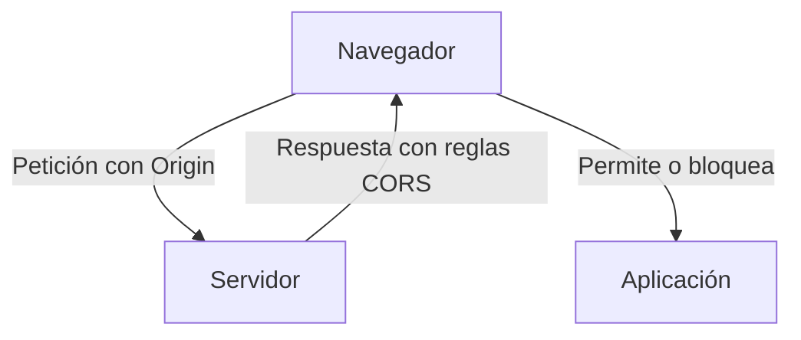
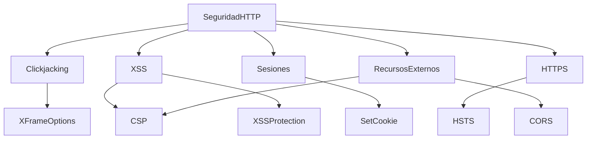

# Cabeceras De Seguridad HTTP En Aplicaciones Web

## Introducción

Las **cabeceras de seguridad HTTP** son configuraciones enviadas desde el servidor al navegador dentro de la respuesta HTTP.  
Su objetivo es **reducir riesgos de ataques web comunes**, limitar comportamientos inseguros y reforzar la protección del lado cliente.

Se utilizan principalmente para mitigar:

- Clickjacking
    
- Cross-Site Scripting (XSS)
    
- Inyección de contenido
    
- Robo de sesiones
    
- Carga de recursos externos maliciosos
    
- Conexiones inseguras HTTP

---

## X-Frame-Options

### Definición

Cabecera que controla si una página web puede mostrarse dentro de un `<iframe>` o `<frame>`.

### Propósito

Prevenir **Clickjacking**, ataque en el que un atacante superpone una página invisible encima de otra para engañar al usuario y que haga clic en elementos no deseados.

### Valores Comunes

|Valor|Descripción|
|---|---|
|DENY|Prohíbe totalmente cargar la página en iframes|
|SAMEORIGIN|Solo permite iframes del mismo dominio|
|ALLOW-FROM|Permite un dominio específico (obsoleto en muchos navegadores)|

---

## X-XSS-Protection

### Definición

Cabecera diseñada para activar filtros anti-XSS en navegadores antiguos.

### Propósito

Bloquear ejecución de **scripts maliciosos reflejados o persistentes**.

### Nota

Actualmente está **obsoleta** en navegadores modernos, siendo reemplazada por **Content-Security-Policy (CSP)**.

---

## Content-Type Y X-Content-Type-Options

### Content-Type

Define el tipo de contenido enviado:

- `text/html`
    
- `application/json`
    
- `image/png`

### X-Content-Type-Options

Valor recomendado: `nosniff`

### Propósito

Evitar que el navegador “adivine” el tipo de archivo y ejecute contenido malicioso disfrazado.

---

## Set-Cookie Seguro

### Definición

Cabecera que crea o modifica cookies del navegador.

### Parámetros De Seguridad

|Parámetro|Función|
|---|---|
|Secure|Solo se envía por HTTPS|
|HttpOnly|Impide acceso vía JavaScript|
|SameSite=Strict|Restringe envío entre dominios|
|Expires|Fecha de expiración|
|Domain|Limita dominio válido|
|Path|Limita rutas accesibles|

### Relevancia

Protege **sesiones de usuario** contra robo o manipulación.

---

## HSTS – Strict-Transport-Security

### Definición

Obliga al navegador a usar **HTTPS siempre**.

### Beneficio

Evita ataques de:

- Downgrade HTTP
    
- Man-in-the-Middle
    
- Interceptación de datos

### Parámetros

|Parámetro|Función|
|---|---|
|max-age|Tiempo de obligatoriedad|
|includeSubDomains|Aplica a subdominios|

---

## Content-Security-Policy (CSP)

### Definición

Cabecera que define **qué recursos externos están permitidos**.

### Objetivo

Mitigar:

- XSS
    
- Inyección de scripts
    
- Carga de recursos externos no confiables

### Ejemplo Conceptual

Permitir solo recursos del mismo dominio.

---

## CORS – Cross-Origin Resource Sharing

### Definición

Mecanismo que controla **qué dominios pueden comunicarse** con la aplicación.

### Cabeceras Principales Del Servidor

|Cabecera|Función|
|---|---|
|Access-Control-Allow-Origin|Dominios permitidos|
|Access-Control-Allow-Methods|Métodos HTTP permitidos|
|Access-Control-Allow-Headers|Cabeceras permitidas|
|Access-Control-Allow-Credentials|Permite cookies/autenticación|
|Access-Control-Max-Age|Tiempo de cache|

### Flujo Conceptual

---

## Relación Entre Cabeceras De Seguridad

---

## Buenas Prácticas Generales

- Usar **HTTPS obligatorio**.
    
- Limitar cookies a lo estrictamente necesario.
    
- Aplicar **CSP restrictiva**.
    
- Configurar CORS solo para dominios confiables.
    
- Deshabilitar contenido mixto HTTP/HTTPS.
    
- Mantener compatibilidad entre navegadores.

---

## Resumen De Puntos Clave

- X-Frame-Options evita Clickjacking.
    
- CSP es la defensa principal contra XSS moderno.
    
- Cookies seguras protegen sesiones.
    
- HSTS fuerza uso de HTTPS.
    
- CORS controla acceso entre dominios.
    
- X-Content-Type-Options previene ejecución indebida de archivos.
    
- Las cabeceras trabajan en conjunto para reducir superficie de ataque.

---

## MicroTest

1. ¿Qué valor se recomienda para la cabecera X-FRAME-OPTIONS?
    
    - La respuesta: d. DENY.
        
    - Justifacion: **DENY** impide completamente que la página se cargue dentro de iframes en cualquier dominio, ofreciendo la máxima protección contra ataques de **clickjacking**.
        
2. ¿Qué valor se recomienda para la cabecera CONTENT-SECURITY-POLICY?
    
    - La respuesta: a. default-src 'self'.
        
    - Justifacion: `default-src 'self'` limita la carga de recursos únicamente al **mismo dominio**, reduciendo riesgos de **XSS** e inyección de contenido externo malicioso.
        
3. ¿Qué valor se recomienda para el parámetro SAMESITE de la cabecera SET-COOKIE?
    
    - La respuesta: a. STRICT.
        
    - Justifacion: **SameSite=Strict** evita que la cookie se envíe en peticiones desde otros dominios, protegiendo contra **CSRF** y robo de sesión al restringir completamente el uso cross-site.