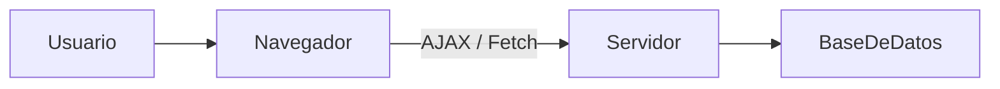

# Seguridad En Aplicaciones RIA (Rich Internet Applications)

## 1. Introducción a Las Aplicaciones RIA

### Definición

Las **RIA (Rich Internet Applications)** son aplicaciones web que trasladan gran parte de la lógica y la interfaz de usuario al **navegador del cliente**, ejecutándose principalmente mediante **JavaScript**.

### Características Principales

- Uso intensivo de **JavaScript**.
    
- Comunicación asíncrona con el servidor.
    
- Interfaz dinámica similar a aplicaciones de escritorio.
    
- Uso de tecnologías como:
    
    - **AJAX (Asynchronous JavaScript and XML)**
        
    - **XMLHttpRequest**
        
    - **Fetch API**
        
    - **JSON**

### Arquitectura General



---

## 2. Política Del Mismo Origen (Same-Origin Policy - SOP)

### Definición

La **Política del Mismo Origen** es una restricción de seguridad implementada por los navegadores que **impide que scripts de un dominio accedan a recursos de otro dominio distinto**.

### ¿Qué Se Considera Mismo Origen?

- **Protocolo** (http / https)
    
- **Dominio**
    
- **Puerto**

Si uno de estos cambia, se considera **origen distinto**.

### Ejemplo

- `https://app.com` → puede acceder a `https://app.com/api`
    
- `https://app.com` → **no** puede acceder a `https://otrodominio.com`

---

## 3. XMLHttpRequest Vs JSONP

### XMLHttpRequest / Fetch

- Respeta la **SOP**.
    
- Permite enviar métodos HTTP como **GET** y **POST**.
    
- Es la forma segura de comunicación asíncrona.

### JSONP (JSON with Padding)

#### Definición

Técnica que **evita la SOP** utilizando etiquetas `<script>`.

#### Riesgo

- Permite ejecutar código remoto.
    
- Se puede usar para exfiltrar datos.

#### Funcionamiento Básico

1. Se inserta una etiqueta `<script>` apuntando a otro dominio.
    
2. Se define un parámetro `callback`.
    
3. El servidor remoto responde con una función ejecutable.

Ejemplo conceptual:

```javascript
<script src="http://otrodominio.com/datos?callback=miFuncion"></script>
```

---

## 4. CORS (Cross-Origin Resource Sharing)

### Definición

**CORS** es un mecanismo que permite **habilitar accesos entre dominios de forma controlada** mediante cabeceras HTTP.

### Cabecera Clave

- `Access-Control-Allow-Origin`

### Ventaja

Permite comunicación segura sin recurrir a JSONP.

---

## 5. Vulnerabilidad: Cross-Site Scripting Basado En DOM

### Definición

Ataque donde el código malicioso se ejecuta **directamente en el navegador** manipulando el **DOM** sin necesidad de intervención del servidor.

### Ejemplo Conceptual Vulnerable

```javascript
document.write(parametroUsuario);
```

Si `parametroUsuario` contiene JavaScript, se ejecutará.

### Mitigación

- Validar entradas.
    
- Escapar caracteres especiales.
    
- No insertar datos sin sanitizar en el DOM.

---

## 6. Vulnerabilidad: JavaScript Hijacking

### Definición

Ataque que aprovecha **sesiones activas del usuario** para robar datos mediante scripts maliciosos cargados desde otro sitio.

### Escenario Típico

1. Usuario autenticado en un sitio legítimo.
    
2. Abre otra pestaña con sitio malicioso.
    
3. El sitio malicioso ejecuta scripts que acceden a recursos aprovechando la sesión activa.

### Relación Con CSRF

Es similar a **Cross-Site Request Forgery**, pero centrado en la explotación de respuestas JSON o scripts.

---

## 7. Medidas De Protección

### Tabla De Mitigaciones

|Vulnerabilidad|Mitigación Principal|
|---|---|
|DOM XSS|Sanitización de datos|
|JSONP|Evitar uso, preferir CORS|
|JavaScript Hijacking|Tokens CSRF|
|SOP Bypass|Content Security Policy|
|Robo de sesión|Cookies SameSite + HTTPS|

---

## 8. Content Security Policy (CSP)

### Definición

Cabecera HTTP que **restringe los orígenes desde los cuales se pueden cargar recursos**.

Ejemplo recomendado:

```Python
Content-Security-Policy: default-src 'self'
```

### Beneficios

- Previene XSS.
    
- Evita carga de scripts externos maliciosos.
    
- Refuerza la SOP.

---

## 9. Tokens Anti-CSRF

### Definición

Valor único generado por el servidor y validado en cada petición sensible.

### Objetivo

Evitar que terceros puedan ejecutar acciones en nombre del usuario autenticado.

---

## 10. Resumen De Puntos Clave

- Las RIA ejecutan gran parte de la lógica en el navegador.
    
- La **Same-Origin Policy** protege contra accesos entre dominios.
    
- **JSONP** permite saltar SOP pero introduce riesgos.
    
- **CORS** es la alternativa segura para comunicación entre dominios.
    
- **DOM XSS** ocurre cuando se insertan datos no validados en el DOM.
    
- **JavaScript Hijacking** roba información aprovechando sesiones activas.
    
- **CSP** y **Tokens CSRF** son defensas críticas.
    
- La validación y sanitización de datos es fundamental.

---

## MicroTest

1.La vulnerabilidad XSS DOM se puede evitar mediante:  
- La respuesta: d. Todas las anteriores son correctas.  
- Justifacion: Porque el XSS basado en DOM se mitiga aplicando varias capas de seguridad: validación de entrada para impedir datos maliciosos, codificación de salida para que el navegador no ejecute scripts y cabeceras como XSS-PROTECTION que añaden un filtro adicional en algunos navegadores.

2.El ataque Javascript hijacking es similar en tecnología AJAX a:  
- La respuesta: b. CSRF.  
- Justifacion: Porque ambos ataques aprovechan la sesión activa del usuario en el navegador para ejecutar peticiones o extraer información sin su consentimiento, reutilizando credenciales y cookies válidas.

3.¿Cómo se puede saltar/evitar la política del mismo origen?  
- La respuesta: d. Todas las anteriores son correctas.  
- Justifacion: Porque etiquetas como `<script>`, `<iframe>` o `` pueden cargar recursos desde otros dominios y permiten técnicas que evitan la restricción de la Same Origin Policy si no existen controles adicionales como CSP o CORS.

https://cheatsheetseries.owasp.org/cheatsheets/AJAX_Security_Cheat_Sheet.html