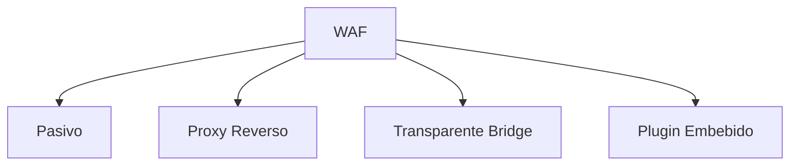
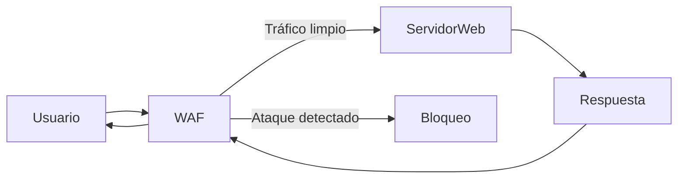

# Tema 10 — Seguridad En la Fase De Producción De Aplicaciones Web

## Introducción

La seguridad en fase de producción se centra en **medidas de protección online** para aplicaciones web ya desplegadas. El objetivo principal es **prevenir, detectar y bloquear ataques en tiempo real** sin afectar negativamente la disponibilidad del servicio.

---

## WAF — Web Application Firewall

### Definición

Un **WAF (Web Application Firewall)** es un firewall especializado que **protege aplicaciones web a nivel de capa de aplicación (HTTP/HTTPS)**, analizando el contenido de las peticiones y respuestas.

### Diferencia Con Firewall Perimetral De Red

|Característica|Firewall de Red Perimetral|WAF|
|---|---|---|
|Capa OSI|Capa de Red / Transporte|Capa de Aplicación|
|Protocolos|TCP/IP|HTTP / HTTPS|
|Función principal|Permitir o bloquear tráfico por IP/puerto|Analizar contenido y detectar ataques web|
|Análisis de contenido|No|Sí|
|Protección contra XSS/SQLi|No|Sí|

**Idea clave:** El firewall de red deja pasar tráfico web legítimo por puerto 80/443; el **WAF inspecciona ese tráfico** para detectar patrones maliciosos.

---

## Funcionamiento Del WAF

### Técnicas De Validación

- **Lista Blanca (Whitelist):** Solo se permite tráfico explícitamente autorizado.
    
- **Lista Negra (Blacklist):** Se bloquean patrones conocidos de ataque.
    
- **Modelo Híbrido:** Combina ambas estrategias.

### Tipo De Análisis

- **Análisis Sintáctico de Peticiones y Respuestas**
    
    - Evalúa estructura de URLs, headers, parámetros.
        
    - Detecta patrones típicos de ataques web.

### Inspección TLS

- El WAF puede **instalar certificados digitales** para descifrar tráfico HTTPS y poder analizarlo.

---

## Modos De Despliegue Del WAF

### 1. Modo Pasivo (Offline)

- Detecta y registra.
    
- **No bloquea** tráfico.
    
- Útil para pruebas iniciales.

### 2. Modo Proxy Reverso (Recomendado)

- El WAF actúa como **intermediario** entre cliente y servidores.
    
- Permite **ocultar infraestructura interna**.
    
- Protege múltiples aplicaciones simultáneamente.

### 3. Modo Transparente (Bridge)

- No require cambios de IP.
    
- Se instala como **puente de nivel 2**.
    
- Fácil instalación inicial.

### 4. Modo Plugin (Embebido)

- Instalado directamente en el servidor web (Apache, Nginx, Tomcat).
    
- Ejemplo: **ModSecurity**.

---

### Relación De Modos De Despliegue

---

## Herramientas Comunes

|Herramienta|Tipo|Característica|
|---|---|---|
|ModSecurity|Open Source|Integrable con Apache/Nginx|
|Nginx WAF|Comercial / OSS|Proxy reverso eficiente|
|AWS WAF|Cloud|Integración con servicios AWS|

---

## Pruebas Antes De Producción

### Métricas Clave

- **Rendimiento:** Impacto en latencia.
    
- **Falsos Positivos:** Bloqueos incorrectos.
    
- **Falsos Negativos:** Ataques no detectados.
    
- **Alta Disponibilidad:** Redundancia con dispositivos en standby.

---

## Administración Y Gestión

### Buenas Prácticas

- Administración vía **SSH seguro**.
    
- Revisión de **formatos de logs**.
    
- Integración con **SIEM (Security Information and Event Management)**.
    
- Monitoreo continuo.

---

## Flujo General De Protección

---

## Información Adicional Relevante

- Un WAF **no reemplaza** un firewall de red; lo complementa.
    
- Debe mantenerse actualizado con reglas nuevas.
    
- Es esencial para cumplimiento normativo (PCI-DSS, ISO 27001).

---

## Resumen De Puntos Clave

- El WAF protege a **nivel de aplicación HTTP/HTTPS**.
    
- Diferente al firewall de red que opera en **TCP/IP**.
    
- Usa **listas blancas, negras y análisis sintáctico**.
    
- Puede **inspeccionar tráfico HTTPS** mediante certificados.
    
- Modos de instalación: **Pasivo, Proxy Reverso, Transparente, Plugin**.
    
- Deben realizarse **pruebas de rendimiento y precisión** antes de producción.
    
- Administración segura, logs y **SIEM** son esenciales.
    
- La opción más recomendable suele set **Proxy Reverso**.
    
- Es una **capa adicional crítica** en la seguridad web.

## MicroTest