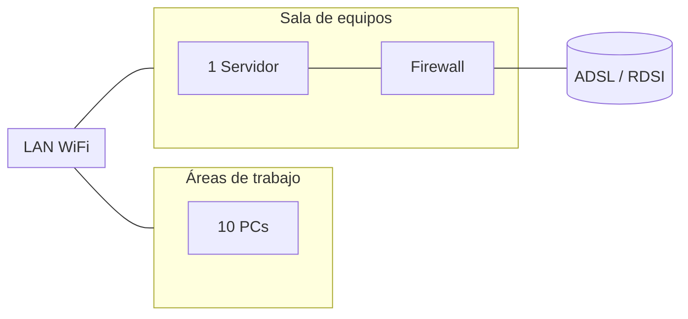
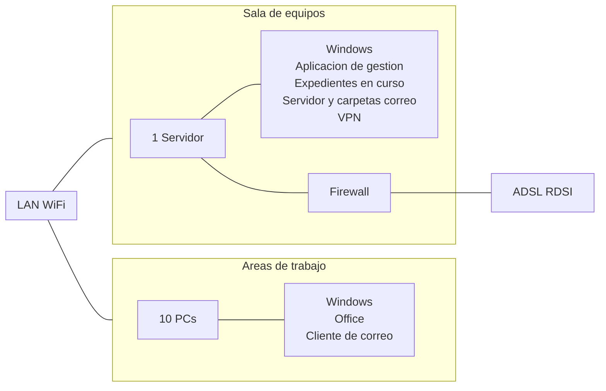

# Actividad Individual: Análisis Y Gestión De Riesgos De Una Instalación IT

## Objetivos

- Aprender a analizar y valorar los activos de una organización.
- Aprender a diseñar un plan de salvaguardas.
- Aprender a analizar el riesgo de un system

## Pautas De Elaboración

Se trata de la realización de un **análisis de riesgos de una entidad modelo.** Se deberá desarrollar un trabajo de análisis de riesgos con una versión de evaluación de la herramienta PILAR a partir de un ejemplo de un servicio público del Estado que utilize sistemas de información propios y de terceros para sus tareas internas y para prestar servicios de atención a los ciudadanos (administración electrónica).

El ejemplo solo pretende set ilustrativo, sin que el lector deba derivar mayores consecuencias o conclusión alguna de cumplimiento obligado. Incluso ante los mismos impactos y riesgos las soluciones pueden set diferentes, sin poder extrapolarse ciegamente de una a otra circunstancia. En particular, hay que destacar el papel de la dirección de la organización como último punto de decisión respecto de qué política adoptar para mantener impactos y riesgos bajo control.

Buena parte del texto que sigue presenta la situación en palabras **normals**, tal y como puede llegarle al equipo de trabajo a lo largo de las entrevistas. Es la misión de este equipo traducir el conocimiento adquirido a los términos formales definidos por esta metodología.

## **Ejemplo Para trabajar**

El servicio público del Estado objeto de estudio no es de nueva creación, sino que lleva años tramitando expedientes de forma local, antes manualmente, ahora por medio de un sistema informático propio. A este sistema informático se le ha añadido recientemente una conexión a un archivo central que funciona como **memoria histórica**: permite recuperar datos y conservar los expedientes cerrados. La última novedad consiste en **ofrecer un servicio propio de la administración electrónica,** en el que los usuarios pueden realizar sus tramitaciones vía web, usando su NIF como identificación más una contraseña personal. El mismo sistema de tramitación es usado localmente por un funcionario que atiende a los ciudadanos que se personan en las dependencias de la unidad.

El responsible del proyecto de administración electrónica, alarmado por las noticias aparecidas en los medios sobre la inseguridad de Internet y sabiendo que un fallo en el servicio conllevaría un serio daño a la imagen de su unidad, assume el papel de promotor. En este papel escribe un informe interno, dirigido al director de la unidad, en el que da cuenta de los medios informáticos con que se está trabajando y los que se van a instalar, las incidencias acaecidas desde que la unidad existe y las incertidumbres que le causa el uso de Internet para la prestación del servicio.

Con base en dicho informe, argumenta la conveniencia de lanzar un proyecto. La dirección, convencida de la necesidad de tomar medidas antes de que ocurra una desgracia, crea un comité de seguimiento formado por los responsables de los servicios involucrados: atención a usuarios, asesoría jurídica, servicios informáticos y seguridad física.

Se determina que el alcance del proyecto será el servicio de tramitación electrónica, presencial y remoto. También se estudiará la seguridad de la información que se maneja: expedientes. Respecto del equipamiento, se analizarán equipos y redes de comunicaciones. Se toma la decisión de dejar fuera del estudio elementos que pudieran set relevantes en un análisis más detallado, como pudieran set los datos de identificación y autenticación de los usuarios de los sistemas, las áreas de trabajo del personal que los maneja, la sala de equipos (centro de proceso de datos) y las personas relacionadas con el proceso. Está previsto lanzar en el futuro un proyecto más detallado que profundice en dichos aspectos.

Explícitamente, se excluirá la evaluación de la seguridad de los servicios subsidiarios que se emplean. El análisis es local, circunscrito a la unidad que nos ocupa. Dichos servicios remotos se consideran, a efectos de este análisis, **opacos**, es decir, no entraremos en analizar cómo se prestan.

El lanzamiento del proyecto incluye una reunión de la dirección con el comité de seguimiento en la que se exponen los puntos principales del análisis somero realizado por el promotor, que queda habilitado como director del proyecto en el que participaran dos personas de su equipo junto con un contrato de asesoría establecido con una empresa consultora externa. Uno de los miembros del equipo interno tendrá un perfil técnico: ingeniero de sistemas. A la consultora externa se le exige identificar nominalmente a las personas que van a participar y firmar un acuerdo de confidencialidad.

El proyecto se anuncia internamente mediante comunicación general a todo el personal de la unidad y notificación personal a aquellas personas que se verán directamente afectadas. En estas comunicaciones se identifican las personas responsables del proyecto.

### Resumen

- Administración electrónica.
- Pequeña ciudad en la que se prestan servicios administrativos a los administrados:
    - Presencial (ventanilla): desplazándose a los locales del ayuntamiento.
    - Servicio www: en Internet, en casa o fuera de la ciudad. Los avisos se reciben por correo electrónico.
- El sistema de información maneja expedientes administrativos.
- Los expedientes se almacenan localmente mientras están abiertos:
    - Hay una VPN a la capital de la provincia.
    - Los expedientes se descargan cuando se requieren.
    - Los expedientes se remiten a la capital cuando se cierran.
    - La disponibilidad a largo plazo la proporciona en la capital.
- La mensajería electrónica se usa asiduamente:
    - Coordinación interna.
    - Anuncios a los administrados.
    - Los mensajes se guardan en el servidor central.
    - No hay mensajes almacenados en los PC.

Figura 1. Equipamiento. Fuente: elaboración propia.

Figura 2. _Software_ instalado. Fuente: elaboración propia.

### Proceso De Análisis De Riesgos

La fase de análisis de riesgos arranca con una series de entrevistas a los responsables designados por el comité de seguimiento, en las que participan:

- La persona de enlace como introductor.
    - El personal de la consultora externa, como el director de la entrevista.
    - El personal propio, como el secretario: acta de la reunión y recopilación de datos.

### Servicio De Tramitación

El servicio de tramitación se presta por medio de una aplicación informática desarrollada en el pasado sobre una base de datos. A esta aplicación se accede a través de una identificación local del usuario que controla sus privilegios de acceso. En la faceta de tramitación presencial, es la persona que está atendiendo al usuario final la que se identifica frente al sistema. En el caso de la tramitación remota, es el propio administrado.

Toda la tramitación incluye una fase de solicitud (entrada de datos) y una fase de respuesta (entrega de datos). El usuario realiza su solicitud y espera una notificación para recoger la respuesta. La notificación es por correo, certificado, en el caso de tramitación presencial, y electrónico, en el caso de tramitación electrónica.

Iniciar una tramitación supone abrir un expediente que se almacena localmente en la oficina. También supone recabar una series de datos del archivo central de información, los cuales se copian localmente. Al cierre del expediente, los datos y un informe de las actuaciones realizadas se remiten al archivo central para su custodia y se elimina la información de los equipos locales.

El personal de la unidad se identifica por medio de su cuenta de usuario, mientras que los usuarios remotos se identifican por su NIF. En ambos casos, el sistema require una contraseña para autenticarlos.

Por último, hay que destacar el papel que presta la mensajería electrónica en todo el proceso de tramitación, medio interno de comunicación usado entre el personal y como mecanismo de notificación a los usuarios externos. Como norma, no se debe emplear el correo como transporte de documentos; estos siempre serán servidos por medio de accesos web.

### Servicio De Archivo Central

En forma de intranet, se presta un servicio centralizado de archivo y recuperación de documentos. Los usuarios acceden por medio de una interfaz web local que se conecta por medio de una red privada virtual con el servidor remoto, identificándose por medio de su NIF. Este servicio solo está disponible para el personal de la unidad y para el empleado virtual que presta el servicio de tramitación remota.

### Equipamiento Informático

La unidad dispone de varios equipos personales de tipo PC situados dentro de los locales. Estos equipos disponen de un navegador web, de un cliente de correo electrónico sin almacenamiento local de los mensajes y un paquete ofimático estándar (procesador de textos y hoja de cálculo).

Existe una capacidad de almacenamiento local de información en el disco del PC, del que no se realizan copias de seguridad; es más, existe un procedimiento de instalación/actualización que borra el disco local y reinstala el sistema íntegro. Los equipos no disponen de unidades de disco removible de ningún tipo: disquetes, CD, DVD, USB, etc.

Se dispone de un servidor de tamaño medio, de propósito general, dedicado a las tareas de servidor de ficheros; servidor de mensajería electrónica, con almacenamiento local y acceso vía web; servidor de bases de datos: expedientes en curso e identificación de usuarios; y un servidor web para la tramitación remota y para la intranet local.

### Comunicaciones

Se dispone de una red de área local que cubre las dependencias de trabajo y la sala de equipos. Está explícitamente prohibida la instalación de módems de acceso remoto y redes inalámbricas, para lo que existe un procedimiento rutinario de inspección.

Existe una conexión a Internet, de ADSL, contratada a un operador comercial. Sobre este enlace se prestan múltiples servicios:

- Servicio (propio) de tramitación remota.
- Servicio de correo electrónico (como parte del servicio de tramitación remota).
- Servicio (propio) de acceso a información.
- Red privada virtual con el archivo central.

La conexión a Internet se realiza única y exclusivamente a través de un cortafuegos que limita las comunicaciones a nivel de red, por lo que únicamente permite:

- El intercambio de correo electrónico con el servidor de correo.
- El intercambio web con el servidor web.

La red privada virtual con el archivo central utilize una aplicación informática _software._ La red se establece al inicio de la jornada y se corta automáticamente a la hora de cierre. En el establecimiento, los equipos terminales se reconocen mutuamente y establecen una clave de sesión para la jornada. No hay intervención de ningún operador local.

Hay una sensación de que muchos servicios dependen de la conexión a Internet. Además, en el pasado ha habido incidencias tales como cortes de servicio debidos a obras municipales y a una deficiente prestación del servicio por parte del proveedor. Por todo ello:

- Se ha establecido un contrato de servicio que establece un cierto nivel de calidad por encima del cual el operador debe abonar unas indemnizaciones pactadas de antemano en proporción al período de interrupción o a la lentitud (insuficiente volumen de datos transmitidos en períodos determinados de tiempo) del enlace.
    - Se ha contratado con otro proveedor un enlace digital (RDSI) de respaldo, enlace que habitualmente no está establecido, pero que se activa automáticamente cuando el enlace ADSL se interrumpe durante más de diez minutos.

Durante la entrevista, se descubre que estos enlaces se prestan sobre la misma acometida de red telefónica que presta los servicios de voz de la unidad.

### Seguridad Física

El personal trabaja en los locales de la unidad, principalmente en zonas interiores, salvo una series de terminales en los puntos de atención al público. El acceso a las zonas interiores está limitado a las horas de oficina, por lo que queda cerrado con llave fuera de dicho horario. En horas de oficina, hay un control de entrada que identifica a los empleados y registra su hora de entrada y de salida.

La sala de equipos es simplemente una habitación interior que permanece cerrada con llave de la que es custodio el administrador de sistemas. La sala dispone de un sistema de detección y extinción de incendios que se revisa anualmente. Esta sala se encuentra a cincuenta metros de la canalización de agua más cercana.

Los locales de la unidad ocupan íntegramente la cuarta planta de un edificio de oficinas de doce plantas. Los controles de acceso son propios de la unidad, no del edificio, que es de uso compartido con otras actividades. No hay ningún control sobre qué hay en el piso de arriba o en el piso de abajo.

## Usar Excel Con Octave

La actividad consiste en la aplicación de la metodología MAGERIT mediante el uso de la herramienta PILAR. Cabe señalar que dicha herramienta ha sido desarrollada específicamente para el contexto de España. Por esta razón, les recomiendo considerar el uso de OCTAVE, metodología ampliamente empleada en Latinoamérica. En este caso, pueden apoyarse en hojas de cálculo en Excel en lugar de la herramienta PILAR, siguiendo las directrices establecidas en la guía metodológica de OCTAVE.

Adjunto una plantilla en Excel que puede utilizarse para el registro y análisis de los activos identificados como riesgos. En la carpeta de documentos he subido la metodología de OCTAVE paso a paso. 

Finalmente, tienen la libertad de elegir entre OCTAVE o MAGERIT para el desarrollo y conclusión de esta actividad.

[[Plantilla OCTAVE SEI.xlsx]]

### Octave Allegro - Activos: Sheet 1

| ID Activo | Nombre del Activo | Tipo de Activo | Propietario | Ubicación | Confidencialidad | Integridad | Disponibilidad | Impacto | Notas |
| --------- | ----------------- | -------------- | ----------- | --------- | ---------------- | ---------- | -------------- | ------- | ----- |
|           |                   |                |             |           |                  |            |                |         |       |

### Escenarios De Amenaza: Sheet 2

| ID Escenario | Activo Relacionado | Amenaza | Vulnerabilidad | Probabilidad | Impacto | Riesgo Score | Riesgo Cualitativo | Controles Existentes | Controles Recomendados | Notas |
| ------------ | ------------------ | ------- | -------------- | ------------ | ------- | ------------ | ------------------ | -------------------- | ---------------------- | ----- |
|              |                    |         |                |              |         |              |                    |                      |                        |       |

### Valoracion Y Mitigacion: Sheet 3

| ID Escenario | Nivel de Riesgo Inicial | Estrategia de Mitigación | Controles Aplicados | Nivel de Riesgo Residual | Responsible | Fecha de Revisión |
| ------------ | ----------------------- | ------------------------ | ------------------- | ------------------------ | ----------- | ----------------- |
|              |                         |                          |                     |                          |             |                   |

## Recomendaciones

Revisar las opciones por defecto en Examinar > menú Editar > Opciones. Las opciones por defecto son las que se recomiendan para el ejercicio.

- - **Proyecto/fases del proyecto:** normalmente, se necesita definir fases (anuales) en un proyecto a medio/largo plazo en el que se van a ir aplicando sucesivamente las salvaguardas que la dirección ha aprobado en el documento de aplicabilidad de salvaguardas inicial. Por defecto, vienen dos fases: Current y Target; PILAR sería la fase que marca el objetivo de referencia que se debe conseguir, a la que debe aproximarse la fase Target. Sería conveniente crear una fase más al menos: Current > Intermedia1 > Intermedia2 > Target.
    - **Activos:** hay que identificar los activos esenciales (servicios y datos) de servicios de tramitación de expedientes presencial y remoto y datos como definición de activos, expedientes personales que deben set clasificados. A continuación, se definen activos de _software_ (que implementan servicios, clientes, servidores, PC, personal, instalaciones, etc.) y se caracterizan de acuerdo con la especificación del problema lo mejor possible.
    - **Valoración activos (por dominios de seguridad: es la opción por defecto y recomendada para empezar):** se valoran los activos esenciales y se propaga al resto de activos de los que dependen en el(los) dominio(s) de seguridad definidos.
    - **Salvaguardas y valoración:** se valoran por fases paulatinamente. Partiendo de las valoraciones de los activos asignadas se deben seleccionar y valorar por fases incrementales en niveles, de L1 A L5 (menor a mayor grado de implementación). El riesgo debe ir disminuyendo con relación al estado inicial en cada una de las fases.

## Extensión Y Formato

Debes confeccionar una memoria explicando el proceso y el fichero del proyecto realizado y generado con la herramienta PILAR con extensión .mgr.

La extensión óptima de la actividad son 10 páginas de un documento de Word (convertido a PDF), tipo de letra Georgia, tamaño 11 e interlineado 1,5.

| **Análisis y gestión de riesgos de una instalación IT** | **Descripción** | **Puntuación máxima** | **Peso %** |
|---------------------------------------------------------|------------------|------------------------|-------------|
| Criterio 1 | Configuración del proyecto                | 1   | 10%  |
| Criterio 2 | Diseño de activos                         | 2.5 | 25%  |
| Criterio 3 | Valoración de activos                     | 2   | 20%  |
| Criterio 4 | Diseño y valoración de salvaguardas       | 2.5 | 25%  |
| Criterio 5 | Resultado de riesgo                       | 2   | 20%  |
| **Total**  |                                          | **10** | **100%** |
