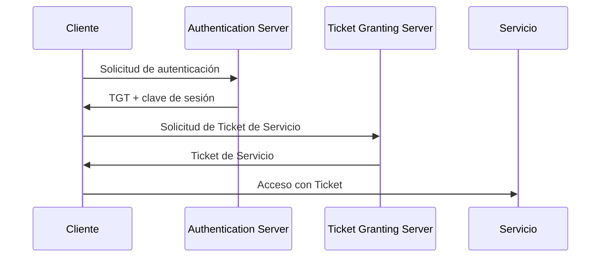
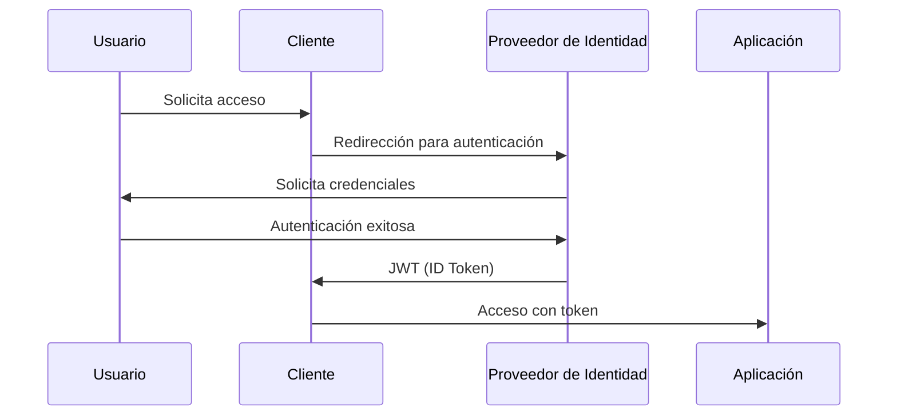
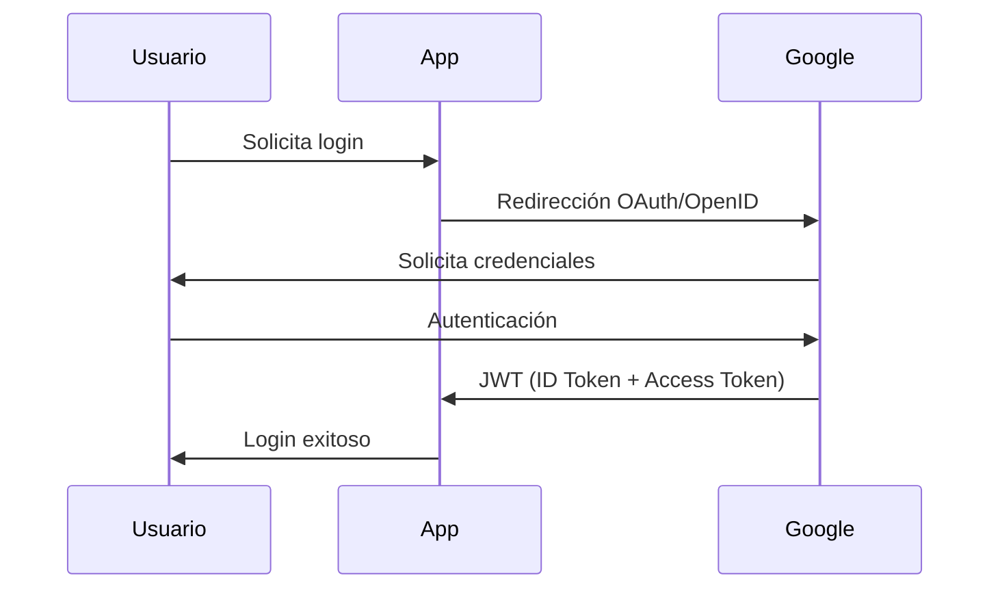

# Notas De Estudio: Autenticación NTLM Y Kerberos

---

## 1. Contexto General De la Autenticación

### 1.1 Autenticación En Sistemas Cliente-servidor

La **autenticación** es el proceso mediante el cual un sistema verifica la identidad de un usuario antes de permitirle el acceso a recursos o servicios.

En sesiones previas se mencionaron:

- **HTTP Digest Authentication**  
    Basada en un esquema de **desafío–respuesta**, donde el servidor envía un valor aleatorio (nonce) al cliente.
    
- **Autenticación basada en JavaScript**  
    Generalmente menos segura y dependiente del navegador.

En esta sesión se profundiza en dos mecanismos más avanzados:

- **NTLM**
    
- **Kerberos**

---

## 2. NTLM (New Technology LAN Manager)

### 2.1 Definición

**NTLM** es un protocolo de autenticación desarrollado por Microsoft, utilizado principalmente en **redes Windows**.

### 2.2 Modelo De Funcionamiento

NTLM se basa en un esquema de **desafío–respuesta**:

1. El servidor envía un valor aleatorio (desafío).
    
2. El cliente responde usando un valor derivado de sus credenciales.
    
3. El servidor valida la respuesta.

Este esquema es conceptualmente similar al uso de **nonces** en HTTP Digest.

### 2.3 Uso Común

- Redes Windows con **Active Directory (AD)**.
    
- Entornos donde Kerberos no puede set negociado.
    
- Compatible también con entornos Linux mediante **LDAP** u otras integraciones.

### 2.4 Limitaciones De Seguridad

- Vulnerable a **ataques de replay** (repetición).
    
- Considerado menos seguro que Kerberos.
    
- Por esta razón, Microsoft diseñó Kerberos como su reemplazo.

---

## 3. Kerberos

### 3.1 Definición

**Kerberos** es un protocolo de autenticación seguro basado en un **modelo de tickets**, no en desafío–respuesta.

Su objetivo principal es permitir:

- **Autenticación fuerte**
    
- **Single Sign-On (SSO)**

---

### 3.2 Components Principales De Kerberos

|Componente|Nombre completo|Función|
|---|---|---|
|KDC|Key Distribution Center|Centro que gestiona claves y tickets|
|AS|Authentication Server|Autentica al usuario inicialmente|
|TGS|Ticket Granting Server|Emite tickets para servicios|
|TGT|Ticket Granting Ticket|Permite solicitar tickets de servicio|

---

### 3.3 Flujo General De Kerberos

1. El usuario se autentica una sola vez.
    
2. El **AS** emite un **TGT**.
    
3. Con el TGT, el usuario solicita tickets al **TGS**.
    
4. El usuario accede a múltiples servicios sin volver a autenticarse.

#### Diagrama Del Flujo De Kerberos (MermaidJS)



---

### 3.4 Ventajas Clave

- Implementa **Single Sign-On**.
    
- Reduce la exposición de credenciales.
    
- Más resistente a ataques de replay que NTLM.

---

## 4. Validez Y Duración De Los Tickets En Kerberos

### 4.1 Duración Típica

|Tipo de Ticket|Duración|
|---|---|
|TGT|Hasta 8 horas|
|Ticket de Servicio|10 minutos a 2 horas|
|Renovación|Hasta 7 días (configurable)|

La duración depende de la configuración de la organización.

---

## 5. Comparación De Seguridad: NTLM Vs Kerberos

|Característica|NTLM|Kerberos|
|---|---|---|
|Modelo|Desafío–respuesta|Tickets|
|SSO|No|Sí|
|Vulnerable a replay|Sí|Menos probable|
|Uso de dominio|Opcional|Requerido|
|Seguridad|Media|Alta|

---

## 6. Ataques Relacionados Con Kerberos

### 6.1 Pass-the-Ticket (PTT)

- El atacante roba un **ticket válido**.
    
- Reutiliza el ticket para acceder a servicios.
    
- No necesita conocer la contraseña del usuario.

### 6.2 Herramientas Utilizadas

- **Mimikatz**
    
    - Permite extraer tickets Kerberos desde la memoria.
        
    - Muy utilizada en pruebas de penetración y ataques reales.

---

### 6.3 Medidas De Mitigación

|Medida|Descripción|
|---|---|
|Windows Defender Credential Guard|Aísla credenciales en memoria|
|Detección de anomalías|Identifica comportamientos sospechosos|
|SIEM|Análisis centralizado de eventos|

Ejemplos de herramientas SIEM:

- Splunk
    
- Microsoft Sentinel (Azure)

---

## 7. Negociación De Autenticación En Windows

### 7.1 Proceso De Negociación

1. Windows intenta autenticarse usando **Kerberos**.
    
2. Si Kerberos no es possible:
    
    - Se utilize **NTLM** como fallback.

### 7.2 Requisito Clave Para Kerberos

- Debe existir un **dominio válido**.
    
- Ejemplo válido: `unit.net`
    
- Ejemplo no válido: `localhost`

Cuando se usa `localhost`, Windows no puede usar Kerberos y cambia automáticamente a NTLM.

---

## 8. Análisis De Tráfico Con Wireshark

### 8.1 Definición

**Wireshark** es una herramienta professional de análisis de tráfico de red que permite:

- Capturar paquetes en tiempo real.
    
- Analizar protocolos de autenticación.
    
- Ver procesos de negociación NTLM/Kerberos.

### 8.2 Uso En Autenticación

- Permite observar:
    
    - Intentos de Kerberos.
        
    - Fallback a NTLM.
        
    - Respuestas HTTP como **200 OK**.

---

## 9. Ejemplo Práctico De Autenticación

### 9.1 Escenario

- Cliente y servidor en Windows.
    
- Aplicación desarrollada en **.NET (C#)**.
    
- El cliente envía credenciales y URL del servidor.

### 9.2 Resultado

- Windows intenta negociar Kerberos.
    
- Al usar `localhost`, no hay dominio.
    
- Se utilize **NTLM**.
    
- Respuesta HTTP **200 OK** indica autenticación exitosa.

---

## 10. Resumen De Puntos Clave

- NTLM es un protocolo basado en desafío–respuesta y menos seguro.
    
- Kerberos usa tickets y permite Single Sign-On.
    
- Kerberos require un dominio correctamente configurado.
    
- Los tickets tienen tiempo de vida limitado y configurable.
    
- Kerberos es más seguro, pero vulnerable a Pass-the-Ticket.
    
- Mimikatz permite robar tickets desde memoria.
    
- Wireshark ayuda a analizar la negociación de autenticación.
    
- Windows intenta Kerberos primero y usa NTLM como alternativa.

## 11. NTLM Versión 2 (NTLMv2)

### 11.1 Definición

**NTLMv2** es una versión mejorada del protocolo NTLM que introduce mecanismos criptográficos más fuertes para mitigar ataques conocidos, especialmente los **ataques de replay**.

### 11.2 Mejoras De Seguridad

NTLMv2 introduce:

- **HMAC** en lugar de hashes simples.
    
- Uso de algoritmos criptográficos más robustos.
    
- Protección de la integridad de los mensajes.

### 11.3 Algoritmos Utilizados

- **HMAC-MD5**:  
    A diferencia de MD5 simple (considerado obsoleto), HMAC incorpora una **clave secreta**, lo que lo hace resistente a manipulaciones.
    
- **SHA-256**:  
    Utilizado como algoritmo hash más seguro en comparación con MD5.

---

## 12. HMAC (Hash-based Message Authentication Code)

### 12.1 Definición

**HMAC** es un mecanismo criptográfico que combina:

- Un algoritmo hash (por ejemplo SHA-256)
    
- Una **clave secreta**

Su objetivo es garantizar:

- **Integridad del mensaje**
    
- **Autenticidad del origen**
    
- Protección contra **ataques de replay**

### 12.2 MIC (Message Integrity Check)

El **MIC** es un hash que:

- Se calcula sobre el contenido del mensaje.
    
- Permite detectar cualquier modificación.
    
- Si el mensaje cambia, el hash no coincide y la petición es rechazada.

---

## 13. Ataques De Replay Y Mitigación En NTLMv2

### 13.1 Ataque Replay

Un **ataque de replay** consiste en:

- Capturar una petición válida.
    
- Reenviarla posteriormente para obtener acceso no autorizado.

### 13.2 Mitigación Con NTLMv2

NTLMv2 mitiga estos ataques mediante:

- Uso de HMAC con clave secreta compartida.
    
- Verificación del MIC entre cliente y servidor.
    
- Rechazo automático de mensajes alterados.

---

## 14. Ejemplo Práctico: Protección De Parámetros URL Con HMAC

### 14.1 Problema Común

Los desarrolladores suelen enviar parámetros en la URL, por ejemplo:

```Python
http://localhost/app?id=123
```

Un atacante puede modificar el parámetro:

```Python
http://localhost/app?id=999
```

### 14.2 Solución Con Firma (Signature / SIG)

Se añade una **firma criptográfica** al URL:

```Python
http://localhost/app?id=123&sig=HASH
```

### 14.3 Proceso Paso a Paso

1. El servidor genera una **clave secreta**.
    
2. El cliente envía:
    
    - ID
        
    - Firma (HMAC del ID + clave secreta)
        
3. El servidor:
    
    - Recalcula el HMAC usando el ID recibido.
        
    - Compara la firma recibida con la firma generada.
        
4. Si no coinciden:
    
    - La solicitud es rechazada.

### 14.4 Resultado

- Si el atacante cambia el ID pero no puede recalcular la firma:
    
    - La firma es inválida.
        
    - El servidor rechaza la petición.

---

## 15. Gestión De Claves Secretas

### 15.1 Buenas Prácticas

- Las claves secretas **no deben almacenarse en texto plano**.
    
- No deben estar embebidas directamente en el código fuente.
    
- Se recomienda usar:
    
    - Servicios de gestión de secretos (ej. CyberArk).
        
    - Servicios de nube especializados.

---

## 16. Ubicación De la Firma En la Comunicación

### 16.1 Transmisión De la Firma

- La firma suele enviarse en:
    
    - Headers HTTP
        
    - Metadata de la petición
        
- Durante el **handshake** entre cliente y servidor:
    
    - El servidor proporciona la clave de forma segura.
        
    - El cliente la utilize para firmar los parámetros.

---

## 17. Single Sign-On (SSO)

### 17.1 Definición

**Single Sign-On (SSO)** permite a un usuario:

- Autenticarse una sola vez.
    
- Acceder a múltiples aplicaciones o servicios sin volver a ingresar credenciales.

### 17.2 Casos Comunes

- Autenticación con Google.
    
- Autenticación con Facebook.
    
- Acceso a múltiples aplicaciones empresariales.

### 17.3 Ventajas

- Mejor experiencia de usuario.
    
- Menos contraseñas que recordar.
    
- Gestión centralizada de identidades.

### 17.4 Desventaja Principal

- **Punto único de fallo**:
    
    - Si se compromete la cuenta principal (ej. Google),  
        se comprometen todos los servicios asociados.

---

## 18. OpenID Connect

### 18.1 Definición

**OpenID Connect** es un **protocolo de autenticación** interoperable construido sobre **OAuth 2.0**.

### 18.2 Función Principal

- Autenticar usuarios sin que las aplicaciones gestionen usuarios y contraseñas.
    
- Delegar la autenticación a un proveedor confiable (Google, Facebook, etc.).

---

## 19. OAuth 2.0

### 19.1 Definición

**OAuth 2.0** es un **framework de autorización**, no de autenticación.

### 19.2 Función

- Permite acceso a recursos protegidos.
    
- No comparte credenciales (usuario y contraseña).
    
- Utilize tokens de acceso.

---

## 20. Relación Entre OpenID Connect Y OAuth 2.0

|Concepto|Tipo|Función|
|---|---|---|
|OpenID Connect|Protocolo|Autenticación|
|OAuth 2.0|Framework|Autorización|

- OpenID Connect **siempre** utilize JWT.
    
- OAuth 2.0 **puede o no** usar JWT.

---

## 21. JSON Web Token (JWT)

### 21.1 Definición

**JWT** es un token compacto y firmado que:

- Transporta información entre cliente y servidor.
    
- Se usa ampliamente en OpenID Connect.
    
- Puede usarse opcionalmente en OAuth 2.0.

### 21.2 Uso Principal

- Intercambio seguro de información.
    
- Autenticación y autorización sin compartir credenciales.

---

## 22. Flujo General De SSO Con OpenID Connect (Mermaid)



---

## 23. Riesgos De OAuth 2.0 Mal Configurado

### 23.1 Open Redirect / Covert Redirect Attack

Ocurre cuando:

- El servidor OAuth no valida correctamente la URL de redirección.
    
- El atacante redirige al usuario a un dominio malicioso.
    
- El token JWT es enviado al atacante.

### 23.2 Impacto

- Robo de tokens.
    
- Suplantación de identidad.
    
- Acceso no autorizado a recursos protegidos.

---

## 24. Resumen De Puntos Clave

- NTLMv2 mejora la seguridad usando HMAC y MIC.
    
- HMAC protege contra ataques de replay y modificaciones.
    
- Las firmas permiten validar parámetros como IDs en URLs.
    
- Las claves secretas deben gestionarse de forma segura.
    
- SSO simplifica el acceso a múltiples servicios.
    
- OpenID Connect autentica; OAuth 2.0 autoriza.
    
- JWT es clave en OpenID Connect.
    
- Una mala configuración de OAuth puede permitir ataques de redirección maliciosa.

## 24. JSON Web Token (JWT)

### 24.1 Definición

Un **JSON Web Token (JWT)** es una cadena de caracteres en formato JSON **codificada en Base64** que se utilize para intercambiar información de forma segura entre un cliente y un servidor.  
Es ampliamente utilizado en **OpenID Connect** y en esquemas modernos de autenticación y autorización.

---

### 24.2 Estructura Del JWT

Un JWT se compone de **tres partes**, separadas por puntos (`.`):

1. **Header**
    
2. **Payload (Claims)**
    
3. **Signature**

```Python
Header.Payload.Signature
```

Todas las partes están codificadas en **Base64**, pero **solo la firma está protegida criptográficamente**.

---

### 24.3 Header (Encabezado)

#### Contenido

- **typ**: Tipo de token (JWT)
    
- **alg**: Algoritmo criptográfico usado para la firma (ej. HS256, RS256)

#### Ejemplo (JSON)

```json
{
  "typ": "JWT",
  "alg": "HS256"
}
```

Este contenido se codifica en Base64 antes de enviarse.

---

### 24.4 Payload (Claims)

#### Definición

El **payload** contiene los **claims**, que son los datos del usuario y del contexto de autenticación.

#### Ejemplos De Claims

- Usuario
    
- Rol (admin, user)
    
- Correo electrónico
    
- Estado de verificación
    
- Nonce (valor aleatorio)
    
- Imagen de perfil

> Importante:  
> El payload **no está cifrado**, solo codificado en Base64.  
> Cualquiera puede leerlo si obtiene el token.

---

### 24.5 Signature (Firma)

#### Función

La firma garantiza:

- **Integridad del token**
    
- **Autenticidad del emisor**

#### Cómo Se Genera

Se calcula usando:

- Header codificado
    
- Payload codificado
    
- **Clave secreta** (HMAC) o clave privada (RSA)

Ejemplo conceptual:

```Python
HMACSHA256(
  base64(header) + "." + base64(payload),
  secret_key
)
```

La clave secreta **solo reside en el servidor**.

---

## 25. JWT Y Autorización Basada En Claims

### 25.1 Claims Como Base De Autorización

Los claims permiten implementar distintos modelos de control de acceso sin necesidad de consultar una base de datos en cada petición.

---

### 25.2 Modelos De Control De Acceso

|Modelo|Descripción|Ventajas|Desventajas|
|---|---|---|---|
|RBAC|Role-Based Access Control|Simple, común|Rígido|
|ABAC|Attribute-Based Access Control|Flexible, contextual|Más complejo|
|PBAC|Policy-Based Access Control|Muy granular|Difícil de administrar|

---

### 25.3 RBAC (Role-Based Access Control)

- El acceso depende del **rol del usuario**.
    
- Ejemplo:
    
    - Admin → lectura y escritura
        
    - User → solo lectura

**Limitación**  
Todos los usuarios con el mismo rol tienen los mismos privilegios.

---

### 25.4 ABAC (Attribute-Based Access Control)

#### Definición

ABAC basa la autorización en **atributos**:

- Del usuario
    
- Del recurso
    
- Del entorno

#### Ejemplo

Un banco:

- Un cliente solo puede ver **sus propias transacciones**
    
- Aunque esté en el mismo departamento que otros usuarios

**Ventaja principal**

- Mayor flexibilidad y control dinámico.

---

## 26. ABAC En Windows Y Active Directory

### 26.1 Flujo General

1. El usuario se autentica usando **Kerberos**.
    
2. Active Directory obtiene los **claims del usuario**.
    
3. El recurso tiene **etiquetas de clasificación**.
    
4. Se evalúa la **regla ABAC**.
    
5. Se concede o rechaza el acceso.

---

### 26.2 Ejemplo De Regla ABAC

- Si:
    
    - Usuario pertenece a _Auditoría_
        
    - Recurso es _Confidencial_
        
- Entonces:
    
    - Acceso permitido

Si no se cumplen ambas condiciones → acceso denegado.

---

### 26.3 Comparación Con ACL

- **ACL (Access Control List)**:
    
    - Modelo estático
        
    - Permisos fijos
        
- **ABAC**:
    
    - Modelo dinámico
        
    - Permisos basados en condiciones

---

## 27. Single Sign-On (SSO) Con Google (Caso práctico)

### 27.1 Configuración Inicial

1. Crear un proyecto en **Google Cloud Console**.
    
2. Generar:
    
    - Client ID
        
    - Client Secret
        
3. Configurar URL de redirección.

---

### 27.2 Flujo De Autenticación SSO



---

### 27.3 Características Clave

- Google **no envía usuario ni contraseña** a la aplicación.
    
- La aplicación recibe un **JWT**.
    
- El JWT contiene:
    
    - Header
        
    - Claims
        
    - Signature

---

### 27.4 Análisis Del JWT

Usando un **JWT Decoder** se pueden observar:

- Algoritmo (ej. RS256)
    
- Claims:
    
    - Email
        
    - Email verificado
        
    - Nombre
        
    - Nonce
        
    - Imagen de perfil

---

### 27.5 Seguridad En Tránsito

- El JWT viaja cifrado usando **TLS 1.3**.
    
- Protocolo observado con herramientas como **Wireshark**.

---

## 28. Proveedores OAuth 2.0 / OpenID Connect

Ejemplos comunes:

- Google
    
- Microsoft Entra ID (Azure AD)
    
- Facebook
    
- X (Twitter)
    
- Okta
    
- Keycloak
    
- Auth0

---

## 29. Autenticación Basada En Formularios

### 29.1 Definición

Utilize formularios HTML y peticiones **HTTP POST** para enviar:

- Usuario
    
- Contraseña

---

### 29.2 Buenas Prácticas De Seguridad

1. **HTTPS obligatorio**
    
    - TLS 1.2 o superior
        
2. **MFA / 2FA**
    
    - Autenticadores (Google, Microsoft)
        
3. **CAPTCHA**
    
    - Previene ataques automatizados
        
4. **No recordar contraseñas**
    
    - En aplicaciones sensibles
        
5. **Enmascarar contraseñas**
    
    - Uso de caracteres ocultos
        
6. **Timeout de sesión**
    
    - Reautenticación tras inactividad

---

## 30. Comparativa De Seguridad Por Tipo De Autenticación

|Método|Nivel de Seguridad|
|---|---|
|HTTP Basic|Muy bajo|
|HTTP Digest|Bajo|
|NTLM|Medio|
|NTLMv2|Medio-Alto|
|Kerberos|Alto|
|Formularios|Variable (depende de TLS y MFA)|

---

## 31. Puntos Clave Para Repaso

- JWT consta de header, payload y firma.
    
- El payload es legible; la seguridad depende de la firma.
    
- ABAC ofrece mayor flexibilidad que RBAC.
    
- Kerberos es el estándar corporativo más seguro.
    
- SSO reduce fricción pero introduce un punto único de fallo.
    
- OAuth 2.0 autoriza; OpenID Connect autentica.
    
- TLS es indispensable en cualquier autenticación moderna.
    
- Formularios deben reforzarse con MFA, HTTPS y CAPTCHA.