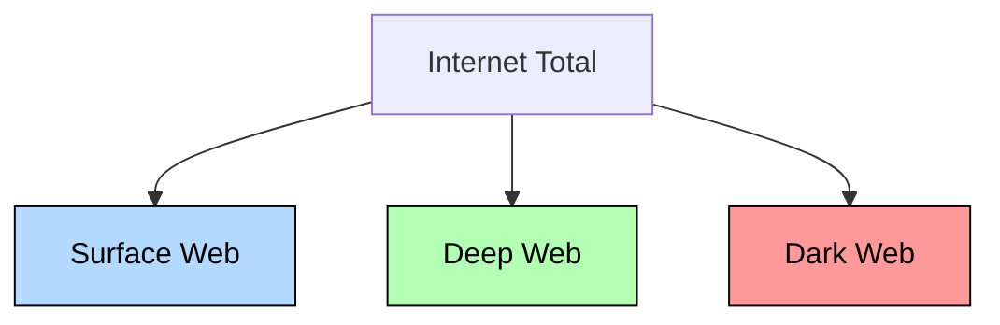
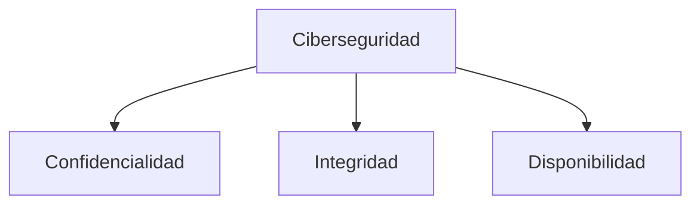

# Notas De Estudio: Introducción a la Ciberseguridad

---

## 1. Introducción a la Asignatura

### Panorama General

La materia introduce los **fundamentos de la ciberseguridad**, sus **principales amenazas** y **dimensions** (conocidas como la **tríada CIA: Confidencialidad, Integridad y Disponibilidad**).

Se abordan temas como:

- Amenazas y riesgos en el entorno digital.
    
- Tipos de atacantes y sus motivaciones.
    
- Principios y pilares de seguridad.
    
- Infraestructura segura (firewalls, IDS, WAF).
    
- Protocolos de comunicación y el modelo OSI/TCP-IP.

### Profesionalismo Y Normas Académicas

- **Política antiplagio**: prohíbe la suplantación de identidad, trampas o falsificaciones.
    
- **Entregas**: deben realizarse dentro del tiempo establecido; los retrasos requieren justificante y autorización formal.

---

## 2. Concepto De Ciberseguridad

### Definición

> Conjunto de **prácticas, tecnologías y procedimientos** destinados a **proteger los sistemas informáticos** frente a accesos no autorizados, daño o pérdida de información.

### Ámbitos De Aplicación

- Infraestructura de red (LAN, servidores, nube).
    
- Aplicaciones web y móviles.
    
- Datos personales y corporativos.

---

## 3. Tipos De Atacantes

|Tipo de atacante|Descripción|Ejemplo de amenaza|
|---|---|---|
|**Crimen organizado**|Buscan beneficio económico mediante ransomware o phishing.|Ransomware que encripta archivos y exige rescate.|
|**Nación-Estado**|Motivos políticos o militares.|Espionaje entre países (Corea del Norte, Rusia, EE. UU.).|
|**Competencia**|Robo de información corporativa o tecnológica.|Espionaje industrial entre empresas (Apple vs. Samsung).|
|**Hacktivistas**|Motivos sociales o ideológicos.|Ataques DDoS o defacement (modificación de sitios web).|
|**Insiders (internos)**|Empleados o usuarios que cometen errores o filtran información.|Ingeniería social, fuga de datos, errores humanos.|

---

## 4. Ingeniería Social

### Definición

Conjunto de técnicas que buscan **manipular psicológicamente a las personas** para que revelen información o realicen acciones que comprometen la seguridad.

### Subtipos Y Técnicas

|Técnica|Medio de ataque|Descripción|
|---|---|---|
|**Phishing**|Correo electrónico|Enlaces o archivos maliciosos que instalan malware o roban credenciales.|
|**Smishing**|SMS o mensajería|Mensajes falsos con enlaces o descargas.|
|**Vishing**|Llamadas telefónicas|Suplantación de voz para obtener información.|
|**QRishing**|Códigos QR|Códigos maliciosos colocados en lugares públicos (p. ej., menús de restaurantes).|
|**Footprinting / Fingerprinting**|Redes sociales|Recolección de huellas digitales e información pública.|

### Ejemplo De Phishing Real

Un correo de “Liverpool” falso con URL modificada y remitente no official.  
**Prevención**:

- Verificar dominio y remitente.
    
- No abrir enlaces sospechosos.
    
- Capacitar empleados mediante simulaciones de phishing.

---

## 5. Costos Y Medidas De Seguridad

### Costos Asociados

1. **Hardware**: Firewalls, IDS (Intrusion Detection System), WAF (Web Application Firewall).
    
2. **Software y mantenimiento**: Soluciones antivirus, actualizaciones, monitoreo continuo.
    
3. **Respuesta a incidentes**: Análisis, reparación, pérdidas económicas.

### Costo vs. Riesgo

Implementar seguridad es **costoso**, pero **no hacerlo es más riesgoso**: pérdida de reputación, sanciones legales y daño financiero.

---

## 6. Error Humano Y Cultura Organizacional

- **El eslabón más débil** en la seguridad suele set el usuario.
    
- Ejemplo: contraseñas anotadas en post-its visible (“Dave”).
    
- **Prevención**:
    
    - Políticas de contraseñas seguras.
        
    - Capacitación continua y simulaciones.
        
    - Clasificación de correos externos (etiquetas como _[EXTERNAL]_).

---

## 7. Capas De Internet Y Profundidad Web

|Capa|Características|Acceso|
|---|---|---|
|**Surface Web**|Páginas indexadas por buscadores (Google).|Público.|
|**Deep Web**|Contenido no indexado (bancos, correos, redes sociales).|Privado con autenticación.|
|**Dark Web**|Actividad anónima, contenido illegal, venta de datos.|Navegadores especiales (Tor).|

---

## 8. Justificación De la Seguridad

### Factores Clave

- **Reputación empresarial**: un ataque puede destruir la confianza del cliente.
    
- **Impacto financiero**: pérdidas por interrupciones o demandas.
    
- **Cumplimiento legal**: leyes y regulaciones nacionales e internacionales.

### Regulaciones Relevantes

|País / Región|Regulación|Enfoque|
|---|---|---|
|EE. UU.|HIPAA|Protección de datos médicos.|
|México|Ley Federal de Protección de Datos Personales|Privacidad y tratamiento de datos.|
|Internacional|ISO/IEC 27001|Estándares de gestión de seguridad de la información.|

---

## 9. Protocolos Y Modelo OSI/TCP-IP

### Protocolos Clave

|Protocolo|Función|Capa OSI|
|---|---|---|
|**HTTP / HTTPS**|Comunicación web|Aplicación|
|**SFTP**|Transferencia segura de archivos|Aplicación|
|**TCP / UDP**|Transporte de datos|Transporte|
|**IP**|Enrutamiento de paquetes|Red|

### Capas Del Modelo OSI

1. Física
    
2. Enlace de datos
    
3. Red
    
4. Transporte
    
5. Sesión
    
6. Presentación
    
7. Aplicación

Cada capa tiene vulnerabilidades específicas y ataques asociados (phishing, exploits, denegación de servicio, etc.).

---

## 10. Pilares De la Seguridad

|Pilar|Descripción|
|---|---|
|**Confidencialidad**|Solo usuarios autorizados acceden a la información.|
|**Integridad**|Los datos se mantienen correctos y sin alteraciones.|
|**Disponibilidad**|Los sistemas están accesibles cuando se necesitan.|

---

## Resumen De Puntos Clave

- La **ciberseguridad** busca proteger la información mediante prácticas, tecnologías y políticas.
    
- Los **atacantes** pueden set externos o internos, con diferentes motivaciones.
    
- La **ingeniería social** es una de las amenazas más comunes y efectivas.
    
- Los **costos de prevención** son menores que las pérdidas por incidentes.
    
- La **Deep y Dark Web** representan espacios donde circulan datos robados o ilegales.
    
- La **seguridad integral** require medidas técnicas, organizacionales y humanas.
    
- El **modelo OSI** ayuda a identificar los niveles donde se aplican controles.
    
- Los **pilares CIA** son la base para diseñar políticas de protección.
