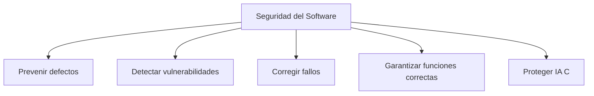

# Notas De Estudio

## Idea Clave: El Problema De la Seguridad En El Software

---

## 1. Introducción: El Papel Del Software En la Tecnología Actual

El software es un componente común y fundamental en prácticamente todos los sistemas TIC modernos: redes sociales, bases de datos, sistemas de información, dispositivos inalámbricos, servidores, sistemas operativos, firewalls, IDS/IPS y más.  
**Idea central:** Si todos dependen del software, todos pueden set vulnerables.

---

## 2. Origen De Las Vulnerabilidades En El Software

### 2.1 Integración De Components Externos

Muchos sistemas combinan librerías y módulos desarrollados por distintos equipos o empresas.

- Esto facilita el desarrollo, pero **aumenta el riesgo** si los components ya contienen vulnerabilidades conocidas.
    
- Herramientas como **Software Composition Analysis (SCA)** permiten detectar fallos en dependencias.

### 2.2 Mezcla De Código Y Mala Arquitectura

Cuando intervienen múltiples equipos (consultoría, proveedores, equipo interno), una arquitectura débil puede generar problemas de integración.

- Una mala integración puede consumir más tiempo que el propio desarrollo.
    
- Sin diseño seguro, surgen brechas graves en puntos de unión entre components.

### 2.3 Pruebas De Seguridad Insuficientes

- Muchas veces se ejecutan al final del proyecto.
    
- Los retrasos de calendario suelen reducir el tiempo destinado a pruebas.
    
- Esto permite que vulnerabilidades lleguen a producción.

### 2.4 Falta De Conocimiento En Programación Segura

Programadores sin formación en seguridad pueden introducir errores comunes:

- Buffer overflow
    
- Inyecciones
    
- Manejo incorrecto de memoria  
    Una **guía de codificación segura** por parte de la organización reduce estos errores sistemáticos.

### 2.5 Tolerancia a Los Defectos

Permitir errores “menores” durante el desarrollo puede generar grandes costos posteriores, tanto económicos como reputacionales.

### 2.6 Entornos De Prueba Mal Configurados

Si los entornos de testing no reflejan el entorno real, las vulnerabilidades de configuración pueden pasar desapercibidas.

### 2.7 Complejidad Creciente Del Software

A mayor complejidad, mayor probabilidad de errores.

### 2.8 Requisitos Incompletos O Vagos

- Frecuente ausencia de requisitos de seguridad.
    
- Ejemplo de requisito incorrecto: “el software debe set seguro”.
    
    - Es ambiguo, no medible y no orienta al desarrollo.

### 2.9 Cambios De Requisitos

Cambios tardíos generan errores y afectan la estabilidad.  
Incluso requisitos aparentemente simples pueden tener gran impacto técnico.

### 2.10 Cadena De Suministro Insegura

Proveedores externos sin controles de seguridad pueden introducir vulnerabilidades.

### 2.11 Nuevas Funcionalidades Durante El Desarrollo

Añadir funciones sin planificación aumenta el riesgo y rompe la estabilidad del diseño.

---

## 3. Definición De Seguridad En El Software

La seguridad del software es un **conjunto de principios de diseño y buenas prácticas** aplicadas durante todo el ciclo de vida del software (SDLC) para:

- Detectar, prevenir y corregir defectos de seguridad.
    
- Producir software confiable y robusto ante ataques.
    
- Asegurar que el software:
    
    - Realice únicamente las funciones para las que fue diseñado.
        
    - No posea vulnerabilidades accidentales ni intencionadas.
        
- Mantener integridad, disponibilidad y confidencialidad.

### Diagrama Conceptual

---

## 4. Coste De Corregir Vulnerabilidades

### 4.1 Comparativa Según Fase

El costo de corregir una vulnerabilidad aumenta drásticamente según la fase del ciclo de vida:

- Corregir en producción puede costar **hasta 30 veces más** que en fase de codificación.

### 4.2 Tabla De Impacto

|Fase del SDLC|Costo relativo de corregir una vulnerabilidad|
|---|---|
|Diseño|Bajo|
|Codificación|Moderado|
|Pruebas|Alto|
|Producción|Muy alto (≈30x)|

---

## 5. Caso Real: Microsoft Y El SDL (2005)

### 5.1 Contexto

Windows XP sufrió numerosas vulnerabilidades críticas, lo que obligó a Microsoft a replantear su proceso de desarrollo.

### 5.2 Acción Tomada

Implementación del **Security Development Lifecycle (SDL)** para todo su software global.

### 5.3 Resultados Clave

|Producto|Vulnerabilidades Antes|Vulnerabilidades Después|
|---|---|---|
|Windows (en general)|Reducción del 40% el primer año|—|
|Críticas|—|Reducción del 75%–85%|
|Windows XP → Vista|119|66|
|SQL Server|34|3|

### 5.4 Conclusión

Implementar un ciclo de desarrollo seguro es **altamente rentable** y reduce significativamente las vulnerabilidades.

---

## Resumen De Puntos Clave

- Todo sistema TIC depende del software y, por lo tanto, es vulnerable.
    
- Las vulnerabilidades provienen de una combinación de falta de diseño seguro, mala integración, dependencia de terceros, pruebas insuficientes y desconocimiento en seguridad de programación.
    
- La seguridad del software debe integrarse en todas las fases del SDLC.
    
- Corregir vulnerabilidades en producción es extremadamente costoso.
    
- El caso Microsoft demuestra que un ciclo seguro reduce drásticamente fallos y es rentable.

---

## MicroTest

1. **¿Cuál no es una de las principales causas de la aparición de vulnerabilidades en el software?**
    
    - **La respuesta:** D. Cambios de requisitos del proyecto durante la etapa de requisitos.
        
    - **Justificación:** Aunque los cambios de requisitos pueden generar complejidad, no son una causa principal directa de vulnerabilidades. Las otras opciones corresponden a causas mencionadas en el temario: integración defectuosa, mezcla de código y tamaño/ complejidad excesiva.

---

1. **Señala la respuesta incorrecta. Se puede definir la seguridad del software como:**
    
    - **La respuesta:** A. La confianza de que el software, hardware y servicios están libres de vulnerabilidades…
        
    - **Justificación:** Esta definición mezcla software, hardware y servicios, y además plantea una ausencia total de vulnerabilidades, lo cual no es realista ni coherente con la definición formal. Las otras opciones sí se ajustan a las definiciones vistas.

---

1. **Señala la respuesta incorrecta. Se puede definir la seguridad del software como:**
    
    - **La respuesta:** A. La confianza de que el software, hardware y servicios funcionan conforme a los estándares.
        
    - **Justificación:** Define conformidad con estándares, pero no aborda vulnerabilidades, ni el ciclo de vida, ni las buenas prácticas, por lo que no corresponde a una definición válida de seguridad del software. Las otras opciones sí reflejan elementos esenciales del concepto.

https://www.microsoft.com/en-us/securityengineering/sdl