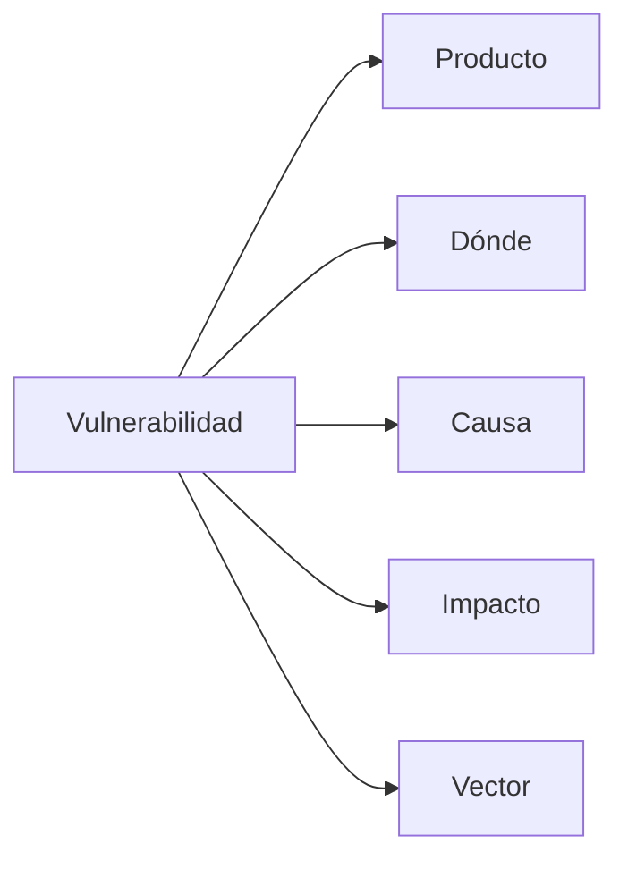
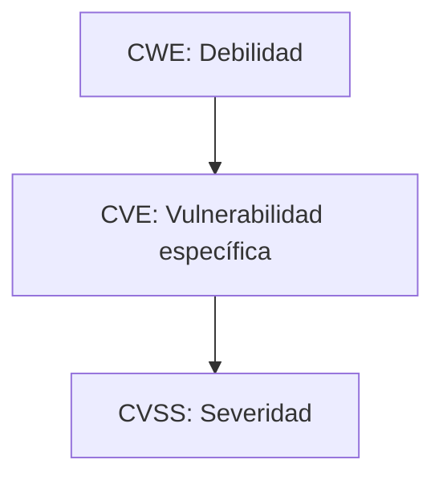

# Notas De Estudio

## Idea Clave 2: Vulnerabilidades Y Su Clasificación

---

## 1. Definición De Vulnerabilidad

Una **vulnerabilidad** es un fallo de programación, diseño o configuración que permite a un atacante alterar el comportamiento normal de un programa para realizar acciones maliciosas como:

- Acceder o modificar información sensible.
    
- Robar datos.
    
- Destruir sistemas o aplicaciones.
    
- Tomar control de la máquina.

### Tipos De Fallos Que Generan Vulnerabilidades

|Tipo de fallo|Descripción|Ejemplo|
|---|---|---|
|Fallos de implementación|Errores cometidos durante la codificación.|Inyección, buffer overflow, cross-site scripting.|
|Fallos de diseño|Defectos en la arquitectura o protocolo desde su concepción.|Telnet enviando usuario y contraseña sin cifrar.|
|Fallos de configuración|Configuraciones incorrectas o inseguros al desplegar el software.|Parámetros mal ajustados que permiten acceso no autorizado.|

---

## 2. Factores Que Caracterizan Una Vulnerabilidad

Toda vulnerabilidad puede describirse mediante **cinco factores clave**:

|Factor|Descripción|
|---|---|
|Producto|El sistema o software afectado.|
|Dónde|El componente específico donde se produce el error.|
|Causa|Qué fallo técnico lo originó (ej. escritura fuera de límites).|
|Impacto|La gravedad y las consecuencias potenciales.|
|Vector|La técnica usada para explotarla.|

### Diagrama De Caracterización

---

## 3. Estándares Para Clasificar Y Gestionar Vulnerabilidades

### 3.1 CVE (Common Vulnerabilities and Exposures)

Es el estándar más conocido para **identificar vulnerabilidades**.

- Formato: **CVE-AÑO-NÚMERO**
    
    - Ejemplo: CVE-2018-0087
        
- Incluye:
    
    - Identificador único
        
    - Breve descripción
        
    - Referencias a fuentes técnicas (como CWE)

#### Tabla: Estructura De Un CVE

|Elemento|Descripción|
|---|---|
|Identificador|Código único del tipo CVE-YYYY-NNNN|
|Descripción|Explicación breve del fallo|
|Referencias|Recursos técnicos para ampliar información|

---

### 3.2 CVSS (Common Vulnerability Scoring System)

Es un estándar que **califica la gravedad** de las vulnerabilidades con un puntaje de **0 a 10**.

Se basa en tres grupos de métricas:

- **Métricas base (obligatorias):** características intrínsecas del fallo.
    
- **Métricas temporales:** cambian con el tiempo (existencia de parche, madurez del exploit).
    
- **Métricas ambientales:** ajustan la gravedad según el entorno específico.

#### Métricas Base Más Importantes

|Métrica|Significado|
|---|---|
|Vector de ataque|Si se explota por red, local, físico, etc.|
|Complejidad del ataque|Si require condiciones especiales.|
|Privilegios necesarios|Menos privilegios → más grave.|
|Interacción del usuario|Sin interacción → más grave.|
|Impacto en CIA|Confidencialidad, integridad, disponibilidad.|

#### Ejemplo Explicado (CVE-2018-87xx)

- Explotable por red.
    
- Sin complejidad.
    
- Privilegios bajos.
    
- No require interacción del usuario.  
    → Resultado: **puntuación de 9.8** (casi máxima).

---

### 3.3 CWE (Common Weakness Enumeration)

Es el estándar **más completo a nivel técnico** y el más útil en ingeniería de software segura.  
Describe **debilidades del software**, no incidentes específicos.

#### Contenido Típico De Una Entrada CWE

|Elemento|Descripción|
|---|---|
|Nombre|Tipo de debilidad (ej. Buffer Overflow)|
|Descripción del error|Qué es y por qué ocurre|
|Explicación técnica|Detalle técnico del fallo|
|Consecuencias|Impactos posibles|
|Mitigación|Cómo evitarlo o corregirlo|
|Ejemplos de código|Casos reales|
|Requisitos|Controles que deberían aplicarse|
|Relación con CVE|CVE asociados a esa debilidad|

---

## 4. Comparación Entre Estándares

|Estándar|Enfoque|Para qué sirve|
|---|---|---|
|CVE|Identificación|Etiqueta y referencia vulnerabilidades concretas.|
|CVSS|Severidad|Asigna puntuación numérica de gravedad.|
|CWE|Debilidades técnicas|Explica técnicamente la causa y cómo prevenirla.|

### Diagrama Comparativo

---

## Resumen De Puntos Clave

- Una vulnerabilidad puede set de implementación, diseño o configuración.
    
- Se define mediante cinco factores: producto, dónde, causa, impacto y vector.
    
- CVE identifica vulnerabilidades; CVSS les asigna un nivel de gravedad; CWE describe la debilidad técnica que las origina.
    
- CVSS utilize métricas base, temporales y ambientales para calcular una puntuación de 0 a 10.
    
- CWE es el estándar más profundo y útil para prevenir vulnerabilidades desde el desarrollo.

---

## MicroTest

### **1. Señalar la Respuesta Incorrecta. El Cálculo Del CVSS Se Realiza En Base a Tres Tipos De métricas:**

- **La respuesta:** B. Métricas estadísticas.
    
- **Justificación:**  
    El sistema CVSS se basa exclusivamente en **métricas base, temporales y ambientales**. No existen “métricas estadísticas” dentro del estándar, por lo que esta opción es incorrecta.

---

### **2. ¿Cuál De Las Siguientes no Es Una Fase Del Ciclo De Vida De Una vulnerabilidad?**

- **La respuesta:** C. Validación final por el usuario.
    
- **Justificación:**  
    El ciclo de vida de una vulnerabilidad incluye: **descubrimiento, verificación, análisis, solución y publicación**, pero **no contempla ninguna fase donde el usuario final valid la vulnerabilidad**. Esa acción no forma parte del proceso formal.

---

### **3. «Los Técnicos Buscan Vulnerabilidades Similares (el Ciclo Vuelve a comenzar)». ¿A Qué Fase corresponde?**

- **La respuesta:** B. Búsqueda.
    
- **Justificación:**  
    La frase describe la actividad de **buscar nuevas vulnerabilidades basadas en patrones previous**, lo cual forma parte de la fase de **búsqueda**, donde se reinicia el proceso utilizando lo aprendido en ciclos anteriores.

---

Si quieres, puedo prepararte más microtests para practicar según estas mismas notas.