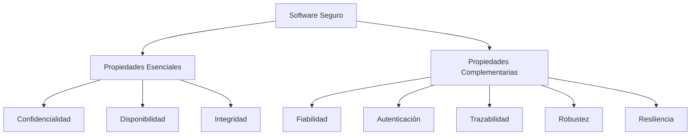

# Propiedades Del Software Seguro

Notas de estudio

## 1. Introducción

Estas notas describen las propiedades que debe cumplir un software para set considerado seguro o confiable. Las propiedades se dividen en dos grupos: esenciales y complementarias. También se presentan factores adicionales que influyen en la seguridad del software.

---

## 2. Propiedades Esenciales Del Software Seguro

### 2.1 Confidencialidad

Definición: Capacidad del software para asegurar que los datos procesados, almacenados o transmitidos no puedan set vistos por personas no autorizadas.  
Relevancia: Protege la información sensible evitando accesos indebidos.

### 2.2 Disponibilidad

Definición: Capacidad del software para estar operativo en todo memento cuando los usuarios lo necesitan.  
Relevancia: Un servicio debe funcionar 24/7 para garantizar continuidad de negocio y soporte al usuario.

### 2.3 Integridad

Definición: Capacidad del software para asegurar que los datos no son modificados, alterados o eliminados por entidades no autorizadas.  
Relevancia: Mantiene datos correctos, completos y confiables durante el procesamiento.

---

## 3. Propiedades Complementarias Del Software Seguro

### 3.1 Fiabilidad

Definición: Capacidad del software para funcionar de manera esperada en todo tipo de situaciones, incluso ante ataques maliciosos.  
Relevancia: Garantiza comportamiento estable y predecible.

### 3.2 Autenticación

Definición: Capacidad del software para garantizar que la persona, proceso o entidad que accede es realmente quien dice set.  
Relevancia: Reduce el riesgo de intrusiones por suplantación de identidad.

### 3.3 Trazabilidad (en El Transcript Se Menciona Como “sentricación/sensibilidad”)

Definición: Capacidad del sistema para imputar acciones a un usuario o entidad concreta, permitiendo registrar y auditar qué hizo cada uno.  
Relevancia: Fundamental para auditorías, investigación de incidentes y rendición de cuentas.

### 3.4 Robustez

Definición: Resistencia del software ante ataques o acciones maliciosas que buscan comprometerlo.  
Relevancia: Un sistema robusto es difícil de explotar y mantiene su funcionamiento bajo presión.

### 3.5 Resiliencia

Definición: Capacidad del software para recuperarse tras un ataque o fallo, manteniendo o restaurando un nivel mínimo de servicio en un tiempo oportuno.  
Relevancia: Permite continuar operando incluso después de un incidente.  
Diferencia con robustez: La robustez resiste ataques; la resiliencia se recupera después de ellos.

---

## 4. Factores Adicionales Que Influyen En la Seguridad Del Software

### 4.1 Herramientas Utilizadas En El Desarrollo

- El uso de análisis estático de código contribuye a mejorar la seguridad.
    
- Herramientas profesionales como Fortify o Checkmarx ofrecen más confiabilidad que algunas alternativas libres como SonarQube.
    
- Las herramientas deben ayudar a detectar vulnerabilidades antes del despliegue.

### 4.2 Dependencias Y Components Adquiridos

- Las librerías, frameworks o paquetes deben estar libres de vulnerabilidades conocidas.
    
- Es importante gestionarlas adecuadamente mediante controles de seguridad y actualizaciones.

### 4.3 Conocimiento Professional Del Equipo De Desarrollo

- Un equipo consciente de la seguridad comete menos errores.
    
- Conocer principios de desarrollo seguro reduce vulnerabilidades introducidas accidentalmente.

### 4.4 Configuraciones Desplegadas

- El software debe configurarse correctamente según el diseño.
    
- Configuraciones débiles pueden introducir riesgos aunque el código sea seguro.

### 4.5 Ambiente De Operación

- El entorno donde se ejecuta el software puede afectar su seguridad.
    
- Debe set controlado, monitoreado y alineado con estándares de seguridad.

### 4.6 Principios De Diseño Seguro

Incluyen criterios como mínima exposición, defensa en profundidad, separación de privilegios, entre otros.  
Estos principios se estudiarán en mayor detalle en temas posteriores.

### 4.7 Buenas Prácticas De Desarrollo Seguro

Ejemplos mencionados:

- Casos de abuso
    
- Patrones de ataque
    
- Análisis estático de código
    
- Pruebas de penetración  
    Estas prácticas permiten descubrir y corregir problemas durante el ciclo de vida del software.

---

## 5. Relación Entre Propiedades Del Software Seguro

---

## 6. Tabla Resumen De Propiedades

|Tipo|Propiedad|Definición breve|
|---|---|---|
|Esencial|Confidencialidad|Evitar accesos no autorizados a datos|
|Esencial|Disponibilidad|El sistema está siempre accessible|
|Esencial|Integridad|Datos no alterados sin permiso|
|Complementaria|Fiabilidad|Comportamiento consistente y esperado|
|Complementaria|Autenticación|Verifica la identidad del usuario|
|Complementaria|Trazabilidad|Registro e imputación de acciones|
|Complementaria|Robustez|Resistencia ante ataques|
|Complementaria|Resiliencia|Recuperación tras incidentes|

---

## 7. Resumen De Puntos Clave

- Las propiedades esenciales de seguridad son confidencialidad, disponibilidad e integridad.
    
- Existen propiedades complementarias como autenticación, fiabilidad, trazabilidad, robustez y resiliencia.
    
- La seguridad del software depende también de herramientas, dependencias, configuraciones, entorno y conocimientos del equipo.
    
- Principios de diseño seguro y buenas prácticas fortalecen el nivel de protección.

---

## MicroTest

### **1. ¿Cómo se define la propiedad _resiliencia_?**

- **La respuesta:** C.  
    _Capacidad del software para aislar, contener y limitar los daños ocasionados por fallos causados por ataques de sus vulnerabilidades explotables, recuperarse lo más rápido posible de ellos y reanudar su operación en o por encima de cierto nivel mínimo predefinido de servicio aceptable en un tiempo oportuno._
    
- **Justificación:**  
    La resiliencia se refiere **a la recuperación y continuidad operativa tras un ataque o fallo**, no solo a resistir (eso sería robustez). La opción C describe exactamente esta capacidad: contener el daño, recuperarse y volver a operar en un nivel aceptable.
    

---

### **2. Señalar la respuesta incorrecta. Entre las técnicas para salvaguardar la integridad tenemos, por ejemplo:**

- **La respuesta:** B. Uso de arquitecturas de alta disponibilidad, con diferentes tipos de redundancias.
    
- **Justificación:**  
    La integridad protege que los datos **no sean alterados sin autorización**.  
    Las arquitecturas de alta disponibilidad y redundancia pertenecen al dominio de la **disponibilidad**, no de la integridad.  
    Las demás opciones sí están directamente relacionadas con proteger la integridad mediante control de sesiones, firma digital y validación del procesamiento.
    

---

### **3. ¿Cuál de las siguientes NO es una propiedad de un software seguro?**

- **La respuesta:** D. Corrección.
    
- **Justificación:**  
    Las propiedades esenciales del software seguro son **confidencialidad, integridad y disponibilidad** (CIA). La _corrección_ es una propiedad de la calidad del software, pero **no una propiedad de seguridad**. Las otras opciones sí forman parte fundamental del modelo de seguridad.
    
