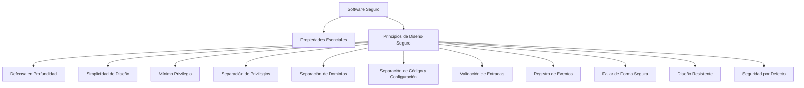

# Principios Del Diseño De Seguridad Del Software

**Notas de Estudio**

---

## 1. Introducción

Estos apuntes resumen los **principios fundamentales del diseño de software seguro**, tal como fueron explicados en el transcript. Su propósito es ofrecer una guía clara para entender cómo debe diseñarse una aplicación para minimizar vulnerabilidades, resistir ataques y mantener un funcionamiento seguro incluso ante fallos.

---

## 2. Principios Fundamentales Del Diseño Seguro

### 2.1 Defensa En Profundidad

**Definición:**  
Estrategia que consiste en implementar **múltiples capas de seguridad** en la aplicación y su entorno.

**Relevancia:**  
Si una capa es comprometida, otras capas continúan protegiendo el sistema, reduciendo la probabilidad de explotación exitosa.

**Ejemplos comunes:**

- Firewall → WAF → validación de entrada → controles de acceso.
    
- Cifrado → separación de dominios → monitoreo y alertas.

---

### 2.2 Simplicidad En El Diseño

**Definición:**  
Principio que busca que la arquitectura sea **lo más simple possible**.

**Relevancia:**  
La complejidad introduce más errores potenciales y más puntos explotables. Simplificar reduce:

- Fallos de codificación.
    
- Errores de diseño.
    
- Superficie de ataque.

---

### 2.3 Mínimo Privilegio

**Definición:**  
Lo que **no está explícitamente permitido, está prohibido**.  
Las entidades solo deben tener los permisos estrictamente necesarios.

**Relevancia:**  
Evita que usuarios o procesos abusen de privilegios excesivos.

**Ejemplo:**  
Un servicio que solo necesita lectura en una carpeta no debe tener permisos de escritura.

---

### 2.4 Separación De Privilegios

**Definición:**  
Dividir funciones, tareas y accesos entre roles o entidades diferentes, otorgando solo lo necesario.

**Relevancia:**  
Un compromiso de un rol no afecta a otros que tienen distintos privilegios.

---

### 2.5 Separación De Dominios

**Definición:**  
Aislar recursos, procesos y datos para reducir el impacto de un acceso malicioso.

**Relevancia:**  
Si un atacante compromete un dominio (por ejemplo, archivos temporales), no puede acceder a otros (como configuraciones o ejecutables).

---

### 2.6 Separación De Código, Datos Y Configuración

**Definición:**  
Almacenar código, datos y configuraciones en **rutas separadas**, con permisos distintos.

**Relevancia:**  
Evita que, si un atacante accede a un directorio, pueda modificar otros elementos críticos.

**Ejemplo real:**  
Archivos de configuración con usuarios y contraseñas almacenados en texto claro — práctica insegura y común.

---

### 2.7 Entrorno De Ejecución Seguro (Validación De Entradas)

**Definición:**  
Todas las entradas (formulario, red, archivos, variables de entorno) deben validarse.

**Relevancia:**  
La falta de validación es una de las principales causas de vulnerabilidades como:

- Inyección SQL
    
- XSS
    
- Deserialización insegura
    
- Path traversal

---

### 2.8 Registro De Eventos De Seguridad

**Definición:**  
Registrar eventos relevantes de seguridad para detectar ataques y activar acciones reactivas.

**Relevancia:**

- Identificación de incidentes
    
- Auditorías
    
- Forense digital

---

### 2.9 Fallar De Forma Segura

**Definición:**  
El sistema debe permanecer en un **estado seguro** cuando se produzca un fallo.

**Relevancia:**  
Los estados inestables son aprovechados por atacantes para generar exploits.

**Buenas prácticas:**

- Uso de temporizadores (timeouts)
    
- Mecanismos automáticos que fuerzan el retorno a un estado seguro

---

### 2.10 Diseño De Software Resistente

**Definición:**  
Reducir al mínimo el tiempo en el que el sistema no está protegido o presenta fallos.

**Relevancia:**  
Minimiza ventanas de oportunidad para atacantes.

---

### 2.11 Seguridad Por Oscuridad (Error)

**Definición:**  
La idea errónea de que esconder configuraciones, rutas o mecanismos de defensa aumenta la seguridad.

**Relevancia:**  
No se debe confiar en ocultar elementos.  
Es un error común, por ejemplo:

- Rutas ocultas en servidores web
    
- "Criptografía propia"

La criptografía debe set diseñada por expertos y revisada internacionalmente.

---

### 2.12 Seguridad Por Defecto

**Definición:**  
El software debe set seguro desde la primera instalación o uso, sin configuraciones complejas.

**Relevancia:**  
Reduce la superficie de ataque y evita errores de configuración.

Características:

- Puertos mínimos abiertos
    
- Configuración clara y corta
    
- Usabilidad adecuada

---

## 3. Representación De la Relación Entre Propiedades Y Principios

---

## 4. Tabla Resumen De Principios

|Principio|Descripción|
|---|---|
|Defensa en profundidad|Capas múltiples de protección|
|Simplicidad|Diseños simples → menos errores|
|Mínimo privilegio|Solo permisos necesarios|
|Separación de privilegios|División de funciones y roles|
|Separación de dominios|Aislar recursos críticos|
|Separación de código/datos/configuración|Rutas y permisos distintos|
|Validación de entradas|Revisión de toda entrada externa|
|Registro de eventos|Auditoría y detección de ataques|
|Fallar de forma segura|Mantener seguridad ante fallos|
|Diseño resistente|Minimizar periodos vulnerables|
|Seguridad por defecto|Configuración inicial segura|

---

## 5. Resumen De Puntos Clave

- Los principios de diseño seguro previenen fallos antes de que ocurran.
    
- La validación de entradas es una de las medidas más críticas.
    
- La separación de roles, dominios y privilegios limita el impacto de un ataque.
    
- No se debe diseñar seguridad basada en ocultar elementos.
    
- Fallar de forma segura y diseñar para la resistencia permiten mantener seguridad incluso bajo fallos inevitables.
    
- La seguridad debe set una propiedad inherente desde el diseño, no un añadido posterior.

---

## MicroTest

1. **Aplicar el principio de defensa en profundidad significa:**
    
    - **La respuesta:** C. Diseñar una aplicación con múltiples capas de defensa, de esta manera, si una capa falla, otro nivel puede proveer protección.
        
    - **Justificación:** La defensa en profundidad consiste en implementar varias barreras de seguridad en diferentes niveles del sistema. Así, si un atacante supera una capa, aún debe enfrentarse a otras, reduciendo el riesgo de compromiso total.

---

1. **Aplicar el principio de defensa en profundidad significa:**
    
    - **La respuesta:** B. Limitar el impacto que podría suponer el compromiso de un sistema de información por parte de un atacante.
        
    - **Justificación:** Este principio no solo establece múltiples capas defensivas, sino que también busca que, en caso de que una parte del sistema sea comprometida, el daño sea mínimo gracias a las barreras adicionales.

---

1. **El objetivo del principio de seguridad por defecto es:**
    
    - **La respuesta:** C. Ofrecer al usuario una aplicación segura desde un primer memento, sin pasar por una previa y compleja configuración.
        
    - **Justificación:** La seguridad por defecto garantiza que la configuración inicial del software sea la más segura possible, evitando depender de configuraciones manuales que los usuarios podrían no aplicar o realizar incorrectamente.