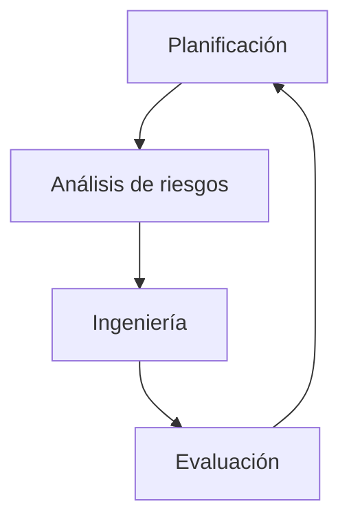

# Tipos De S-SDLC (Secure Software Development Life Cycle)

## 1. Introducción Al SDLC

El **SDLC (Software Development Life Cycle)** es un procedimiento formal usado para planificar, diseñar, construir, probar y desplegar software. Define fases, entradas, salidas y puntos de control que aseguran orden y calidad en el desarrollo.

### Objetivos Del SDLC

- Establecer fases claras del desarrollo.
    
- Organizar y coordinar equipos.
    
- Gestionar el proyecto y controlar su progreso.
    
- Garantizar calidad mediante _hitos de control_.

### Fases Típicas Del SDLC

1. Requisitos
    
2. Diseño
    
3. Construcción / Desarrollo
    
4. Integración y pruebas
    
5. Instalación / Despliegue
    
6. Mantenimiento

---

## 2. Modelos De Ciclo De Vida

### 2.1 Modelo En Cascada

Sequential. Cada fase debe completarse antes de pasar a la siguiente.

**Ventajas:** Estructura clara.  
**Desventajas:** Cambios tardíos costosos. No permite retroalimentación temprana.

---

### 2.2 Modelos Iterativos

Se construye el software en ciclos repetidos, mejorando en cada iteración.

### 2.3 Modelo En Espiral

Combina iteración con análisis de riesgos continuo.

**Ventaja:** Control del riesgo en cada vuelta.  
**Permite:** Ajustes tempranos y reducción de errores.

---

### 2.4 Modelos Ágiles

Ejemplos: **XP (Extreme Programming)**, **Scrum**.  
Se trabaja en ciclos cortos donde se entrega valor continuamente.

---

## 3. Qué Es Un S-SDLC (Secure SDLC)

Un **S-SDLC** es un SDLC tradicional al que se integran **prácticas de seguridad en todas las fases**.  
También aparece como **SSDLC** en literatura.

### Objetivo

Asegurar que el software sea:

- Más seguro
    
- Más robusto
    
- Más confiable

### Maneras De Implementar Un S-SDLC

1. **Adoptar una metodología de desarrollo seguro existente.**
    
2. **Tomar el SDLC actual e ir añadiendo prácticas de seguridad progresivamente.**

---

## 4. Prácticas De Seguridad Integradas En Un S-SDLC

El S-SDLC **no reemplaza** las actividades del SDLC; añade tareas de seguridad.

### Ejemplos De Prácticas Integradas

- Requisitos de seguridad
    
- Análisis de riesgo arquitectónico
    
- Análisis estático de código
    
- Pruebas de penetración
    
- Hardening de sistemas
    
- Revisión externa
    
- Codificación segura
    
- Pruebas basadas en riesgo

### Importancia

Detectar fallos en etapas tempranas reduce **costos**, **tiempo** y **riesgos comerciales**.

---

## 5. Ventajas Del S-SDLC

|Beneficio|Descripción|
|---|---|
|Software más robusto|Se reducen vulnerabilidades desde la fase de diseño.|
|Equipos concienciados|Mejor cultura de seguridad en todo el proceso.|
|Ahorro de costos|Detectar defectos temprano es más barato.|
|Reducción de riesgo comercial|Menos posibilidad de filtración o daño reputacional.|

---

## 6. Elementos Clave En Un S-SDLC

### Gestión Del Proyecto

- Hitos de control para validar la seguridad de entregables.

### Formación

- Desarrolladores deben conocer codificación segura.

### Gestión De Configuración

- Control de versiones y cambios con seguridad.

### Principios De Diseño Seguro

- Incluyen defensa en profundidad, mínimo privilegio, etc.

### Arquitectura Y Diseño

- Integración segura
    
- Requisitos de seguridad
    
- Pruebas de seguridad

### Herramientas

- Auditorías de código
    
- Análisis estático
    
- Revisiones externas

---

## 7. Ejemplo De S-SDLC (basado En Gary McGraw)

Orden de importancia de prácticas insertadas:

|Prioridad|Práctica|
|---|---|
|1|Revisión de código|
|2|Análisis de riesgo arquitectónico|
|3|Pruebas de penetración|
|4|Pruebas basadas en riesgo|
|5|Casos de uso y abuso|
|6|Requisitos de seguridad|
|7|Operación y hardening|
|8|Revisión externa|

---

## 8. Modelos De S-SDLC Reconocidos

- Microsoft SDL
    
- CLASP
    
- TSP-Secure
    
- Oracle Security Assurance
    
- AEGIS
    
- Raytheon Surety Process
    
- Touchpoints (Gary McGraw)
    
- BSIMM (no es SDLC, sino marco de medición)

---

## 9. Conclusiones

- Security must be incorporated into _every stage_ of SDLC.
    
- The specific SDLC model is less important than including correct security practices.
    
- It is fully compatible with agile methodologies.
    
- Objective: create software that is secure, reliable, and maintainable.

---

## **Resumen De Puntos Clave**

- El SDLC define fases, tareas y controles del desarrollo.
    
- Existen varios modelos: cascada, iterativo, espiral, ágil.
    
- El S-SDLC añade seguridad en cada fase del SDLC.
    
- Incluir seguridad temprano reduce costos y riesgos.
    
- Las prácticas más críticas: revisión de código y análisis de riesgo arquitectónico.
    
- Existen numerosos modelos de S-SDLC adoptados por la industria.

---

## MicroTest

1. Señala la respuesta incorrecta. Los elementos clave de un proceso de S-SDLC son:
    
    - **La respuesta:** C. Despliegue y distribución.
        
    - **Justificación:** El despliegue es parte del SDLC tradicional, pero **no es un elemento clave específico del S-SDLC**. Los elementos clave del S-SDLC incluyen gestión de configuración, pruebas de seguridad y hitos de control orientados a validar la seguridad.
        
2. «Constituyen otra forma de representar la mentalidad del atacante en base a la descripción comportamiento del sistema bajo un ataque».
    
    - **La respuesta:** A. Casos de abuso.
        
    - **Justificación:** Los **casos de abuso** modelan el comportamiento del sistema desde la perspectiva del atacante, describiendo cómo podría set abusado, a diferencia de pruebas de penetración o revisiones de código.
        
3. ¿Cuál de los siguientes mecanismos de seguridad protegen de forma más adecuada a las aplicaciones?
    
    - **La respuesta:** B. Inclusión de prácticas de seguridad en el SDLC.
        
    - **Justificación:** Los controles externos como cortafuegos, SIEM o IDS ayudan, pero **no sustituyen la seguridad desde el diseño y desarrollo seguro**. Integrar prácticas de seguridad en el SDLC es la medida más efectiva para proteger aplicaciones.