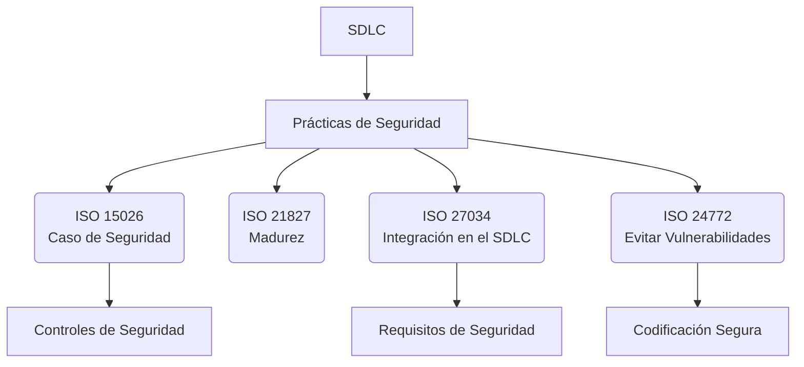

# Estándares De Seguridad Del Software

## Notas De Estudio

---

## 1. Introducción a Los Estándares De Seguridad Del Software

### ¿Qué Es Un Estándar?

Un **estándar** es una guía o conjunto de recomendaciones que orienta cómo debe comportarse o desarrollarse un proceso.  
En el contexto del software seguro, los estándares buscan:

- Establecer **procesos** y **buenas prácticas** para minimizar riesgos.
    
- Integrarse en todas las fases del ciclo de vida del software.
    
- Garantizar que el software desarrollado sea **confiable** y **seguro**.

---

## 2. Diferencia Entre Aseguramiento De la Calidad Y Seguridad Del Software

|Aseguramiento de la Calidad (QA)|Seguridad del Software|
|---|---|
|Se centra en la **funcionalidad**, comportamiento y ausencia de errores involuntarios.|Se centra en **minimizar vulnerabilidades** explotables con intención maliciosa.|
|Busca cumplir requisitos funcionales.|Busca proteger el software frente a amenazas.|
|Los fallos suelen set accidentales.|Las vulnerabilidades pueden set explotadas con intención dañina.|

### Idea Clave

El QA asegura que **el software funcione correctamente**, mientras que la seguridad asegura que **no pueda set explotado**.

---

## 3. Estándar ISO/IEC 15026 — Caso De Seguridad

### Objetivo

Obliga a incorporar un **caso de seguridad** durante el desarrollo o adquisición del software.

### ¿Qué Es Un Caso De Seguridad?

Documento que recoge:

- Controles de seguridad implementados.
    
- Evidencias que justifican que el software minimiza riesgos.
    
- Actividades de evaluación y verificación del producto.

### Components Principales

- Plan de aseguramiento.
    
- Evaluación de riesgos.
    
- Controles de seguridad.
    
- Seguimiento y mantenimiento del caso de seguridad.

### Uso Recomendado

Muy útil en **proyectos contratados**, ya que obliga al proveedor a demostrar seguridad mediante un caso documentado.

---

## 4. Estándar ISO/IEC 21827 — Modelo De Madurez SSE-CMM

### Descripción

Es un modelo de **capacidad y madurez** enfocado en la seguridad de sistemas y software.

### Características

- Deriva del famoso modelo **CMM/CMMI**.
    
- Contiene **22 dominios**:
    
    - 11 específicos de seguridad.
        
    - 11 referentes a la gestión del proyecto.

### Objetivo

Evaluar el nivel de madurez de una organización respecto al desarrollo seguro:

- Procesos repetibles
    
- Gestión estructurada
    
- Buenas prácticas de seguridad integradas

---

## 5. Estándar ISO/IEC 27034 — Integración De Seguridad En El Ciclo De Vida

### Propósito

Ayudar a las organizaciones a **integrar la seguridad** en su ciclo de vida de desarrollo, sea cual sea el modelo existente.

### Importante

No es un modelo de SDLC seguro en sí, sino una **norma de integración**.

### Contenido Principal

- Concepts and principles
    
- Organizational normative framework (ONF)
    
- Application security controls
    
- Requisitos de seguridad para proyectos
    
- Evidencias para demostrar seguridad del software desarrollado
    
- Guías para contratación segura

### Aplicación

Se recomienda solicitar su cumplimiento en desarrollos contratados para obtener un **desarrollo verificable y confiable**.

---

## 6. ISO/IEC 24772 — Evitar Vulnerabilidades En Lenguajes De Programación

### Tipo De Documento

No es una norma: es un **informe técnico**.

### Objetivo

Evitar vulnerabilidades introducidas durante la codificación mediante:

- Patrones seguros de programación.
    
- Alternativas para sustituir construcciones inseguras.
    
- Guía para seleccionar herramientas de análisis estático.

### Lenguajes Cubiertos (parcial)

- C
    
- C++
    
- Java
    
- PHP
    
- Ruby
    
- Ada
    
- Fortran
    
- Otros

### Relevancia

Es fundamental para:

- Desarrolladores.
    
- Revisores de código.
    
- Analistas de seguridad de software.

Ayuda a prevenir errores típicos como:

- Desbordamientos
    
- Manejo inseguro de memoria
    
- Validación débil de entradas
    
- Uso incorrecto de punteros
    
- Errores en manejo de excepciones

---

## 7. Relación Entre Estándares Y Desarrollo Seguro

---

## 8. Resumen De Los Puntos Clave

- Los estándares proporcionan **guías formales** para integrar seguridad en el desarrollo de software.
    
- QA y seguridad son **complementarios**, pero no equivalentes.
    
- **ISO 15026** introduce el caso de seguridad como evidencia formal.
    
- **ISO 21827 (SSE-CMM)** evalúa la madurez de procesos seguros.
    
- **ISO 27034** ayuda a integrar seguridad en cualquier SDLC.
    
- **ISO 24772** guía para evitar vulnerabilidades según el lenguaje de programación.
    
- Todos los estándares buscan reducir riesgo y asegurar desarrollos más confiables.

---

## MicroTest

1. Señala la respuesta correcta. ¿Cuál de las siguientes sentencias son áreas de proceso (PA) de ingeniería seguridad modelo SSE-CMM, norma ISO/IEC 21827?
    
    - **La respuesta:** B. Administrar los controles de seguridad.
        
    - **Justificación:** El modelo SSE-CMM (ISO/IEC 21827) define áreas de proceso relacionadas con la ingeniería de seguridad, incluyendo la gestión y administración de controles de seguridad. Las otras opciones no pertenecen a las PA específicas de seguridad definidas en este modelo.
        
2. Señala la respuesta correcta. Con respecto a la norma ISO/IEC 24772
    
    - **La respuesta:** C. Grupo de trabajo para evitar vulnerabilidades en lenguajes de programación…
        
    - **Justificación:** La ISO/IEC 24772 es un informe técnico que orienta a programadores para evitar vulnerabilidades específicas en distintos lenguajes de programación, sugiriendo patrones de codificación más seguros. No define métodos de aseguramiento ni perfiles integrales de seguridad como las otras opciones.
        
3. Señala la respuesta correcta. ¿Cuál es la norma que ayuda a las organizaciones a integrar la seguridad en el ciclo de vida de sus aplicaciones?
    
    - **La respuesta:** B. ISO/IEC 27034.
        
    - **Justificación:** La ISO/IEC 27034 se centra en integrar la seguridad dentro del ciclo de vida de desarrollo de aplicaciones (Application Security). No es un estándar de codificación segura ni un modelo de madurez como las otras normas listadas.